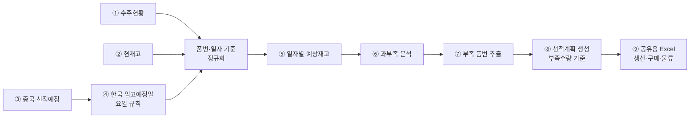

# 생산관리 선적계획 자동화 시스템 — 프로젝트 기획서

| 항목 | 내용 |
|---|---|
| 리포 | data09-18 |
| 제출자 | 안제민 |
| 직무·소속 | 원문 미기재 (생산관리 업무 담당으로 보임 — 가정) |
| 과정 | 현장 데이터 디지털화 전문가과정 1차수 |
| 작성일 | 2026-09-28 |
| 문서 상태 | 초안 v0.1 — 수강생 제출 자료 기반 |

---

## 1. 추진 배경과 현안

- 현재 생산관리자가 엑셀로 수작업하는 업무를 데이터화하고자 합니다.
- 품번별 수주량·재고량·선적예정량을 자동으로 분석해 **부족 예상 품목**과 **선적 필요 수량**을 자동으로 산출하는 것이 목표입니다.
- 중국에서 선적한 물량이 한국에 입고되기까지 요일에 따라 입고일이 달라지므로, 이를 반영한 일자별 재고 예측이 필요합니다.

현재는 수주현황·현재고·선적예정을 각각 다른 엑셀에서 옮겨 적어 품번마다 계산하는 것으로 보입니다(가정). 품번 수가 많을수록 옮겨 적기 실수와 계산 시간이 늘어나는 구조로 보입니다(가정).

## 2. 목표

### 2.1 최종 목표

- 수주현황·현재고·중국 선적예정을 넣으면 **한국 입고예정일을 자동 계산**하고, **일자별 예상재고와 과부족**을 품번별로 보여 주는 시스템
- 부족 품번을 자동으로 뽑아 **부족수량 기준 선적계획**을 만들고, **생산·구매·물류 담당자와 공유**

### 2.2 1차 개발 목표

제출된 업무 흐름 ①~⑨를 그대로 따라가는 **브라우저 도구**를 먼저 만듭니다.

- 수주·재고·선적예정 Excel 가져오기(열 매핑)
- 입고예정일 규칙 적용 → 일자별 예상재고 → 과부족 → 부족 품번 추출
- 부족수량 기준 선적계획 생성
- 공유용 Excel 출력

담당자 자동 알림(메일·메신저)은 2단계에서 다룹니다.

## 3. 보유 데이터

| 데이터 | 형태 | 규모·주기 | 비고(민감도 등) |
|---|---|---|---|
| 수주현황 | Excel로 가정 | 품번 수·갱신 주기 미상 | 고객 주문 정보 — 사내 정보. 열 구성 미상(품번, 수량, 납기일 또는 출하일, 고객사 등이 있을 것으로 가정) |
| 현재고 | Excel 또는 사내 시스템 출력으로 가정 | 미상 | 품번별 기준 시점 재고. 창고가 여럿인지 미상 |
| 중국 선적예정 | Excel로 가정 | 미상 | 품번, 선적일, 수량이 있을 것으로 가정. 중국 쪽에서 받는 자료인지 미상 |

제출 원문에 첨부 파일은 없고 보유 데이터 항목도 따로 적혀 있지 않습니다. 위 표는 업무 흐름 ①~③에서 읽어 낸 것입니다. 샘플이 있어야 열 매핑을 확정할 수 있습니다(10장).

## 4. 해결 방안 개요

| 단계 | 내용 |
|---|---|
| 수집 | 수주현황, 현재고, 중국 선적예정 (Excel) |
| 정리 | 세 파일을 품번·일자 기준으로 맞추고, 선적예정에 입고예정일 규칙을 적용해 입고 일정으로 변환 |
| 분석 | 품번별·일자별 예상재고 = 전일 예상재고 + 당일 입고예정 − 당일 수주 소요, 음수(또는 기준 미만) 발생 일자와 수량 산출 |
| AI | 계산은 규칙으로 처리. AI는 선적계획 요약 문장·공유 메시지 초안 정도에 선택적으로 사용 (확장) |
| 산출물 | 일자별 예상재고표, 과부족표, 부족 품번 목록, 선적계획표, 공유용 Excel |

## 5. 주요 기능

### 5.1 한국 입고예정일 규칙 (제출 원문 그대로)

| 중국 선적 요일 | 한국 입고예정일 | 원문 표현 |
|---|---|---|
| 월 | 선적일 + 2일 (수) | 월~수 선적 → 2일 후 입고 |
| 화 | 선적일 + 2일 (목) | 월~수 선적 → 2일 후 입고 |
| 수 | 선적일 + 2일 (금) | 월~수 선적 → 2일 후 입고 |
| 목 | 다음 월요일 | 목~금 선적 → 다음 월요일 입고 |
| 금 | 다음 월요일 | 목~금 선적 → 다음 월요일 입고 |
| 토·일 | 원문에 규칙 없음 | 10장에서 확인 |

- 괄호 안 요일은 원문 규칙에서 바로 따라 나오는 결과입니다.
- 이 규칙대로라면 **화요일에 입고되는 선적은 없습니다.** 따라서 선적계획을 거꾸로 세울 때 「화요일 부족분」은 전날(월) 입고, 곧 전주 목·금 선적으로 맞춰야 합니다. 이 역산 방식이 현장 판단과 맞는지 10장에서 확인합니다.
- 공휴일·연휴에 입고일이 걸리는 경우의 처리는 원문에 없어, 1단계에서는 **휴일 목록을 사용자가 넣으면 다음 영업일로 미루는 선택 기능**으로 둡니다(가정).

### 5.2 기능 목록

| 기능 | 설명 | 우선순위 |
|---|---|---|
| 수주·재고·선적예정 Excel 가져오기 | 세 파일을 읽어 공통 항목(품번, 일자, 수량)으로 변환. 열 이름이 파일마다 다를 수 있어 열 매핑 화면 제공, 매핑 저장 | MVP |
| 입고예정일 자동 계산 | 5.1 규칙으로 선적일 → 입고예정일 변환. 규칙은 설정 화면에서 바꿀 수 있게 둠 | MVP |
| 일자별 예상재고 | 품번별로 기준일 현재고에서 시작해 날짜마다 입고예정을 더하고 수주 소요를 빼서 계산 | MVP |
| 과부족 분석 | 날짜별 예상재고가 0(또는 사용자가 정한 기준) 아래로 떨어지는 첫 날짜와 부족수량 표시 | MVP |
| 부족 품번 추출 | 부족이 생기는 품번만 모아 첫 부족일·최대 부족수량 순으로 정렬 | MVP |
| 선적계획 생성 | 부족수량을 채우기 위해 언제(선적일) 얼마를 선적해야 하는지 5.1 규칙을 거꾸로 적용해 제안. 사용자가 수량·날짜를 고칠 수 있음 | MVP |
| 공유용 Excel 출력 | 선적계획표·부족 품번 목록·일자별 예상재고표를 Excel로 내보내기 | MVP |
| 안전재고 기준 | 품번별 안전재고를 넣으면 0이 아니라 안전재고 미만을 부족으로 판정 | 확장(기준 확보 후) |
| 선적 단위 반영 | 박스·팔레트 등 선적 단위로 올림 | 확장(단위 확인 후) |
| 담당자 자동 공유 | 선적계획이 만들어지면 생산·구매·물류 담당자에게 메일·메신저 발송 | 확장 |
| 계획 대비 실적 | 실제 입고일·수량을 넣어 계획과 비교 | 확장 |

## 6. 기대 산출물

1. **선적계획 자동화 도구(브라우저)** — 세 가지 Excel을 넣으면 ①~⑧을 한 번에 계산
2. **일자별 예상재고표·과부족표** — 품번별
3. **부족 품번 목록** — 첫 부족일·부족수량 포함
4. **선적계획표** — 선적일·수량·입고예정일
5. **공유용 Excel** — 생산·구매·물류 담당자 배포용
6. **담당자 자동 공유** — 2단계 (확장)

## 7. 기술 구성

| 과정 도구 | 이 프로젝트에서 쓰는 곳 |
|---|---|
| DAY1 암묵지 자산화·전략기획 | 입고예정일 규칙의 예외(휴일·주말 선적), 선적 수량을 정할 때의 판단 기준, 안전재고 기준을 꺼내 적기 |
| DAY2 코랩(Python)·바이브코딩 | 세 파일 정리, 입고예정일 계산, 일자별 예상재고·과부족 계산 로직 시험, 브라우저 도구 제작 — 이 프로젝트의 중심 |
| DAY3 멀티모달 비정형 정보화 | (필요 시) 중국 쪽에서 오는 선적 안내가 PDF·이미지라면 품번·수량·선적일을 표로 뽑기 |
| DAY4 RAG (Dify, NotebookLM) | 이 프로젝트의 핵심은 계산이라 비중이 낮음. 필요 시 물류 규칙·예외 사례 질의 (확장) |
| DAY5 Make 자동화 | 선적계획 파일을 담당자에게 정기 발송, 공유 폴더 갱신 시 재계산 알림 (확장, 보안 허용 시) |
| 생성형 AI | 선적계획 요약 문장, 공유 메시지 초안 (선택) |

**개발 형태(권장)**

- **설치 없이 브라우저에서 도는 정적 웹 도구**로 만듭니다. Excel을 브라우저 안에서만 읽고 계산하므로 **수주·재고 정보가 외부로 나가지 않습니다.** 모든 계산이 규칙이라 AI 서비스가 없어도 됩니다.
- 결과는 지금 쓰는 방식과 같게 **Excel로 내보내** 공유합니다. 받는 사람은 새 도구를 몰라도 됩니다.

## 8. 개발 단계

### 1단계 — 지금 바로 개발 가능한 부분

제출된 흐름과 입고예정일 규칙이 구체적이어서, 샘플을 받기 전에도 가상의 데이터로 ①~⑨ 전체를 만들 수 있습니다. 샘플을 받으면 열 매핑만 맞춥니다.

- 수주·재고·선적예정 Excel 가져오기(열 매핑, 매핑 저장)
- 입고예정일 계산(5.1 규칙, 휴일 목록 선택 입력)
- 품번별 일자별 예상재고 계산
- 과부족 분석과 부족 품번 추출
- 부족수량 기준 선적계획 생성(입고예정일 규칙 역산, 사용자 수정 가능)
- 공유용 Excel 출력(선적계획표·부족 품번·예상재고표)
- 시험용 가상 데이터에는 월~금 각 요일 선적, 화요일에 처음 부족해지는 품번, 입고가 늦어 부족이 생기는 품번을 일부러 넣어 계산이 맞는지 확인합니다.

### 2단계

- 실제 샘플로 열 매핑·계산 보정, 휴일·주말 선적 규칙 확정 반영
- 안전재고 기준, 선적 단위(박스·팔레트) 올림
- 선적계획 담당자 자동 공유(Make)

### 3단계

- 계획 대비 실적(실제 입고일·수량) 비교와 입고 지연 추적
- 사내 시스템(ERP 등)에서 수주·재고를 직접 받아오는 연동(가정 — 사내 시스템 확인 후)
- 여러 사람이 같은 계획을 보는 공유 저장소

## 9. 기대 효과

- **계산 시간 단축** — 세 가지 자료를 옮겨 적고 품번마다 계산하던 일을 한 번에 처리합니다.
- **부족 품목 조기 발견** — 날짜별로 부족이 언제 생기는지 미리 보여 주어 선적 시점을 놓치지 않습니다.
- **계산 기준 일관화** — 누가 계산해도 같은 입고예정일 규칙과 같은 판정 기준을 씁니다.
- **공유 누락 감소** — 생산·구매·물류가 같은 선적계획표를 받습니다.

제출 자료에는 정량 수치가 없어 이 문서도 수치를 적지 않습니다.

## 10. 확인 필요 사항

**샘플 데이터 (필수)**

1. 수주현황·현재고·중국 선적예정 Excel 샘플 각 1개 — 열 구성, 시트 구성
2. 수주현황의 날짜가 무엇을 뜻하는지(고객 납기일, 출하일, 생산 투입일 중 어느 것인지) — 예상재고에서 빠지는 날짜 기준
3. 현재고의 기준 시점(매일 아침 기준인지 등)과 창고가 여러 곳인지
4. 품번 수와 한 번에 계획하는 기간(몇 주 앞까지 보는지)

**입고예정일 규칙**

5. 토·일요일에 선적하는 경우가 있는지, 있다면 입고일은 언제인지
6. 공휴일·연휴(한국·중국 모두)에 입고일이 걸리면 어떻게 하는지
7. 「2일 후」가 달력 기준 2일인지 — 월~수 선적은 모두 같은 주 안이라 결과는 같지만, 휴일이 끼는 경우 해석이 달라집니다
8. 화요일에 입고되는 선적이 없는데, 화요일 부족분은 월요일 입고(전주 목·금 선적)로 맞추는 것이 맞는지

**계산 기준**

9. 수량 단위(개, 박스, 팔레트)와 선적 최소 단위
10. 안전재고 기준(품번별로 정해져 있는지) — 0 아래를 부족으로 볼지, 안전재고 아래를 부족으로 볼지
11. 이미 확정된 선적예정과 새로 만드는 선적계획을 어떻게 구분해 관리하는지

**공유·환경**

12. 생산·구매·물류 담당자에게 지금은 어떤 방식(메일 첨부, 공유 폴더, 메신저)으로 공유하는지, 기존 공유 양식이 있는지
13. 수주·재고 자료를 외부 AI나 클라우드(코랩 포함)에 올려도 되는지

## 부록. 제출 원문 요약

| 출처 | 파일·게시물 | 내용 |
|---|---|---|
| 패들릿 게시물 1 (2026-09-28T08:27) | 「생산관리 선적계획 자동화 시스템」 — `기획_원문.md` | 프로젝트 목표(엑셀 수작업 데이터화, 품번별 수주량·재고량·선적예정량 분석으로 부족 예상 품목·선적 필요 수량 자동 산출), 핵심 업무 흐름 ①~⑨(수주현황 입력 → 현재고 반영 → 중국 선적예정 반영 → 한국 입고예정일 계산[월~수 선적 → 2일 후, 목~금 선적 → 다음 월요일] → 일자별 예상재고 → 과부족 분석 → 부족 품번 추출 → 선적계획 생성 → 생산·구매·물류 공유) |

첨부 파일은 제출되지 않았습니다(`attachments.json` 비어 있음). 원문에 직무·소속과 보유 데이터 항목은 따로 적혀 있지 않습니다.
