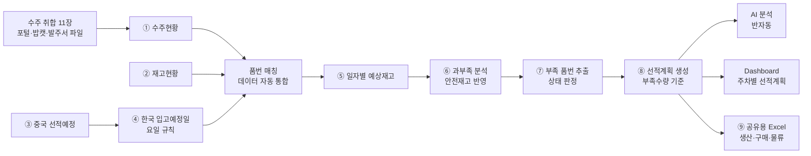
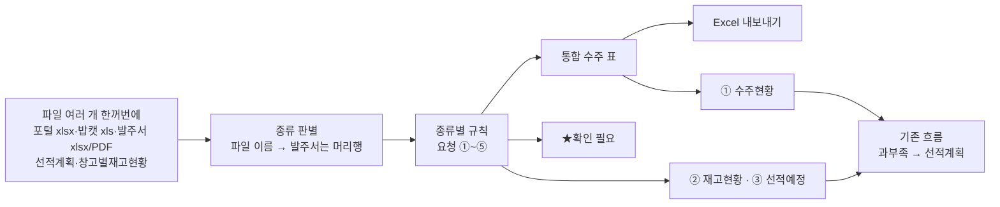

# 생산관리 선적계획 자동화 시스템 — 프로젝트 기획서

| 항목 | 내용 |
|---|---|
| 리포 | data09-18 |
| 제출자 | 안제민 |
| 직무·소속 | 와이어링 하네스 생산관리 / 선적관리 (기획안 「적용업무」 기재). 소속 회사명은 원문 미기재 |
| 과정 | 현장 데이터 디지털화 전문가과정 1차수 |
| 작성일 | 2026-09-28 (v0.3: 2026-09-29, v0.4: 2026-09-30) |
| 문서 상태 | 초안 v0.4 — 수주 취합 확인 부탁 답변(2026-09-30) 반영: 직송 수집·밥캣 −2일·「완제품」 품번 그대로 확정 |

> v0.4 변경 요약: 패들릿 댓글(2026-09-30)로 11.7 확인 부탁에 답을 받았습니다. 엔진 결품·납품예정 겹침은 결품 기준(기본값 그대로), **직송 파일은 AM·CKD 처럼 납품예정과 같이 수주로 넣기**, **밥캣 결품 납기 −2일**, 발주서는 최근 시트만(그대로), **재고 품번의 「완제품」은 사내 완제품 품번이라 그대로** — 도구 기본값과 규칙을 이 답대로 바꿨습니다(11.9). 매핑표·업로드 양식은 메일로 받기로 해 대기입니다.
>
> v0.3 변경 요약: 수강생 메일(2026-09-29, 첨부 16개)의 「수주(발주) 데이터 자동 취합」 요청을 반영했습니다. 고객사 포털 파일·밥캣 xls·발주서(엑셀·PDF)를 한꺼번에 넣어 하나의 수주 표로 만드는 **앞단계**를 이 도구에 붙이고(11장), 그 결과가 입력 ① 수주현황이 되게 했습니다. 첨부 파일의 머리행 구조를 열 매핑표로 적고(11.3), 보내 주신 파일로 돌려 본 결과를 가려 적었습니다(11.6). 1~10장의 선적계획 계산 내용은 그대로입니다.
>
> v0.2 변경 요약: 수강생이 올린 기획안 docx(「AI 데이터 디지털화를 활용한 생산관리 선적계획 자동화 프로젝트 기획안 — 와이어링 하네스 생산관리」)를 반영했습니다. v0.1에서 (가정)으로 두었던 직무, 보유 데이터 항목, 과부족 공식, 상태 구분, Dashboard 구성을 기획안 원문 기준으로 바꿨습니다. 입고예정일 규칙은 기획안 표(월→수, 화→목, 수→금, 목·금→다음 주 월)와 게시물 원문(월~수 선적 → 2일 후, 목~금 선적 → 다음 월요일)이 같은 내용이라 그대로 둡니다.

---

## 1. 추진 배경과 현안

- 와이어링 하네스 생산관리 업무에서 **수주현황, 재고현황, 중국 선적예정 데이터를 각각의 엑셀 파일로 관리**하고 있습니다(기획안 2장).
- 담당자가 세 자료를 취합해 품번별 과부족을 계산하고, 부족수량에 대한 선적계획을 **수작업으로** 세웁니다. 반복 작업이 많고, 수주·선적 변동이 생기면 신속한 대응이 어렵습니다.
- 중국에서 선적한 물량이 한국에 입고되기까지 요일에 따라 입고일이 달라지므로, 이를 반영한 일자별 재고 예측이 필요합니다.

기획안 4장의 현행 문제는 다음과 같습니다.

| 구분 | 현행 문제 (기획안 원문) |
|---|---|
| 데이터 관리 | 여러 엑셀 파일에 데이터 분산 |
| 데이터 취합 | 담당자가 수작업으로 자료 통합 |
| 과부족 계산 | 수식 및 자료 확인 과정에서 오류 가능 |
| 입고예정 | 중국 선적일을 기준으로 별도 계산 필요 |
| 부족품 확인 | 담당자가 전체 품번을 직접 확인 |
| 선적계획 | 담당자의 경험 및 판단에 의존 |
| 긴급 대응 | 수주 변동 시 즉각적인 재계산 필요 |

## 2. 목표

### 2.1 최종 목표

기획안 16장: 「생산관리 담당자가 데이터를 찾아서 계산하는 업무에서, 데이터가 스스로 분석되어 필요한 선적계획을 제시하는 업무로 전환한다.」

- 수주현황·재고현황·중국 선적예정을 넣으면 **한국 입고예정일을 자동 계산**하고, **일자별 예상재고와 과부족**을 품번별로 보여 주는 시스템
- 부족 품번을 자동으로 뽑아 **부족수량 기준 선적계획**을 만들고, **생산·구매·물류 담당자와 공유**
- 부족·긴급 품목을 AI가 우선순위로 설명하고, **주차별 선적계획 Dashboard**로 한눈에 확인
- 향후 확장(기획안 15장): 선적계획 자동화 → 생산계획 자동화 → 구매발주량 자동 산출 → 수요예측 AI → 통합 생산관리 AI 시스템

### 2.2 1차 개발 목표

제출된 업무 흐름 ①~⑨와 기획안 5장 개선 프로세스(데이터 자동 통합 → 품번 매칭 → 입고일 계산 → 예상재고 계산 → 과부족 분석 → 부족품 자동 추출 → 선적계획 자동 생성 → AI 분석 → Dashboard)를 그대로 따라가는 **브라우저 도구**를 먼저 만듭니다.

- 수주·재고·선적예정 Excel 가져오기(열 매핑)
- 입고예정일 규칙 적용 → 일자별 예상재고 → 과부족(안전재고 반영) → 상태 판정 → 부족 품번 추출
- 부족수량 기준 선적계획 생성
- AI 분석은 반자동(질문문 복사 → AI 답 붙여넣기)
- Dashboard와 공유용 Excel 출력

담당자 자동 알림(메일·메신저)은 2단계에서 다룹니다.

## 3. 보유 데이터

기획안 6장 「데이터 구성」 기준입니다. 실제 파일 샘플은 아직 없어 열 이름·시트 구성은 모릅니다. 그래서 1단계 도구는 **열 매핑 화면**으로 실제 열 이름을 나중에 맞춥니다.

| 데이터 | 주요 항목 (기획안 원문) | 형태 | 규모·주기 | 비고(민감도 등) |
|---|---|---|---|---|
| 수주현황 | 품번, 품명, 고객사, 수주일, 납기일, 수주수량 | Excel (기획안 2장) | 품번 수·갱신 주기 미상 | 고객 주문 정보 — 사내 정보. 고객사명은 외부 AI에 보내지 않는 것을 기본값으로 둡니다 |
| 재고현황 | 품번, 품명, 현재고, 가용재고 | Excel (기획안 2장) | 미상 | 기준 시점 미상. 창고가 여럿인지 미상 |
| 선적예정 | 품번, 품명, 중국 선적예정일, 선적수량, 한국 입고예정일 | Excel (기획안 2장) | 미상 | 한국 입고예정일 열이 이미 있으나 규칙으로 다시 계산합니다(5.1). 둘이 다르면 표시합니다 |
| 안전재고 | 품번별 안전재고 | 원문 공식(8장)에는 있으나 **데이터 구성표에는 없음** | 미상 | 어디서 관리하는지 확인 필요(10장). 1단계는 재고현황의 선택 열 또는 전체 기본값으로 받습니다(가정) |

- 예상재고 계산에는 **현재고**를 씁니다(기획안 8장 공식). 가용재고를 써야 하는지는 10장에서 확인하며, 도구에서 기준 열을 고를 수 있게 둡니다.
- 예상재고에서 수주를 빼는 날짜는 **납기일**로 봅니다(가정 — 10장 확인).

## 4. 해결 방안 개요

| 단계 | 내용 |
|---|---|
| 수집 | 수주현황, 재고현황, 중국 선적예정 (Excel) |
| 정리 | 세 파일을 품번 기준으로 맞추고, 선적예정에 입고예정일 규칙을 적용해 입고 일정으로 변환 |
| 분석 | 기획안 8장 공식 — 예상재고 = 현재고 + 입고예정수량 − 수주수량, 과부족수량 = 예상재고 − 안전재고. 품번별 합계와 일자별 흐름을 함께 계산 |
| AI | 계산은 규칙으로 처리. AI는 부족·긴급 품목의 우선순위 설명(기획안 9장)에 사용 — 1단계는 질문문 복사·답 붙여넣기 방식 |
| 산출물 | 과부족 현황표, 선적계획표, 일자별 예상재고표, 부족 품번 목록, Dashboard, 공유용 Excel |

## 5. 주요 기능

### 5.1 한국 입고예정일 규칙 (제출 원문 그대로)

| 중국 선적 요일 | 한국 입고예정일 | 원문 표현 |
|---|---|---|
| 월 | 선적일 + 2일 (수) | 게시물: 월~수 선적 → 2일 후 입고 / 기획안 7장: 월요일 → 수요일 |
| 화 | 선적일 + 2일 (목) | 게시물: 월~수 선적 → 2일 후 입고 / 기획안 7장: 화요일 → 목요일 |
| 수 | 선적일 + 2일 (금) | 게시물: 월~수 선적 → 2일 후 입고 / 기획안 7장: 수요일 → 금요일 |
| 목 | 다음 월요일 | 게시물: 목~금 선적 → 다음 월요일 입고 / 기획안 7장: 다음 주 월요일 |
| 금 | 다음 월요일 | 게시물: 목~금 선적 → 다음 월요일 입고 / 기획안 7장: 다음 주 월요일 |
| 토·일 | 원문에 규칙 없음 | 1단계는 규칙 없음으로 표시하고 계산에서 뺍니다. 파일에 입고예정일이 적혀 있으면 그 값을 씁니다(10장 확인) |

- 이 규칙대로라면 **화요일에 입고되는 선적은 없습니다.** 선적계획을 거꾸로 세울 때 「화요일 부족분」은 전날(월) 입고, 곧 전주 목·금 선적으로 맞춥니다(10장 확인).
- 규칙은 설정 화면에서 요일별 「선적일 + N일」로 바꿀 수 있게 둡니다. 기본값은 위 표(월·화·수 +2, 목 +4, 금 +3)입니다.
- 공휴일·연휴에 입고일이 걸리면 **휴일 목록을 사용자가 넣었을 때 다음 영업일로 미룹니다**(가정).

### 5.2 과부족·상태 판정 (기획안 8장·10장·11장)

| 항목 | 계산 | 근거 |
|---|---|---|
| 예상재고 | 현재고 + 입고예정수량 − 수주수량 (계획 기간 합계) | 기획안 8장 원문 |
| 과부족수량 | 예상재고 − 안전재고 | 기획안 8장 원문. 양수 = 재고 여유, 0 = 적정, 음수 = 재고 부족 |
| 일자별 예상재고 | 기준일 현재고에서 시작해 날짜마다 입고예정을 더하고 납기일 수주를 뺌 | 게시물 흐름 ⑤ |
| 부족수량 | 일자별 예상재고가 안전재고 아래로 가장 많이 내려간 만큼 (없으면 0) | 게시물 흐름 ⑥⑦. 합계로는 맞아도 입고가 늦어 중간에 비는 경우를 잡기 위함 |

상태 구분은 기획안 11장의 「정상 / 부족 / 주의 / 과잉」과 10장 예시의 「긴급」을 씁니다. 원문에 판정 기준이 없어 다음처럼 정하고, 기준값은 모두 설정에서 바꿀 수 있게 둡니다(가정 — 10장 확인).

| 상태 | 판정 기준 (가정) |
|---|---|
| 긴급 | 과부족수량이 음수이고, 첫 부족일이 기준일로부터 **긴급 기준일수** 이내 |
| 부족 | 과부족수량이 음수 |
| 주의 | 과부족수량은 0 이상이지만, 기간 중 어느 날 일자별 예상재고가 안전재고 아래로 내려감(입고 시점이 늦음) |
| 과잉 | 과부족수량이 수주수량 합계 × **과잉 기준 비율** 이상 |
| 정상 | 위에 해당하지 않음 |

- 긴급 기준일수와 과잉 기준 비율은 원문에 값이 없습니다. 기본값은 도구의 설정 화면에서 정하고, 수강생 확인 후 바꿉니다. 기획안 10장 예시표(A001~A004)가 이 판정으로 같은 결과가 나오는지 시험에 넣습니다.

### 5.3 기능 목록

| 기능 | 설명 | 우선순위 |
|---|---|---|
| 수주 자동 취합 (11장) | 고객사 포털 납품예정·누적결품·직송, 밥캣 xls, 발주서(엑셀·PDF), 선적계획·창고별재고현황을 한꺼번에 넣어 종류 판별 → 요청 규칙 → 통합 수주 표 + ★확인 필요, Excel, 「이 수주로 선적계획 계산」 | MVP (2026-09-29 추가) |
| 수주·재고·선적예정 Excel 가져오기 | 세 파일(Excel·CSV)을 읽어 3장의 항목으로 변환. 열 이름이 다를 수 있어 **열 매핑 화면** 제공, 매핑 저장 | MVP |
| 품번 매칭 | 세 자료를 품번으로 묶고, 한쪽에만 있는 품번(예: 수주는 있는데 재고현황에 없음)을 따로 표시 | MVP |
| 입고예정일 자동 계산 | 5.1 규칙으로 선적일 → 입고예정일 변환. 규칙·휴일은 설정에서 변경. 파일의 입고예정일과 다르면 표시 | MVP |
| 일자별 예상재고 | 품번별로 기준일 현재고에서 시작해 날짜마다 입고예정을 더하고 수주를 빼서 계산 | MVP |
| 과부족 분석·상태 판정 | 5.2 공식과 상태 구분(정상·부족·주의·과잉·긴급) 적용, 첫 부족일과 부족수량 표시 | MVP |
| 안전재고 기준 | 품번별 안전재고(재고현황 선택 열) 또는 전체 기본값. 기획안 8장 공식에 들어 있어 v0.1의 확장에서 MVP로 올림 | MVP |
| 부족 품번 추출 | 부족·긴급·주의 품번만 모아 첫 부족일·부족수량 순으로 정렬 | MVP |
| 선적계획 생성 | 부족수량을 채우도록 선적일·수량을 5.1 규칙을 거꾸로 적용해 제안. 선적일이 기준일보다 앞서야 하면 「납기 내 입고 불가」로 표시. 사용자가 수량·날짜를 고칠 수 있음 | MVP |
| AI 분석 (반자동) | 부족·긴급 품번의 수치를 담은 질문문을 만들어 복사 → 사내 허용 AI에 붙여 넣기 → 정해진 형식의 답을 붙여 넣으면 품번별 의견으로 정리. 고객사·품명은 기본적으로 빼고 보냄 | MVP |
| Dashboard | 기획안 11장 항목 — 전체 품번 수, 전체 수주수량, 현재고, 입고예정수량, 부족 품번 수, 부족수량, 금주 선적수량, 긴급 선적 품번, 주차별 선적계획, 상태별 색상 구분 | MVP |
| 공유용 Excel 출력 | 과부족 현황표·선적계획표·부족 품번 목록·일자별 예상재고표·입고예정 계산표를 한 파일로 내보내기. 담당자에게 보낼 안내문 초안 복사 | MVP |
| 선적 단위 반영 | 박스·팔레트 등 선적 단위로 올림 | 확장(단위 확인 후) |
| 최근 수주량 변화 반영 | 기획안 9장의 AI 분석 입력 중 「최근 수주량 변화」 — 과거 수주 이력이 있어야 함 | 확장(이력 확보 후) |
| 담당자 자동 공유 | 선적계획이 만들어지면 생산·구매·물류 담당자에게 메일·메신저 발송 | 확장 |
| 계획 대비 실적 | 실제 입고일·수량을 넣어 계획과 비교 | 확장 |
| 생산계획·구매발주량 자동 산출 | 기획안 15장 향후 확장 계획 | 확장 |

## 6. 기대 산출물

기획안 17장 「최종 산출물」과 맞춥니다.

1. **통합 데이터 관리** — 수주현황 + 재고현황 + 선적예정을 품번으로 묶어 보관·내보내기
2. **품번별 과부족 자동 현황표** — 상태(정상·부족·주의·과잉·긴급) 포함
3. **부족수량 기반 자동 선적계획표** — 선적일·수량·입고예정일
4. **부족/긴급 품목 AI 분석 화면** — 1단계는 반자동
5. **주차별 선적계획 Dashboard**
6. **공유용 Excel** — 생산·구매·물류 담당자 배포용
7. **담당자 자동 공유** — 2단계 (확장)

## 7. 기술 구성

| 과정 도구 | 이 프로젝트에서 쓰는 곳 |
|---|---|
| DAY1 암묵지 자산화·전략기획 | 입고예정일 규칙의 예외(휴일·주말 선적), 긴급·과잉 판정 기준, 안전재고 기준, 선적 수량을 정할 때의 판단 기준을 꺼내 적기 |
| DAY2 코랩(Python)·바이브코딩 | 세 파일 정리, 입고예정일 계산, 일자별 예상재고·과부족 계산 로직 시험, 브라우저 도구 제작 — 이 프로젝트의 중심 |
| DAY3 멀티모달 비정형 정보화 | (필요 시) 중국 쪽에서 오는 선적 안내가 PDF·이미지라면 품번·수량·선적일을 표로 뽑기 |
| DAY4 RAG (Dify, NotebookLM) | 이 프로젝트의 핵심은 계산이라 비중이 낮음. 필요 시 물류 규칙·예외 사례 질의 (확장) |
| DAY5 Make 자동화 | 선적계획 파일을 담당자에게 정기 발송, 공유 폴더 갱신 시 재계산 알림 (확장, 보안 허용 시) |
| 생성형 AI | 부족·긴급 품목 우선순위 설명(기획안 9장), 공유 메시지 초안 |

**개발 형태(권장)**

- **설치 없이 브라우저에서 도는 정적 웹 도구**로 만듭니다. Excel을 브라우저 안에서만 읽고 계산하므로 **수주·재고 정보가 외부로 나가지 않습니다.** 모든 계산이 규칙이라 AI 서비스가 없어도 됩니다.
- AI 분석은 도구가 AI에 직접 접속하지 않고, 질문문을 복사해 사내에서 허용된 AI에 붙여 넣는 방식으로 둡니다. 외부 AI 사용 허용 여부는 10장에서 확인합니다.
- 결과는 지금 쓰는 방식과 같게 **Excel로 내보내** 공유합니다. 받는 사람은 새 도구를 몰라도 됩니다.

## 8. 개발 단계

기획안 13장은 8주 8단계(현행 분석 → 데이터 표준화 → 데이터 통합 → 과부족 계산 → 자동 선적계획 → AI 분석 → Dashboard → 테스트)로 적혀 있습니다. 브라우저 도구로는 이 중 계산·화면 부분을 가상의 데이터로 먼저 만들 수 있어, 아래처럼 묶습니다.

### 1단계 — 지금 바로 개발 가능한 부분

제출된 흐름, 입고예정일 규칙, 과부족 공식, 데이터 항목이 구체적이어서 샘플을 받기 전에도 가상의 데이터로 전체를 만들 수 있습니다. 샘플을 받으면 열 매핑만 맞춥니다.

- (2026-09-29 추가) 수주 자동 취합 — 11장
- 수주·재고·선적예정 Excel 가져오기(열 매핑, 매핑 저장), 품번 매칭
- 입고예정일 계산(5.1 규칙, 규칙 변경, 휴일 목록 선택 입력, 파일 값과 비교)
- 품번별 일자별 예상재고 계산
- 과부족 분석(기획안 8장 공식, 안전재고 반영)과 상태 판정(5.2), 부족 품번 추출
- 부족수량 기준 선적계획 생성(입고예정일 규칙 역산, 사용자 수정 가능)
- AI 분석 반자동(질문문 생성·답 붙여넣기)
- Dashboard(기획안 11장 항목, 주차별 선적계획, 상태별 색상)
- 공유용 Excel 출력과 담당자 안내문 초안
- 시험용 가상 데이터에는 월~금 각 요일 선적, 화요일에 처음 부족해지는 품번, 입고가 늦어 부족이 생기는 품번, 기획안 10장 예시(A001~A004)와 같은 수치의 품번을 넣어 계산이 맞는지 확인합니다.

### 2단계

- 실제 샘플로 열 매핑·계산 보정, 휴일·주말 선적 규칙 확정 반영
- 긴급·과잉 판정 기준, 안전재고 관리 위치 확정 반영
- 선적 단위(박스·팔레트) 올림
- 선적계획 담당자 자동 공유(Make)
- 과거 수주 이력으로 최근 수주량 변화를 AI 분석에 추가

### 3단계

- 계획 대비 실적(실제 입고일·수량) 비교와 입고 지연 추적
- 사내 시스템(ERP 등)에서 수주·재고를 직접 받아오는 연동(가정 — 사내 시스템 확인 후)
- 여러 사람이 같은 계획을 보는 공유 저장소
- 생산계획·구매발주량 자동 산출, 수요예측(기획안 15장)

## 9. 기대 효과

기획안 12장의 개선 효과를 따릅니다.

| 항목 | 개선 효과 (기획안 원문) |
|---|---|
| 데이터 취합시간 | 자동화로 단축 |
| 과부족 계산시간 | 자동 계산으로 단축 |
| 선적계획 작성시간 | 자동 생성으로 단축 |
| 엑셀 수작업 | 반복작업 감소 |
| 데이터 오류 | 수작업 입력 및 계산 오류 감소 |
| 긴급 대응 | 부족품 자동 추출로 대응시간 단축 |

- **계산 기준 일관화** — 누가 계산해도 같은 입고예정일 규칙과 같은 판정 기준을 씁니다.
- **공유 누락 감소** — 생산·구매·물류가 같은 선적계획표를 받습니다.

기획안 14장에는 목표 KPI(데이터 취합시간 50% 이상 단축, 과부족 계산 업무 자동화율 90% 이상, 선적계획 작성시간 50% 이상 단축, 부족품번 자동 추출률 100%, 입고예정일 자동 계산률 100%)가 적혀 있습니다. 이는 수강생이 정한 **목표치**이며, 현재 소요시간 측정값은 제출 자료에 없어 이 문서는 개선 수치를 따로 추정하지 않습니다. 목표 달성 여부는 현재 작업 시간을 먼저 재야 판단할 수 있습니다(10장).

## 10. 확인 필요 사항

**샘플 데이터 (필수)**

1. 수주현황·재고현황·중국 선적예정 Excel 샘플 각 1개 — 실제 열 이름, 시트 구성 (항목은 기획안 6장으로 확인됨)
2. 예상재고에서 수주를 빼는 날짜를 **납기일**로 보는 것이 맞는지 (수주일·출하일·생산 투입일이 아닌지)
3. 재고현황의 **현재고와 가용재고** 중 어느 것을 기준으로 계산할지, 재고 기준 시점(매일 아침 기준인지 등), 창고가 여러 곳인지
4. 품번 수와 한 번에 계획하는 기간(몇 주 앞까지 보는지)
5. 선적예정 파일의 「한국 입고예정일」은 누가 어떻게 적는 값인지 — 규칙 계산값과 다를 때 어느 쪽을 믿을지

**입고예정일 규칙**

6. 토·일요일에 선적하는 경우가 있는지, 있다면 입고일은 언제인지
7. 공휴일·연휴(한국·중국 모두)에 입고일이 걸리면 어떻게 하는지
8. 화요일에 입고되는 선적이 없는데, 화요일 부족분은 월요일 입고(전주 목·금 선적)로 맞추는 것이 맞는지

**계산 기준**

9. 안전재고는 어디에서 관리하는지(품번별로 정해져 있는지, 별도 파일인지) — 기획안 8장 공식에는 있으나 6장 데이터 구성에는 없음
10. 「긴급」 판정 기준 — 첫 부족일이 며칠 안이면 긴급인지, 또는 고객·납기 등 다른 기준인지
11. 「주의」와 「과잉」 판정 기준 — 기획안 11장에 상태 이름만 있고 기준값은 없음
12. 수량 단위(EA, 박스, 팔레트)와 선적 최소 단위
13. 이미 확정된 선적예정과 새로 만드는 선적계획을 어떻게 구분해 관리하는지
14. 기획안 10장 예시의 선적일(9/29)을 정할 때 입고일에 여유를 며칠 두는지

**공유·환경·KPI**

15. 생산·구매·물류 담당자에게 지금은 어떤 방식(메일 첨부, 공유 폴더, 메신저)으로 공유하는지, 기존 공유 양식이 있는지
16. 수주·재고 자료를 외부 AI나 클라우드(코랩 포함)에 올려도 되는지, 사내에서 허용된 AI가 있는지
17. KPI 기준선 — 지금 데이터 취합·과부족 계산·선적계획 작성에 걸리는 시간

**수주 자동 취합 (11장)** — 11.7 확인 부탁 13가지 중 8가지는 2026-09-30 에 답을 받았습니다(11.9). 남은 것은 11.9 끝을 보세요.

## 11. 수주 자동 취합 (앞단계, 2026-09-29 메일 요청)

### 11.1 요청과 반영 방식

수강생이 2026-09-29 메일(「기초자료 송부의 件」)로 첨부 16개와 함께 요청했습니다. 원문 정리본은 `source/2026-09-29_메일_수주취합_요청.md`(고객사 이름을 뺀 것)에 있습니다.

| 요청 | 원문 요지 |
|---|---|
| ① 건기 (인천·군산) | 파일 이름에 「납품예정」이 든 건기 파일에서 품목코드·납품잔량·납기일자 수집. 건기 누적결품은 참고자료 → 수집 제외 |
| ② 엔진 (인천·군산) | 누적결품 우선 반영. 음수 = 고객사 결품일, 납기일 = 결품일 − 2일, 음수 수량은 양수로. 가능하면 작성일자를 발주일자로. 납품예정은 오더유형(V열) Mass PO 제외 후 반영. 결품·납품예정 중복 처리는 확인 필요 |
| ③ 발주서 양식 (7개 고객사) | 파일마다 필요한 항목만 뽑는 열 매핑. PDF 1개는 글자 추출 가능 여부 먼저 확인 |
| ④ 밥캣 | 매크로 생성 로직 문서 참조. 직송 시트 투입 순서 일반 → CKD → AM, 외주와 겹치는 일반 행 제외, 원납기를 [오늘 ~ 마지막 날짜]로 조임. **매크로 대체가 아니라 밥캣 xls 3개를 공통 수주 형식으로 바꾸는 것이 목표** |
| ⑤ 선적계획 | 품목코드 끝 (CI) 자동 삭제. 필요 열: 품목코드 · 미판매수량 · 변경선적요청일 |
| ⑥ 공통 | 모든 양식에 발주일 표시. 결과는 하나의 통합 수주 표: 고객사 · 공장 · 구분 · 품목코드 · 수량 · 납기일 · 발주일 · 원본파일. 창고별재고현황(품목코드·합계)은 재고 부족 확인용 조인 후보 |

**반영 방식** — 새 리포를 만들지 않고 이 도구 앞에 「수주 취합」 화면을 붙였습니다. 이 단계가 만드는 통합 수주 표가 곧 이 도구의 입력 ①「수주현황」이고, 첨부의 선적계획 파일은 입력 ③「선적예정」, 창고별재고현황은 입력 ②「재고현황」에 그대로 맞기 때문입니다.

- 파일은 브라우저 안에서만 읽습니다(SheetJS·pdf.js, 둘 다 `vendor/`). 폐쇄망·`file://` 에서도 돕니다.
- 판별하지 못한 파일, 머리행을 못 찾은 파일, 읽지 못한 칸은 버리지 않고 「★확인 필요」에 파일·행·이유로 남깁니다. 규칙으로 뺀 행(Mass PO, 참고자료 등)은 파일별 집계에 사유와 건수로 보입니다. 그래서 파일마다 **읽은 행 = 수집 + 규칙으로 뺀 행 + ★확인 필요** 가 맞습니다(누적결품은 한 행이 날짜별 여러 줄이 되므로 예외).

### 11.2 파일을 열어 보고 알게 된 것

첨부 16개(번호가 붙은 사본과 안 붙은 사본이 섞여 있고, 내용은 같음 — 도구도 같은 파일이 두 번 들어오면 한 번만 반영합니다)를 풀면 데이터 파일 24개와 매크로 로직 문서 1개입니다.

| 확인한 것 | 결과 |
|---|---|
| 포털 xlsx 12개 | **글자 칸이 모두 빈칸으로 읽혔습니다.** 파일 안 공유 문자열이 `<si >`(태그 뒤 공백)로 적혀 있어 SheetJS 0.18.5 가 글자를 못 읽고 숫자·날짜만 보였습니다. 도구가 파일을 열 때 압축을 풀어 태그 공백만 지우고 다시 읽게 했습니다(`fixZip`, 기존 「자료 가져오기」에도 적용). 고칠 것이 없는 파일은 그대로 읽습니다 |
| 밥캣 `.xls` 3개 | 옛 엑셀(BIFF8, CDFV2) 형식이라 SheetJS 로 그대로 읽힙니다. 다만 **수량·날짜가 모두 글자**로 들어 있습니다(「30」, 「2026/08/18」). 빈 날짜는 「0000/00/00」 |
| 발주서 PDF 1개 | 브라우저 인쇄본이라 글자 층이 있습니다(스캔 아님). pdf.js 로 글자와 위치를 꺼낼 수 있고, 표 머리가 **한 글자씩** 흩어져 있으며 품목코드가 칸 폭 때문에 **두 줄로 나뉘어** 있습니다. 도구가 위치로 표를 다시 짜서 이어 붙입니다 |
| 결품 수량의 부호 | 누적결품은 날짜별 **누적 잔량**입니다. 양수 = 재고 여유, 음수 = 그날까지 쌓인 결품. 날짜가 갈수록 음수가 커지므로, 결품이 전날까지의 최대보다 커진 날에 **늘어난 만큼**이 그날의 결품입니다 |
| 누적결품의 월 칸 | 일별 칸(오늘부터 56일) 뒤에 「11·12·01·02·03」 월 단위 칸이 있습니다(누적값). 날짜가 없어 그 달 첫날(일별 칸과 같은 달이면 일별 마지막 다음날)로 넣었습니다(가정) |
| 밥캣 누적결품의 날짜 | 머리는 「B(D-Day)·B(D+1 Day)…」이고 **바로 아래 행**에 실제 날짜가 있습니다. 영업일만 날짜가 있고 나머지는 「0000/00/00」. 마지막 날짜가 밥캣 원납기 조임의 끝입니다 |
| 오더유형(V열) 값 | 인천건기·인천엔진 납품예정: Mass PO / Proto-Domestic PO · 군산엔진 납품예정·CKD·직송: Mass PO 만 · 밥캣 일반(AI열): Kanban PO / Proto-Domestic PO / Mass PO / Manual PO · 군산건기(예정신고전)은 V열이 「기종-호기」이고 오더유형은 BL열(Z1)·AI열 「오더유형 내역」(Standard PP Order) · 안산AM 은 오더유형 대신 AC열 「발주구분」(NB 일반 / N3 긴급 / N1 장비다운)과 J열 「확정여부」(확정 / 미확정) |
| 날짜 형식 | 포털 xlsx: 날짜 값(셀 서식) · 누적결품 머리: 글자 「2026/09/29」 · 밥캣: 글자 「2026/08/18」 · 발주서: 「20260818」 글자(목록형 A), 「2026-09-02」 글자(목록형 A 의 다른 고객사·목록형 B 납기), 날짜 값(목록형 B 수주일·목록형 C·서식형) · 선적계획: 「2026/11/06 」(끝 공백) · PDF: 「2026/09/18」 |
| 괄호 안 필요 정보 | 괄호 힌트는 **두 파일 이름에만** 있습니다 — `선적계획(품목코드,미판매수량,변경선적요청일)`, `창고별재고현황(품목코드,합계)`. **발주서 7개는 파일 이름에도 파일 안에도 괄호 힌트가 없어**, 머리행 이름으로 품번·수량(잔량)·납기·발주일 네 항목을 골랐습니다(11.7 확인 부탁) |
| 군산건기(예정신고전) | 다른 포털 파일과 양식이 다릅니다(생산오더 단위, 66열). 「납품잔량」 열이 없어 **요청수량**을 수량, **납기일(Actual)** 을 납기, **생성일** 을 발주일로 읽었습니다(가정) |
| 선적계획·창고별재고현황 | 1행이 제목, 2행이 머리입니다. 끝에 월 소계(「2026/09 계」)·「총합계」·「합계」·출력 시각 행이 있어 수량에 섞이지 않게 뺍니다 |

### 11.3 열 매핑표 (파일 종류별)

열은 **이름으로** 찾습니다(열 순서가 바뀌어도 됩니다). 표의 열 문자는 이번 파일 기준입니다.

**포털 납품예정·직송 — 표준 양식** (인천건기·인천엔진·군산엔진·CKD건기 납품예정, 인천건기·인천엔진 직송 · A:No ~ CC:Rev, 81열 · 머리 1행)

| 통합 표 | 원본 열 | 비고 |
|---|---|---|
| 품목코드 | K 품목코드 | |
| 수량 | T 납품잔량 | 0 이면 뺌 |
| 납기일 | Z 납기일자 | 날짜 값 |
| 발주일 | AA 발주일 | 날짜 값 |
| (규칙) | V 오더유형 | 엔진이면 Mass PO 제외 |
| 품명 | L 품목명 | |

**포털 납품예정 — 군산건기(예정신고전)** (A:No ~ BN:ERNAM, 66열) — 품목코드 J · 수량 AE 요청수량 · 납기일 AB 납기일(Actual) · 발주일 AU 생성일 · 오더유형 AI 오더유형 내역(참고)

**포털 납품예정 — 안산AM** (A:품목코드 ~ BA:Maker Part No, 53열) — 품목코드 A · 수량 F 납품잔량 · 납기일 I 납기일자 · 발주일 H 발주일 · 참고 AC 발주구분, J 확정여부

**포털 누적결품** (인천·군산 × 건기·엔진 · A:No ~ CN:Subcontract) — 품목코드 C · 품목명 D · Stock Qty O · 일별 누적 P(오늘) ~ BS(55일 뒤) · 월 칸 BT~BX(11·12·01·02·03) · 발주일 = 파일 이름의 작성일자

**밥캣 누적결품 xls** (A:CK ~ BS:상태) — 품번 D · 품명 E · 현재고 K · 날짜별 누적 L「B(D-Day)」~ AP「B(D+30 Day)」(날짜는 2행) · 발주일 = 파일 이름의 작성일자

**밥캣 납품예정 일반·직송 xls** (A:삭제 ~ CR:자재 유형, 96열) — 품번 T · 수량 AF 납품잔량 · 원납기 AM 납기일자 · 발주일 AN 발주일 · 오더유형 AI · (참고) 조기납품가능일자 AL

**선적계획(미판매현황)** → 입력 ③ 선적예정 — 품번 C 품목코드(끝 (CI) 삭제) · 선적수량 H 미판매수량 · 중국 선적예정일 J 변경선적요청일(비면 I 납기일자 + ★) · 품명 D 품목명(규격)

**창고별재고현황** → 입력 ② 재고현황 — 품번 B 품목코드 · 현재고 G 합계 · 안전재고 R 안전재고(있으면) · 품명 E 품목명

**발주서** — 고객사 이름은 **파일 이름**을 씁니다(코드에 고객사 이름을 두지 않음). 양식은 머리행으로 알아봅니다.

| 양식 | 알아보는 머리 | 품목코드 | 수량 | 납기일 | 발주일 | 이번 파일 |
|---|---|---|---|---|---|---|
| 목록형 A | 자재코드·납품서잔량·납기요청일 | 자재코드 | 납품서잔량 | 납기요청일 | 결재일자 | 2개 고객사(열 순서가 달라도 같은 이름) |
| 목록형 B | 자재코드·납품 가능 수량·납기요청일시 | 자재코드 | 납품 가능 수량(= 수주수량 − 납품서생성수량) | 납기요청일시 | 수주일자 | 1개 |
| 목록형 C | 품목번호·입력가능수량·납기일자 | 품목번호 | 입력가능수량(= 발주 − 누적납품) | 납기일자 | 발주일자 | 1개 |
| 서식형 D | 「품번」과 「발주수량/발주량」이 한 행에 있는 표 | 품번 | 발주수량 칸, 또는 표 아래 날짜 행이 있으면 **날짜 칸마다** 수량 | 「납기일」 칸, 또는 날짜 칸의 날짜 | 「발주일(자)」 칸 | 2개 고객사(한 곳은 시트 20장 — 발주일자가 가장 늦은 시트만) |
| PDF | 「품목코드」 머리 + 「수량」「단가」 글자 위치 | 품목코드(두 줄이면 이어 붙임) | 수량 칸 숫자 | 「납기일자 :」 뒤 날짜 | 「일련번호」의 날짜 | 1개 |

### 11.4 규칙 — 요청 그대로 / 정한 기본값

| 규칙 | 요청 그대로 | 정한 기본값(화면에서 바꿈, 11.7 확인 부탁) |
|---|---|---|
| 건기 | 납품예정만 수집, 누적결품은 참고자료로 제외 | 건기 납품예정은 Mass PO 도 넣음(Mass PO 제외는 엔진 규칙) |
| 엔진 누적결품 | 음수 → 양수, 납기 = 결품일 − 2일, 발주일 = 작성일자 | 누적값의 **날짜별 증가분**을 한 줄씩(「최대 결품 한 줄」로 바꿀 수 있음) · 월 칸 넣음 · 파일 이름 날짜를 작성일자로 |
| 엔진 납품예정 | V열 Mass PO 제외 · **같은 품번이 누적결품에 있으면 누적결품 기준, 납품예정 미반영(2026-09-30 확정)** | 같은 공장 기준으로 봅니다 — 「합산」으로 바꿀 수 있음 |
| 직송 | **납품예정과 동일하게 수주로 넣음(2026-09-30 확정)** | 인천건기·인천엔진 직송은 포털 납품예정 규칙(엔진은 Mass PO 제외·결품 기준), 밥캣 직송은 밥캣 일반 규칙(위블록 겹침 제외·원납기 조임). 끌 수 있음 |
| 안산AM · CKD | **납품예정과 동일하게(2026-09-30 확정)** | 납품잔량·납기일자로 수집, 미확정 AM 도 넣고 비고에 표시(미확정 행은 답을 못 받아 가정 유지) |
| 밥캣 누적결품 | (매크로 위블록) · **납기 = 결품일 − 2일(2026-09-30 확정)** | 음수 → 양수, 날짜별 증가분 |
| 밥캣 납품예정 일반 | 위블록(누적결품) 품번과 겹치는 행 제외, 원납기를 [오늘 ~ 마지막 날짜]로 조임(과거 → 오늘, 뒤 → 마지막 날) | 「오늘」 = 기준일(파일 이름 날짜, 바꿀 수 있음) · 조인 행은 원납기를 비고에 남김 · 외주 7개사 자료는 이번에 없어 위블록 = 밥캣 누적결품만 |
| 밥캣 CKD·AM | 투입 순서 일반 → CKD → AM, CKD·AM 은 외주와 겹쳐도 전량 | CKD건기·안산AM 납품예정 파일은 겹침 제외 없이 전량 넣습니다(규칙과 같음). 매크로의 CKD·AM 이 이 두 파일과 같은 것인지는 확인 부탁 |
| 선적계획 | (CI) 삭제, 품목코드·미판매수량·변경선적요청일 | 변경선적요청일이 비면 납기일자를 쓰고 ★ |
| 창고별재고현황 | **품목코드의 「완제품」은 사내 완제품 품번 — 있는 그대로(2026-09-30 확정)** | 떼지 않고, 수주 품번과 **글자까지 같을 때만** 같은 품번으로 봅니다. ★확인 필요에 올리지 않습니다(다른 한글이 붙은 품번은 그대로 ★) |
| 발주서 | 파일마다 필요한 항목만 · **괄호 힌트 없는 발주서는 최근 시트만(2026-09-30 확정)** | 11.3 표 · 최근 = 발주일자가 가장 늦은 시트 · 날짜로 못 읽은 수량 칸 머리(「추가분」 등)·음수 수량은 ★ |
| 매크로 대체 | 하지 않음 | 사내품번 매핑(VLOOKUP·#N/A 보충)·SUMIFS 집계·오후 추가발주는 이 도구가 하지 않습니다 |

### 11.5 화면과 산출물

- **수주 취합** 화면(메뉴 맨 앞): 파일 끌어다 놓기(여러 개) → 규칙 설정 → 요약(넣은 파일·읽은 행·통합 수주·★확인 필요) → 파일별 결과(판별·읽은 행·수집·뺀 행과 사유·메모) → ★확인 필요 목록 → 통합 수주 표(구분·검색, 납기일 순).
- **통합 수주 Excel** — 시트 `통합수주`(고객사·공장·구분·품목코드·품명·수량·납기일·발주일·원본파일·원본 시트·원본 행·규칙·비고), `파일별집계`, `★확인필요`, `수주현황`(이 도구 표준 열), 넣었으면 `재고현황`·`선적예정`.
- **「이 수주로 선적계획 계산」** — 통합 수주를 입력 ① 수주현황으로, 선적계획 파일을 입력 ③, 창고별재고현황을 입력 ②로 넘기고 기준일을 맞춘 뒤 대시보드로 갑니다. 넣지 않은 자료는 지금 들어 있는 것을 그대로 둡니다. 이후 흐름(과부족·선적계획·AI·공유)은 그대로입니다.
- **예시 파일로 해 보기** — 모든 파일 종류의 가상 예시 25개(`samples/수주취합/`, 같은 머리행·가상 품번 `SMP-…`·고객사A~G)로 바로 돌려 봅니다.

### 11.6 보내 주신 파일로 돌려 본 결과 (로컬에서만, 품번·고객사 가림)

기준일 2026-09-29(파일 이름 날짜), 기본 규칙. 실제 파일은 리포에 넣지 않았습니다.

| 파일 | 읽은 행 | 수집 줄 | 규칙으로 뺀 행 |
|---|---|---|---|
| 납품예정 인천건기 | 345 | 345 | - |
| 납품예정 군산건기(예정신고전) | 440 | 440 | - |
| 납품예정 인천엔진 | 65 | 13 | Mass PO 52 |
| 납품예정 군산엔진 | 17 | 0 | Mass PO 17 (전부 Mass PO) |
| 납품예정 안산AM | 45 | 45 | - |
| 납품예정 CKD건기 | 6 | 6 | - |
| 누적결품 인천건기 · 군산건기 | 167 · 128 | 0 · 0 | 참고자료 167 · 128 |
| 누적결품 인천엔진 | 169 | 963 | 결품 없음 57 (결품 품번 112개 → 날짜별 963줄) |
| 누적결품 군산엔진 | 27 | 470 | 결품 없음 5 (결품 품번 22개 → 470줄) |
| 직송 인천건기 · 인천엔진 | 77 · 5 | 0 · 0 | 직송(수집 안 함) 77 · 5 |
| 밥캣 누적결품 | 147 | 780 | - (147개 품번 모두 결품) |
| 밥캣 납품예정 일반 | 814 | 197 | 위블록 품번과 겹침 617 |
| 밥캣 납품예정 직송 | 238 | 0 | 직송(작업자 확인용) 238 |
| 발주서 목록형 A (2개 고객사) | 7 · 65 | 7 · 65 | - |
| 발주서 목록형 B | 224 | 224 | - |
| 발주서 목록형 C | 8 | 8 | - |
| 발주서 서식형 D (2개 고객사) | 3 · 46 | 3 · 2 | 지난 발주서 시트 41, 이번 발주 없음 3 |
| 발주서 PDF | 1 | 1 | - |
| 선적계획 → 선적예정 | 1,002 | 995 | 소계·합계·출력시각 7 · (CI) 995건 삭제 |
| 창고별재고현황 → 재고현황 | 3,134 | 3,129 | 합계·출력시각 2 |

- **합계**: 파일 24개(사본까지 48개를 넣어도 24개로 판별), 읽은 행 7,180, **통합 수주 3,569줄**(품번 776개, 수량 합계 47,875), 규칙으로 뺀 행 1,416, **★확인 필요 16건** — 창고별재고현황의 품목코드에 「완제품」이 붙은 행 13, 합계가 빈 행 3. 판별하지 못한 파일 0.
- **대조**: 규칙마다 3행씩(건기·AM·CKD·엔진 납품예정·엔진 결품 −2일·밥캣 결품·밥캣 조임 3종·겹침·발주서 양식 5종·선적계획 (CI)·재고) 원본 칸과 맞춰 보았고 48건 모두 일치했습니다. 브라우저에서 같은 파일을 넣어도 같은 수가 나오고, 「이 수주로 선적계획 계산」 뒤 대시보드가 뜨며 새로고침해도 유지됩니다(브라우저 저장 약 160만 자).
- 눈여겨볼 점:
  - 엔진 결품 1,433줄 중 **403줄이 월 단위 칸**(11월 말~3월)에서 나왔습니다. 날짜가 그 달 첫날로 가정된 줄이라, 월 칸을 넣을지(11.7)에 따라 수주가 크게 달라집니다.
  - 기준일 전 납기 줄이 78개입니다(오늘 이미 결품 → 결품일 − 2일이 지난 날). 선적계획 계산에서는 기준일로 모아 뺍니다(4장 가정 그대로).
  - 오늘 파일에서는 엔진 납품예정(Mass PO 를 뺀 13줄)과 엔진 결품의 품번이 **겹치지 않아**, 「결품 우선」과 「합산」의 결과가 같습니다.
  - 직송을 넣으면 통합 수주가 3,873줄(+304)이 됩니다.
  - **밥캣 품번 294개 중 128개는 창고별재고현황에 없는 번호**입니다. 매크로가 하는 「사내 품번 매핑(VLOOKUP)」이 이 도구에는 없어서, 재고·선적계획과 품번으로 묶을 때 이 128개는 재고 0 으로 계산됩니다(11.7).
  - 전체로는 수주 품번 776개 중 500개가 창고별재고현황에, 288개가 선적계획에 있습니다.

### 11.7 확인 부탁

1. **엔진 결품과 납품예정에 같은 품번**이 있으면 결품으로 덮을까요(기본), 더할까요? (오늘 파일은 겹치는 품번이 없어 결과가 같습니다) → **답(09-30): 누적결품 기준, 납품예정 미반영** — 기본값 그대로 확정
2. **직송 파일**(인천건기·인천엔진 직송, 밥캣 직송)도 수주로 넣을까요? 기본은 넣지 않음입니다. → **답: 넣음(납품예정과 동일)** — 기본값을 「넣음」으로 바꿨습니다
3. **안산AM·CKD건기** 규칙 — 건기처럼 납품잔량·납기일자로 넣었습니다. AM 의 「미확정」 행도 넣을까요? 밥캣 매크로의 「CKD·AM」 이 이 두 파일과 같은 것인가요? → **답: 납품예정과 동일하게 넣음** — 확정. 「미확정」 AM 행과 매크로 CKD·AM 이 같은 파일인지는 답이 없어 남김
4. **ERP 업로드 양식**이 따로 있나요? 있으면 샘플 1개를 주시면 통합 표를 그 열 순서로도 내보내겠습니다. → **답: 메일로 보내 주시기로 함** — 대기
5. **밥캣 결품의 납기**도 엔진처럼 결품일 − 2일로 당길까요? 지금은 0일(결품일 그대로)입니다. → **답: −2일** — 기본값을 2일로 바꿨습니다
6. **누적결품 → 수주 줄**: 날짜별 늘어난 만큼 여러 줄(기본)이 맞나요, 품번당 「가장 큰 결품을 첫 결품일에」 한 줄이 맞나요?
7. **누적결품의 월 칸(11·12·01·02·03)** 을 수주로 넣을까요? 넣는다면 날짜는 그 달 첫날이 맞나요?
8. **군산건기(예정신고전)** 는 수량 = 요청수량, 납기 = 납기일(Actual), 발주일 = 생성일로 읽었습니다. 맞나요?
9. **발주서 7개의 필요 항목** — 파일에 괄호 힌트가 없어 11.3 표처럼 골랐습니다. 특히 수량을 잔량 열(납품서잔량·납품 가능 수량·입력가능수량)로 본 것이 맞는지 봐 주세요.
10. 시트가 여럿인 **서식형 발주서**는 발주일자가 가장 늦은 시트만 읽습니다. 지난 시트에도 아직 안 들어간 수량이 있나요? → **답: 최근 시트만이 맞음** — 확정
11. **밥캣 품번 ↔ 사내 품번 매핑표**를 받을 수 있을까요? 받으면 통합 표에 사내 품번 열을 붙여 재고·선적계획과 맞추겠습니다. → **답: 고객사 품번 ↔ 당사 품번 매핑표를 메일로 보내 주시기로 함** — 대기
12. 창고별재고현황에 품목코드 끝·앞에 「완제품」이 붙은 품번이 13개 있습니다. 붙은 말을 떼고 같은 품번으로 볼까요? → **답: 당사 내부 완제품 품번이니 있는 그대로** — 떼지 않고 정확히 같은 품번끼리만 맞춥니다. ★확인 필요에서 뺐습니다
13. 밥캣 위블록에 들어가는 **외주 업체 자료**(매크로 문서의 7개 업체)도 이 도구에 넣을까요? 이번 첨부에는 없어 밥캣 누적결품만으로 겹침을 판단했습니다.

### 11.8 다음 단계

- 메일로 받을 **고객사 품번 ↔ 당사 품번 매핑표**를 불러와 통합 표에 당사 품번 열 붙이기(재고·선적계획과 맞추기), **ERP 업로드 양식** 열 순서로 내보내기
- 밥캣 CKD·AM 파일, 외주 업체 자료가 오면 같은 방식으로 추가
- 매크로(`.xlsm`) 생성·포털 다운로드 자동화는 하지 않습니다 — 요청 ④ 대로 이 도구는 공통 수주 형식 변환까지입니다

### 11.9 2026-09-30 반영 (패들릿 댓글 답변)

원문은 `source/2026-09-30_패들릿_답변.md`. 11.7 의 13가지 중 8가지에 답을 받았습니다.

| 11.7 | 답 | 도구에 한 일 |
|---|---|---|
| 1 결품·납품예정 겹침 | 엔진 누적결품과 납품예정에 같은 품번 → **누적결품 기준(납품예정 미반영)** | 기본값과 같아 **확인됨**. 설정 설명을 「확정」으로 |
| 2 직송 | 직송 파일도 **납품예정과 동일하게 수주로** | 기본값 **넣지 않음 → 넣음**. 엔진 직송도 Mass PO 제외·결품 기준을 똑같이 받고, 밥캣 직송은 밥캣 일반과 같이 위블록 겹침 제외·원납기 조임 |
| 3 AM·CKD | 납품예정과 동일하게 | 지금 규칙과 같아 **확인됨**. 파일 메모의 「확인 부탁」 문구를 확정으로 |
| 5 밥캣 결품 납기 | 결품일 기준 **−2일** | 기본값 **0 → 2일**. 파일 메모에 「−2일 당김」 표시 |
| 10 발주서 시트 | 괄호 힌트 없는 발주서는 **최근 시트만** | 지금 규칙과 같아 **확인됨** |
| 12 「완제품」 품번 | 당사 내부 완제품 품번 — **있는 그대로** | 품번은 원래도 떼지 않았고, **★확인 필요에서 뺌**(파일 메모에 개수만 표시). 수주 품번과 글자까지 같을 때만 같은 품번(떼어 맞추지 않음) |
| 4 업로드 양식 · 11 품번 매핑표 | 메일로 보내 주시기로 함 | **대기** — 받으면 11.8 대로 |

- 이 브라우저에 예전 설정이 저장돼 있어도 **이번에 확정된 칸(직송·밥캣 당김·겹침·시트)만** 새 기본값으로 한 번 되돌립니다(규칙 판 `2026-09-30`). 기준일·고객사 이름 같은 나머지 설정은 그대로 둡니다. 새 판에서 직접 바꾼 값은 유지됩니다.
- `supabase/schema.sql` 의 `intake_setting` 기본값도 같게 바꿨습니다(`bobcat_short_offset` 2, `collect_direct` true, 이미 만든 표에는 `alter column … set default` — 저장된 행은 그대로).
- **09-29 결과(11.6)에 주는 영향**: 직송을 넣으면 통합 수주가 3,569 → **3,873줄(+304)**(09-29 에 직송을 켜고 돌려 잰 값), ★확인 필요 16 → **3건**(「완제품」 13건이 빠짐 — 합계 빈 행 3만 남음). 밥캣 −2일은 줄 수를 바꾸지 않고 밥캣 결품 780줄의 납기만 이틀 당깁니다. 이 수는 09-29 실측과 이번 규칙 변경으로 계산한 값이며, 09-30 에는 원본 파일이 로컬에 남아 있지 않아 다시 돌려 확인하지 못했습니다.

**아직 답을 받지 못한 것** — 6 누적결품 줄 만들기(날짜별 증가분), 7 월 칸, 8 군산건기(예정신고전) 열, 9 발주서 필요 항목(잔량 열), 13 외주 업체 자료, 3 의 「미확정」 AM 행. 지금 기본값(가정)으로 돌고, 화면에서 바꿀 수 있습니다.

## 부록. 제출 원문 요약

| 출처 | 파일·게시물 | 내용 |
|---|---|---|
| 패들릿 게시물 1 (2026-09-28T08:27) | 「생산관리 선적계획 자동화 시스템」 — `source/패들릿_제출_원문.md` | 프로젝트 목표(엑셀 수작업 데이터화, 품번별 수주량·재고량·선적예정량 분석으로 부족 예상 품목·선적 필요 수량 자동 산출), 핵심 업무 흐름 ①~⑨(수주현황 입력 → 현재고 반영 → 중국 선적예정 반영 → 한국 입고예정일 계산[월~수 선적 → 2일 후, 목~금 선적 → 다음 월요일] → 일자별 예상재고 → 과부족 분석 → 부족 품번 추출 → 선적계획 생성 → 생산·구매·물류 공유) |
| 패들릿 게시물 1 첨부 추가 (2026-09-28T08:29) | 「AI 데이터 디지털화를 활용한 생산관리 선적계획 자동화 프로젝트 기획안 — 와이어링 하네스 생산관리」 — `source/01_생산관리_선적계획_자동화_기획안.docx` | 17장 구성. 적용업무(와이어링 하네스 생산관리/선적관리), 현행 문제 7가지, 개선 프로세스, 데이터 구성(수주현황·재고현황·선적예정 항목), 입고예정일 요일표, 과부족 공식(예상재고 = 현재고 + 입고예정수량 − 수주수량, 과부족수량 = 예상재고 − 안전재고), AI 선적계획 설명 예시, 자동 선적계획 예시표(A001~A004), Dashboard 구성, 기대효과, 8주 추진 일정, KPI 목표, 향후 확장 계획, 최종 산출물 |

| 메일 (2026-09-29 14:23) | 「기초자료 송부의 件」 — 첨부 16개(압축 2개와 번호 붙은 사본 포함 — 풀면 포털 납품예정·누적결품·직송 12개, 발주서 양식 7개, 밥캣 xls 3개, 밥캣 매크로 생성 로직 docx, 창고별재고현황, 선적계획) · 정리본 `source/2026-09-29_메일_수주취합_요청.md` | 수주(발주) 데이터 자동 취합 요청 ①~⑥ — 11장. 첨부 원본은 고객사 이름·품번이 들어 있어 리포에 넣지 않았습니다 |
| 패들릿 댓글 (2026-09-30T00:42) | 09-29 반영 결과 글의 댓글 — `source/2026-09-30_패들릿_답변.md` | 11.7 확인 부탁 중 8가지 답(결품 기준·직송·AM·CKD·밥캣 −2일·최근 시트·「완제품」 품번 그대로·매핑표와 업로드 양식은 메일로) — 11.9 |

2026-09-30 댓글 외에 새 댓글은 없습니다. 기획안 docx의 본문과 표는 `source/패들릿_제출_원문.md` 「2026-09-28 추가 게시물·댓글」에 그대로 옮겨 두었습니다.
