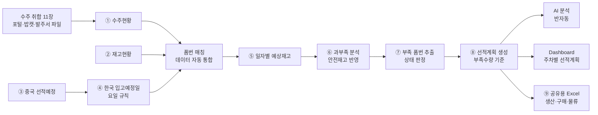
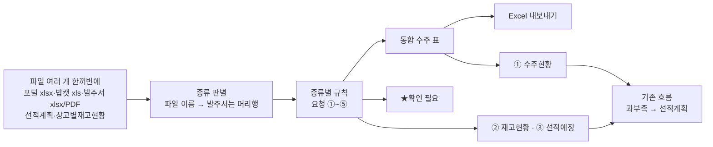

# 생산관리 선적계획 자동화 시스템 — 프로젝트 기획서

| 항목 | 내용 |
|---|---|
| 리포 | data09-18 |
| 제출자 | 안제민 |
| 직무·소속 | 와이어링 하네스 생산관리 / 선적관리 (기획안 「적용업무」 기재). 소속 회사명은 원문 미기재 |
| 과정 | 현장 데이터 디지털화 전문가과정 1차수 |
| 작성일 | 2026-09-28 (v0.3: 2026-09-29, v0.4·v0.5·v0.6·v0.7·v0.8·v0.9·v1.0: 2026-09-30) |
| 문서 상태 | v1.0 — 환율(2026-09-30 요청) 반영: China(RMB) 등 외화 단가를 서울외국환중개 월평균 매매기준율(납기월의 전월 평균)로 원화 단가로 계산, 환율 기준 파일 불러오기 · 직접 입력 · 자동 값(매일 갱신) |

> v1.0 변경 요약: 「통화가 China(RMB) 인 경우 서울외국환중개소 전월 평균 환율로 원화 단가가 나오는지, 안 되면 China(RMB) 버튼으로 환율을 직접 넣을 수 있는지」 요청을 반영했습니다(11.15). **원화 단가는 나옵니다.** 외화 단가(매입단가표의 「통화」 칸 · 「12.5 RMB」 같은 값 · 「매입단가(RMB)」 머리, 고객 발주 파일의 「통화」 칸)는 줄마다 **납기월의 전월 월평균 매매기준율**(설정으로 당월)로 원화로 바꿔 금액 · 비중 · Excel 에 씁니다. 환율은 ① **직접 입력** ② **불러온 환율 기준 파일**(회사 양식 또는 서울외국환중개 월평균 화면을 복사한 표 — 먼저 쓰는 방법) ③ **자동 값**(저장소의 GitHub Actions 가 매일 서울외국환중개에서 받아 두는 월평균) 순서로 찾고, 어디에도 없는 달은 짐작하지 않고 「환율 없음」으로 표시해 금액에서 뺍니다. 새 메뉴 **「환율」**, 매입단가 카드의 **「통화가 적히지 않은 매입단가의 통화 — China(RMB)」** 고르기, 직접 적은 매입단가의 통화 고르기, Excel 「적용 환율」 시트를 더했습니다. 서울외국환중개는 CNY 를 2016년부터 고시하지 않아 China(RMB) 는 원·위안 직거래 시장의 **위안(CNH)** 월평균을 씁니다.
>
> v0.9 변경 요약: 11.13 「남은 확인 부탁」 세 가지에 답을 받았습니다(11.14). ① 생산처 이원화는 1개월 안에 품번별 1곳으로 정리되므로 **매입단가표의 가장 위쪽 단가**를 그대로 씁니다 — 고르는 화면은 두지 않고, 단가가 여럿이었던 품목만 월별 화면·Excel 에 목록으로 보여 주고 통합 수주 표에 「단가 여럿·위쪽」 표시를 붙였습니다. ② 단가가 없는 줄이 있어도 **월별 총금액 비교** — 「10월 수주금액 ○원 · 발주금액 ○원 · 수주금액 대비 발주금액 ○%(비중)」를 월마다 한 줄로 보이고, 비중 = 발주(매입)금액 합계 ÷ 수주금액 합계 × 100 입니다. 합계에서 빠진 줄은 「단가 없음」 행 수로 옆에 붙입니다. 차액·차익률(둘 다 있는 줄)은 보조 정보로 남겼습니다. ③ 월 기준은 **납기월 확정**(발주월 선택은 참고용으로 남김).
>
> v0.8 변경 요약: 「최종 확인 부탁」에 대한 세 번째 답변(2026-09-30)으로 남은 확인이 정해졌습니다(11.13). **업로드는 기존 17열 양식 그대로** — 단가 입력란이 없으므로 도구가 더하던 18번째 「단가」 열을 기본에서 뺐고, 매입단가(생산처 발주단가)·매입금액은 **도구의 결과값**(통합 수주 표·Excel·새 월별 화면)에 둡니다. 17열 가운데 단가·금액에 해당하는 열은 없습니다. **매입단가표는 천일품번 기준**으로 확정되어 매핑된 줄은 천일품번으로만 찾습니다. 작업지시No.·BOM버전·추가문자형식1·창고·적요·하위반제품수·규격은 **모두 비움**이 기본값입니다. 매핑표는 수강생이 직접 고치기로 했습니다. 새 요청 「고객사발주(수주)와 매입금액 비교 — 월별 집계표」는 새 화면 **「월별 수주 vs 매입」**(납기월·발주월, 수주금액·매입금액·차액·차익률, 고객사·구분별, 품목별 상위 N, 쪽마다 단가 없음 행 수, Excel 시트 「월별 수주 vs 매입」)으로 넣었습니다.
>
> v0.7 변경 요약: 패들릿 댓글 두 개(2026-09-30)로 업로드 양식 칸과 단가의 뜻이 정해졌습니다(11.12). **일자 = 등록일자(오늘) `20260930`**, **순번 1, 2, 3**, **품목코드(상단) = 품목코드**, **매핑 없는 품번은 고객사 원품번 그대로** 를 기본값으로 바꾸고, **납품처 코드·납품처명·담당자는 품번별로 직접 적는 표**(한 번 적으면 기억, Excel 로 한꺼번에)를 넣었습니다. 고객사 발주 파일의 단가는 **판매단가(고객 발주)** 로 참고만 하고, 필요한 **매입단가(당사 → 생산처 발주단가)** 는 수강생의 **품목별 단가표**(품목코드 → 매입단가, 생산처 선택)에서 찾아 업로드 양식의 단가 열에 씁니다. 판매 − 매입 차이는 켜면 보입니다. 밥캣 매핑 충돌 3건은 매핑표를 넣으면 화면에 고객사 품번·천일품번 두 값·매핑표 행 번호가 나오고, 그 자리에서 맞는 값을 고를 수 있습니다.
>
> v0.6 변경 요약: 「발주단가도 기재가 필요하다」는 요청을 반영했습니다. 받은 파일마다 단가 열이 있는지 머리행을 확인해 적고(11.11), 통합 수주 표·Excel·수주현황·ERP 업로드 양식에 **발주단가**와 **금액(= 수량 × 단가)**, **단가 출처(원본 · 원본(같은 품번) · 직접입력 · 단가표)** 를 붙였습니다. 원본에 단가가 없는 줄은 비워 두고 「단가 없음」으로 세며, 화면에서 직접 적거나 **단가표(품목코드 → 단가)** 파일로 채울 수 있습니다. 받은 업로드 양식(17열)에는 단가 열이 없어 「수량」 바로 뒤에 「단가」 열을 더하는 것을 기본으로 두고 확인을 부탁드립니다. 다시 받은 첨부로 지금 규칙을 **실제로 다시 돌려**, 11.9 의 계산값을 2026-09-30 실측값으로 바꿨습니다.

> v0.5 변경 요약: 메일로 약속하신 두 파일을 받았습니다 — **고객사 품번 ↔ 천일품번 매핑표**(시트 「건기엔진품목코드」「밥캣품목코드」)와 **ERP 업로드 양식**(시트 「웹자료올리기」, 머리행 17열). 통합 수주 표에 **천일품번** 열을 붙여 재고·선적계획을 천일품번으로 맞추고, 매핑표에 없는 품번은 「★확인 필요 — 매핑 없음」으로 개수와 함께 남기고, 같은 고객사 품번이 서로 다른 천일품번으로 적힌 것은 **매핑 충돌 경고**로 알립니다. 통합 수주를 업로드 양식 17열 순서 그대로 내보내는 「업로드 양식으로 내보내기」를 더했습니다(11.10). 매핑표·양식 원본은 회사 자료라 리포에 넣지 않았습니다.
>
> v0.4 변경 요약: 패들릿 댓글(2026-09-30)로 11.7 확인 부탁에 답을 받았습니다. 엔진 결품·납품예정 겹침은 결품 기준(기본값 그대로), **직송 파일은 AM·CKD 처럼 납품예정과 같이 수주로 넣기**, **밥캣 결품 납기 −2일**, 발주서는 최근 시트만(그대로), **재고 품번의 「완제품」은 사내 완제품 품번이라 그대로** — 도구 기본값과 규칙을 이 답대로 바꿨습니다(11.9). 매핑표·업로드 양식은 메일로 받기로 해 대기입니다.
>
> v0.3 변경 요약: 수강생 메일(2026-09-29, 첨부 16개)의 「수주(발주) 데이터 자동 취합」 요청을 반영했습니다. 고객사 포털 파일·밥캣 xls·발주서(엑셀·PDF)를 한꺼번에 넣어 하나의 수주 표로 만드는 **앞단계**를 이 도구에 붙이고(11장), 그 결과가 입력 ① 수주현황이 되게 했습니다. 첨부 파일의 머리행 구조를 열 매핑표로 적고(11.3), 보내 주신 파일로 돌려 본 결과를 가려 적었습니다(11.6). 1~10장의 선적계획 계산 내용은 그대로입니다.
>
> v0.2 변경 요약: 수강생이 올린 기획안 docx(「AI 데이터 디지털화를 활용한 생산관리 선적계획 자동화 프로젝트 기획안 — 와이어링 하네스 생산관리」)를 반영했습니다. v0.1에서 (가정)으로 두었던 직무, 보유 데이터 항목, 과부족 공식, 상태 구분, Dashboard 구성을 기획안 원문 기준으로 바꿨습니다. 입고예정일 규칙은 기획안 표(월→수, 화→목, 수→금, 목·금→다음 주 월)와 게시물 원문(월~수 선적 → 2일 후, 목~금 선적 → 다음 월요일)이 같은 내용이라 그대로 둡니다.

---

## 1. 추진 배경과 현안

- 와이어링 하네스 생산관리 업무에서 **수주현황, 재고현황, 중국 선적예정 데이터를 각각의 엑셀 파일로 관리**하고 있습니다(기획안 2장).
- 담당자가 세 자료를 취합해 품번별 과부족을 계산하고, 부족수량에 대한 선적계획을 **수작업으로** 세웁니다. 반복 작업이 많고, 수주·선적 변동이 생기면 신속한 대응이 어렵습니다.
- 중국에서 선적한 물량이 한국에 입고되기까지 요일에 따라 입고일이 달라지므로, 이를 반영한 일자별 재고 예측이 필요합니다.

기획안 4장의 현행 문제는 다음과 같습니다.

| 구분 | 현행 문제 (기획안 원문) |
|---|---|
| 데이터 관리 | 여러 엑셀 파일에 데이터 분산 |
| 데이터 취합 | 담당자가 수작업으로 자료 통합 |
| 과부족 계산 | 수식 및 자료 확인 과정에서 오류 가능 |
| 입고예정 | 중국 선적일을 기준으로 별도 계산 필요 |
| 부족품 확인 | 담당자가 전체 품번을 직접 확인 |
| 선적계획 | 담당자의 경험 및 판단에 의존 |
| 긴급 대응 | 수주 변동 시 즉각적인 재계산 필요 |

## 2. 목표

### 2.1 최종 목표

기획안 16장: 「생산관리 담당자가 데이터를 찾아서 계산하는 업무에서, 데이터가 스스로 분석되어 필요한 선적계획을 제시하는 업무로 전환한다.」

- 수주현황·재고현황·중국 선적예정을 넣으면 **한국 입고예정일을 자동 계산**하고, **일자별 예상재고와 과부족**을 품번별로 보여 주는 시스템
- 부족 품번을 자동으로 뽑아 **부족수량 기준 선적계획**을 만들고, **생산·구매·물류 담당자와 공유**
- 부족·긴급 품목을 AI가 우선순위로 설명하고, **주차별 선적계획 Dashboard**로 한눈에 확인
- 향후 확장(기획안 15장): 선적계획 자동화 → 생산계획 자동화 → 구매발주량 자동 산출 → 수요예측 AI → 통합 생산관리 AI 시스템

### 2.2 1차 개발 목표

제출된 업무 흐름 ①~⑨와 기획안 5장 개선 프로세스(데이터 자동 통합 → 품번 매칭 → 입고일 계산 → 예상재고 계산 → 과부족 분석 → 부족품 자동 추출 → 선적계획 자동 생성 → AI 분석 → Dashboard)를 그대로 따라가는 **브라우저 도구**를 먼저 만듭니다.

- 수주·재고·선적예정 Excel 가져오기(열 매핑)
- 입고예정일 규칙 적용 → 일자별 예상재고 → 과부족(안전재고 반영) → 상태 판정 → 부족 품번 추출
- 부족수량 기준 선적계획 생성
- AI 분석은 반자동(질문문 복사 → AI 답 붙여넣기)
- Dashboard와 공유용 Excel 출력

담당자 자동 알림(메일·메신저)은 2단계에서 다룹니다.

## 3. 보유 데이터

기획안 6장 「데이터 구성」 기준입니다. 실제 파일 샘플은 아직 없어 열 이름·시트 구성은 모릅니다. 그래서 1단계 도구는 **열 매핑 화면**으로 실제 열 이름을 나중에 맞춥니다.

| 데이터 | 주요 항목 (기획안 원문) | 형태 | 규모·주기 | 비고(민감도 등) |
|---|---|---|---|---|
| 수주현황 | 품번, 품명, 고객사, 수주일, 납기일, 수주수량 | Excel (기획안 2장) | 품번 수·갱신 주기 미상 | 고객 주문 정보 — 사내 정보. 고객사명은 외부 AI에 보내지 않는 것을 기본값으로 둡니다 |
| 재고현황 | 품번, 품명, 현재고, 가용재고 | Excel (기획안 2장) | 미상 | 기준 시점 미상. 창고가 여럿인지 미상 |
| 선적예정 | 품번, 품명, 중국 선적예정일, 선적수량, 한국 입고예정일 | Excel (기획안 2장) | 미상 | 한국 입고예정일 열이 이미 있으나 규칙으로 다시 계산합니다(5.1). 둘이 다르면 표시합니다 |
| 안전재고 | 품번별 안전재고 | 원문 공식(8장)에는 있으나 **데이터 구성표에는 없음** | 미상 | 어디서 관리하는지 확인 필요(10장). 1단계는 재고현황의 선택 열 또는 전체 기본값으로 받습니다(가정) |

- 예상재고 계산에는 **현재고**를 씁니다(기획안 8장 공식). 가용재고를 써야 하는지는 10장에서 확인하며, 도구에서 기준 열을 고를 수 있게 둡니다.
- 예상재고에서 수주를 빼는 날짜는 **납기일**로 봅니다(가정 — 10장 확인).

## 4. 해결 방안 개요

| 단계 | 내용 |
|---|---|
| 수집 | 수주현황, 재고현황, 중국 선적예정 (Excel) |
| 정리 | 세 파일을 품번 기준으로 맞추고, 선적예정에 입고예정일 규칙을 적용해 입고 일정으로 변환 |
| 분석 | 기획안 8장 공식 — 예상재고 = 현재고 + 입고예정수량 − 수주수량, 과부족수량 = 예상재고 − 안전재고. 품번별 합계와 일자별 흐름을 함께 계산 |
| AI | 계산은 규칙으로 처리. AI는 부족·긴급 품목의 우선순위 설명(기획안 9장)에 사용 — 1단계는 질문문 복사·답 붙여넣기 방식 |
| 산출물 | 과부족 현황표, 선적계획표, 일자별 예상재고표, 부족 품번 목록, Dashboard, 공유용 Excel |

## 5. 주요 기능

### 5.1 한국 입고예정일 규칙 (제출 원문 그대로)

| 중국 선적 요일 | 한국 입고예정일 | 원문 표현 |
|---|---|---|
| 월 | 선적일 + 2일 (수) | 게시물: 월~수 선적 → 2일 후 입고 / 기획안 7장: 월요일 → 수요일 |
| 화 | 선적일 + 2일 (목) | 게시물: 월~수 선적 → 2일 후 입고 / 기획안 7장: 화요일 → 목요일 |
| 수 | 선적일 + 2일 (금) | 게시물: 월~수 선적 → 2일 후 입고 / 기획안 7장: 수요일 → 금요일 |
| 목 | 다음 월요일 | 게시물: 목~금 선적 → 다음 월요일 입고 / 기획안 7장: 다음 주 월요일 |
| 금 | 다음 월요일 | 게시물: 목~금 선적 → 다음 월요일 입고 / 기획안 7장: 다음 주 월요일 |
| 토·일 | 원문에 규칙 없음 | 1단계는 규칙 없음으로 표시하고 계산에서 뺍니다. 파일에 입고예정일이 적혀 있으면 그 값을 씁니다(10장 확인) |

- 이 규칙대로라면 **화요일에 입고되는 선적은 없습니다.** 선적계획을 거꾸로 세울 때 「화요일 부족분」은 전날(월) 입고, 곧 전주 목·금 선적으로 맞춥니다(10장 확인).
- 규칙은 설정 화면에서 요일별 「선적일 + N일」로 바꿀 수 있게 둡니다. 기본값은 위 표(월·화·수 +2, 목 +4, 금 +3)입니다.
- 공휴일·연휴에 입고일이 걸리면 **휴일 목록을 사용자가 넣었을 때 다음 영업일로 미룹니다**(가정).

### 5.2 과부족·상태 판정 (기획안 8장·10장·11장)

| 항목 | 계산 | 근거 |
|---|---|---|
| 예상재고 | 현재고 + 입고예정수량 − 수주수량 (계획 기간 합계) | 기획안 8장 원문 |
| 과부족수량 | 예상재고 − 안전재고 | 기획안 8장 원문. 양수 = 재고 여유, 0 = 적정, 음수 = 재고 부족 |
| 일자별 예상재고 | 기준일 현재고에서 시작해 날짜마다 입고예정을 더하고 납기일 수주를 뺌 | 게시물 흐름 ⑤ |
| 부족수량 | 일자별 예상재고가 안전재고 아래로 가장 많이 내려간 만큼 (없으면 0) | 게시물 흐름 ⑥⑦. 합계로는 맞아도 입고가 늦어 중간에 비는 경우를 잡기 위함 |

상태 구분은 기획안 11장의 「정상 / 부족 / 주의 / 과잉」과 10장 예시의 「긴급」을 씁니다. 원문에 판정 기준이 없어 다음처럼 정하고, 기준값은 모두 설정에서 바꿀 수 있게 둡니다(가정 — 10장 확인).

| 상태 | 판정 기준 (가정) |
|---|---|
| 긴급 | 과부족수량이 음수이고, 첫 부족일이 기준일로부터 **긴급 기준일수** 이내 |
| 부족 | 과부족수량이 음수 |
| 주의 | 과부족수량은 0 이상이지만, 기간 중 어느 날 일자별 예상재고가 안전재고 아래로 내려감(입고 시점이 늦음) |
| 과잉 | 과부족수량이 수주수량 합계 × **과잉 기준 비율** 이상 |
| 정상 | 위에 해당하지 않음 |

- 긴급 기준일수와 과잉 기준 비율은 원문에 값이 없습니다. 기본값은 도구의 설정 화면에서 정하고, 수강생 확인 후 바꿉니다. 기획안 10장 예시표(A001~A004)가 이 판정으로 같은 결과가 나오는지 시험에 넣습니다.

### 5.3 기능 목록

| 기능 | 설명 | 우선순위 |
|---|---|---|
| 수주 자동 취합 (11장) | 고객사 포털 납품예정·누적결품·직송, 밥캣 xls, 발주서(엑셀·PDF), 선적계획·창고별재고현황을 한꺼번에 넣어 종류 판별 → 요청 규칙 → 통합 수주 표 + ★확인 필요, Excel, 「이 수주로 선적계획 계산」 | MVP (2026-09-29 추가) |
| 발주단가 (11.11) | 통합 수주·Excel·업로드 양식에 발주단가·금액·단가 출처. 원본에 없으면 같은 품번 단가 → 직접입력 → 단가표, 그래도 없으면 「단가 없음」 개수 | MVP (2026-09-30 추가) |
| 월별 수주 vs 매입 (11.13 · 11.14) | 납기월(확정)·발주월(참고)별 수주금액(수량 × 판매단가)·발주금액(수량 × 매입단가)·**비중(발주 ÷ 수주 %)**·보조로 차액·차익률(둘 다 있는 줄), 월별 총금액 비교 문장, 단가 여럿 품목 목록(가장 위쪽 단가), 고객사·구분별, 품목별 상위 N, 쪽마다 단가 없음 행 수, Excel 시트 「월별 수주 vs 매입」 | MVP (2026-09-30 추가) |
| 환율 — 외화 단가를 원화로 (11.15) | China(RMB) · USD · JPY · EUR 단가를 납기월의 전월(설정으로 당월) 월평균 매매기준율로 원화 단가로. 환율 = 직접 입력 > 환율 기준 파일(회사 양식 · 서울외국환중개 복사 형식) > 자동 값(서울외국환중개, 매일 갱신). 없으면 「환율 없음」으로 금액에서 뺌. 화면 「환율」, Excel 「적용 환율」 | MVP (2026-09-30 추가) |
| 수주·재고·선적예정 Excel 가져오기 | 세 파일(Excel·CSV)을 읽어 3장의 항목으로 변환. 열 이름이 다를 수 있어 **열 매핑 화면** 제공, 매핑 저장 | MVP |
| 품번 매칭 | 세 자료를 품번으로 묶고, 한쪽에만 있는 품번(예: 수주는 있는데 재고현황에 없음)을 따로 표시 | MVP |
| 입고예정일 자동 계산 | 5.1 규칙으로 선적일 → 입고예정일 변환. 규칙·휴일은 설정에서 변경. 파일의 입고예정일과 다르면 표시 | MVP |
| 일자별 예상재고 | 품번별로 기준일 현재고에서 시작해 날짜마다 입고예정을 더하고 수주를 빼서 계산 | MVP |
| 과부족 분석·상태 판정 | 5.2 공식과 상태 구분(정상·부족·주의·과잉·긴급) 적용, 첫 부족일과 부족수량 표시 | MVP |
| 안전재고 기준 | 품번별 안전재고(재고현황 선택 열) 또는 전체 기본값. 기획안 8장 공식에 들어 있어 v0.1의 확장에서 MVP로 올림 | MVP |
| 부족 품번 추출 | 부족·긴급·주의 품번만 모아 첫 부족일·부족수량 순으로 정렬 | MVP |
| 선적계획 생성 | 부족수량을 채우도록 선적일·수량을 5.1 규칙을 거꾸로 적용해 제안. 선적일이 기준일보다 앞서야 하면 「납기 내 입고 불가」로 표시. 사용자가 수량·날짜를 고칠 수 있음 | MVP |
| AI 분석 (반자동) | 부족·긴급 품번의 수치를 담은 질문문을 만들어 복사 → 사내 허용 AI에 붙여 넣기 → 정해진 형식의 답을 붙여 넣으면 품번별 의견으로 정리. 고객사·품명은 기본적으로 빼고 보냄 | MVP |
| Dashboard | 기획안 11장 항목 — 전체 품번 수, 전체 수주수량, 현재고, 입고예정수량, 부족 품번 수, 부족수량, 금주 선적수량, 긴급 선적 품번, 주차별 선적계획, 상태별 색상 구분 | MVP |
| 공유용 Excel 출력 | 과부족 현황표·선적계획표·부족 품번 목록·일자별 예상재고표·입고예정 계산표를 한 파일로 내보내기. 담당자에게 보낼 안내문 초안 복사 | MVP |
| 선적 단위 반영 | 박스·팔레트 등 선적 단위로 올림 | 확장(단위 확인 후) |
| 최근 수주량 변화 반영 | 기획안 9장의 AI 분석 입력 중 「최근 수주량 변화」 — 과거 수주 이력이 있어야 함 | 확장(이력 확보 후) |
| 담당자 자동 공유 | 선적계획이 만들어지면 생산·구매·물류 담당자에게 메일·메신저 발송 | 확장 |
| 계획 대비 실적 | 실제 입고일·수량을 넣어 계획과 비교 | 확장 |
| 생산계획·구매발주량 자동 산출 | 기획안 15장 향후 확장 계획 | 확장 |

## 6. 기대 산출물

기획안 17장 「최종 산출물」과 맞춥니다.

1. **통합 데이터 관리** — 수주현황 + 재고현황 + 선적예정을 품번으로 묶어 보관·내보내기
2. **품번별 과부족 자동 현황표** — 상태(정상·부족·주의·과잉·긴급) 포함
3. **부족수량 기반 자동 선적계획표** — 선적일·수량·입고예정일
4. **부족/긴급 품목 AI 분석 화면** — 1단계는 반자동
5. **주차별 선적계획 Dashboard**
6. **공유용 Excel** — 생산·구매·물류 담당자 배포용
7. **담당자 자동 공유** — 2단계 (확장)

## 7. 기술 구성

| 과정 도구 | 이 프로젝트에서 쓰는 곳 |
|---|---|
| DAY1 암묵지 자산화·전략기획 | 입고예정일 규칙의 예외(휴일·주말 선적), 긴급·과잉 판정 기준, 안전재고 기준, 선적 수량을 정할 때의 판단 기준을 꺼내 적기 |
| DAY2 코랩(Python)·바이브코딩 | 세 파일 정리, 입고예정일 계산, 일자별 예상재고·과부족 계산 로직 시험, 브라우저 도구 제작 — 이 프로젝트의 중심 |
| DAY3 멀티모달 비정형 정보화 | (필요 시) 중국 쪽에서 오는 선적 안내가 PDF·이미지라면 품번·수량·선적일을 표로 뽑기 |
| DAY4 RAG (Dify, NotebookLM) | 이 프로젝트의 핵심은 계산이라 비중이 낮음. 필요 시 물류 규칙·예외 사례 질의 (확장) |
| DAY5 Make 자동화 | 선적계획 파일을 담당자에게 정기 발송, 공유 폴더 갱신 시 재계산 알림 (확장, 보안 허용 시) |
| 생성형 AI | 부족·긴급 품목 우선순위 설명(기획안 9장), 공유 메시지 초안 |

**개발 형태(권장)**

- **설치 없이 브라우저에서 도는 정적 웹 도구**로 만듭니다. Excel을 브라우저 안에서만 읽고 계산하므로 **수주·재고 정보가 외부로 나가지 않습니다.** 모든 계산이 규칙이라 AI 서비스가 없어도 됩니다.
- AI 분석은 도구가 AI에 직접 접속하지 않고, 질문문을 복사해 사내에서 허용된 AI에 붙여 넣는 방식으로 둡니다. 외부 AI 사용 허용 여부는 10장에서 확인합니다.
- 결과는 지금 쓰는 방식과 같게 **Excel로 내보내** 공유합니다. 받는 사람은 새 도구를 몰라도 됩니다.

## 8. 개발 단계

기획안 13장은 8주 8단계(현행 분석 → 데이터 표준화 → 데이터 통합 → 과부족 계산 → 자동 선적계획 → AI 분석 → Dashboard → 테스트)로 적혀 있습니다. 브라우저 도구로는 이 중 계산·화면 부분을 가상의 데이터로 먼저 만들 수 있어, 아래처럼 묶습니다.

### 1단계 — 지금 바로 개발 가능한 부분

제출된 흐름, 입고예정일 규칙, 과부족 공식, 데이터 항목이 구체적이어서 샘플을 받기 전에도 가상의 데이터로 전체를 만들 수 있습니다. 샘플을 받으면 열 매핑만 맞춥니다.

- (2026-09-29 추가) 수주 자동 취합 — 11장
- 수주·재고·선적예정 Excel 가져오기(열 매핑, 매핑 저장), 품번 매칭
- 입고예정일 계산(5.1 규칙, 규칙 변경, 휴일 목록 선택 입력, 파일 값과 비교)
- 품번별 일자별 예상재고 계산
- 과부족 분석(기획안 8장 공식, 안전재고 반영)과 상태 판정(5.2), 부족 품번 추출
- 부족수량 기준 선적계획 생성(입고예정일 규칙 역산, 사용자 수정 가능)
- AI 분석 반자동(질문문 생성·답 붙여넣기)
- Dashboard(기획안 11장 항목, 주차별 선적계획, 상태별 색상)
- 공유용 Excel 출력과 담당자 안내문 초안
- 시험용 가상 데이터에는 월~금 각 요일 선적, 화요일에 처음 부족해지는 품번, 입고가 늦어 부족이 생기는 품번, 기획안 10장 예시(A001~A004)와 같은 수치의 품번을 넣어 계산이 맞는지 확인합니다.

### 2단계

- 실제 샘플로 열 매핑·계산 보정, 휴일·주말 선적 규칙 확정 반영
- 긴급·과잉 판정 기준, 안전재고 관리 위치 확정 반영
- 선적 단위(박스·팔레트) 올림
- 선적계획 담당자 자동 공유(Make)
- 과거 수주 이력으로 최근 수주량 변화를 AI 분석에 추가

### 3단계

- 계획 대비 실적(실제 입고일·수량) 비교와 입고 지연 추적
- 사내 시스템(ERP 등)에서 수주·재고를 직접 받아오는 연동(가정 — 사내 시스템 확인 후)
- 여러 사람이 같은 계획을 보는 공유 저장소
- 생산계획·구매발주량 자동 산출, 수요예측(기획안 15장)

## 9. 기대 효과

기획안 12장의 개선 효과를 따릅니다.

| 항목 | 개선 효과 (기획안 원문) |
|---|---|
| 데이터 취합시간 | 자동화로 단축 |
| 과부족 계산시간 | 자동 계산으로 단축 |
| 선적계획 작성시간 | 자동 생성으로 단축 |
| 엑셀 수작업 | 반복작업 감소 |
| 데이터 오류 | 수작업 입력 및 계산 오류 감소 |
| 긴급 대응 | 부족품 자동 추출로 대응시간 단축 |

- **계산 기준 일관화** — 누가 계산해도 같은 입고예정일 규칙과 같은 판정 기준을 씁니다.
- **공유 누락 감소** — 생산·구매·물류가 같은 선적계획표를 받습니다.

기획안 14장에는 목표 KPI(데이터 취합시간 50% 이상 단축, 과부족 계산 업무 자동화율 90% 이상, 선적계획 작성시간 50% 이상 단축, 부족품번 자동 추출률 100%, 입고예정일 자동 계산률 100%)가 적혀 있습니다. 이는 수강생이 정한 **목표치**이며, 현재 소요시간 측정값은 제출 자료에 없어 이 문서는 개선 수치를 따로 추정하지 않습니다. 목표 달성 여부는 현재 작업 시간을 먼저 재야 판단할 수 있습니다(10장).

## 10. 확인 필요 사항

**샘플 데이터 (필수)**

1. 수주현황·재고현황·중국 선적예정 Excel 샘플 각 1개 — 실제 열 이름, 시트 구성 (항목은 기획안 6장으로 확인됨)
2. 예상재고에서 수주를 빼는 날짜를 **납기일**로 보는 것이 맞는지 (수주일·출하일·생산 투입일이 아닌지)
3. 재고현황의 **현재고와 가용재고** 중 어느 것을 기준으로 계산할지, 재고 기준 시점(매일 아침 기준인지 등), 창고가 여러 곳인지
4. 품번 수와 한 번에 계획하는 기간(몇 주 앞까지 보는지)
5. 선적예정 파일의 「한국 입고예정일」은 누가 어떻게 적는 값인지 — 규칙 계산값과 다를 때 어느 쪽을 믿을지

**입고예정일 규칙**

6. 토·일요일에 선적하는 경우가 있는지, 있다면 입고일은 언제인지
7. 공휴일·연휴(한국·중국 모두)에 입고일이 걸리면 어떻게 하는지
8. 화요일에 입고되는 선적이 없는데, 화요일 부족분은 월요일 입고(전주 목·금 선적)로 맞추는 것이 맞는지

**계산 기준**

9. 안전재고는 어디에서 관리하는지(품번별로 정해져 있는지, 별도 파일인지) — 기획안 8장 공식에는 있으나 6장 데이터 구성에는 없음
10. 「긴급」 판정 기준 — 첫 부족일이 며칠 안이면 긴급인지, 또는 고객·납기 등 다른 기준인지
11. 「주의」와 「과잉」 판정 기준 — 기획안 11장에 상태 이름만 있고 기준값은 없음
12. 수량 단위(EA, 박스, 팔레트)와 선적 최소 단위
13. 이미 확정된 선적예정과 새로 만드는 선적계획을 어떻게 구분해 관리하는지
14. 기획안 10장 예시의 선적일(9/29)을 정할 때 입고일에 여유를 며칠 두는지

**공유·환경·KPI**

15. 생산·구매·물류 담당자에게 지금은 어떤 방식(메일 첨부, 공유 폴더, 메신저)으로 공유하는지, 기존 공유 양식이 있는지
16. 수주·재고 자료를 외부 AI나 클라우드(코랩 포함)에 올려도 되는지, 사내에서 허용된 AI가 있는지
17. KPI 기준선 — 지금 데이터 취합·과부족 계산·선적계획 작성에 걸리는 시간

**수주 자동 취합 (11장)** — 11.7 확인 부탁 13가지 중 8가지는 2026-09-30 에 답을 받았습니다(11.9). 남은 것은 11.9 끝을 보세요.

## 11. 수주 자동 취합 (앞단계, 2026-09-29 메일 요청)

### 11.1 요청과 반영 방식

수강생이 2026-09-29 메일(「기초자료 송부의 件」)로 첨부 16개와 함께 요청했습니다. 원문 정리본은 `source/2026-09-29_메일_수주취합_요청.md`(고객사 이름을 뺀 것)에 있습니다.

| 요청 | 원문 요지 |
|---|---|
| ① 건기 (인천·군산) | 파일 이름에 「납품예정」이 든 건기 파일에서 품목코드·납품잔량·납기일자 수집. 건기 누적결품은 참고자료 → 수집 제외 |
| ② 엔진 (인천·군산) | 누적결품 우선 반영. 음수 = 고객사 결품일, 납기일 = 결품일 − 2일, 음수 수량은 양수로. 가능하면 작성일자를 발주일자로. 납품예정은 오더유형(V열) Mass PO 제외 후 반영. 결품·납품예정 중복 처리는 확인 필요 |
| ③ 발주서 양식 (7개 고객사) | 파일마다 필요한 항목만 뽑는 열 매핑. PDF 1개는 글자 추출 가능 여부 먼저 확인 |
| ④ 밥캣 | 매크로 생성 로직 문서 참조. 직송 시트 투입 순서 일반 → CKD → AM, 외주와 겹치는 일반 행 제외, 원납기를 [오늘 ~ 마지막 날짜]로 조임. **매크로 대체가 아니라 밥캣 xls 3개를 공통 수주 형식으로 바꾸는 것이 목표** |
| ⑤ 선적계획 | 품목코드 끝 (CI) 자동 삭제. 필요 열: 품목코드 · 미판매수량 · 변경선적요청일 |
| ⑥ 공통 | 모든 양식에 발주일 표시. 결과는 하나의 통합 수주 표: 고객사 · 공장 · 구분 · 품목코드 · 수량 · 납기일 · 발주일 · 원본파일. 창고별재고현황(품목코드·합계)은 재고 부족 확인용 조인 후보 |

**반영 방식** — 새 리포를 만들지 않고 이 도구 앞에 「수주 취합」 화면을 붙였습니다. 이 단계가 만드는 통합 수주 표가 곧 이 도구의 입력 ①「수주현황」이고, 첨부의 선적계획 파일은 입력 ③「선적예정」, 창고별재고현황은 입력 ②「재고현황」에 그대로 맞기 때문입니다.

- 파일은 브라우저 안에서만 읽습니다(SheetJS·pdf.js, 둘 다 `vendor/`). 폐쇄망·`file://` 에서도 돕니다.
- 판별하지 못한 파일, 머리행을 못 찾은 파일, 읽지 못한 칸은 버리지 않고 「★확인 필요」에 파일·행·이유로 남깁니다. 규칙으로 뺀 행(Mass PO, 참고자료 등)은 파일별 집계에 사유와 건수로 보입니다. 그래서 파일마다 **읽은 행 = 수집 + 규칙으로 뺀 행 + ★확인 필요** 가 맞습니다(누적결품은 한 행이 날짜별 여러 줄이 되므로 예외).

### 11.2 파일을 열어 보고 알게 된 것

첨부 16개(번호가 붙은 사본과 안 붙은 사본이 섞여 있고, 내용은 같음 — 도구도 같은 파일이 두 번 들어오면 한 번만 반영합니다)를 풀면 데이터 파일 24개와 매크로 로직 문서 1개입니다.

| 확인한 것 | 결과 |
|---|---|
| 포털 xlsx 12개 | **글자 칸이 모두 빈칸으로 읽혔습니다.** 파일 안 공유 문자열이 `<si >`(태그 뒤 공백)로 적혀 있어 SheetJS 0.18.5 가 글자를 못 읽고 숫자·날짜만 보였습니다. 도구가 파일을 열 때 압축을 풀어 태그 공백만 지우고 다시 읽게 했습니다(`fixZip`, 기존 「자료 가져오기」에도 적용). 고칠 것이 없는 파일은 그대로 읽습니다 |
| 밥캣 `.xls` 3개 | 옛 엑셀(BIFF8, CDFV2) 형식이라 SheetJS 로 그대로 읽힙니다. 다만 **수량·날짜가 모두 글자**로 들어 있습니다(「30」, 「2026/08/18」). 빈 날짜는 「0000/00/00」 |
| 발주서 PDF 1개 | 브라우저 인쇄본이라 글자 층이 있습니다(스캔 아님). pdf.js 로 글자와 위치를 꺼낼 수 있고, 표 머리가 **한 글자씩** 흩어져 있으며 품목코드가 칸 폭 때문에 **두 줄로 나뉘어** 있습니다. 도구가 위치로 표를 다시 짜서 이어 붙입니다 |
| 결품 수량의 부호 | 누적결품은 날짜별 **누적 잔량**입니다. 양수 = 재고 여유, 음수 = 그날까지 쌓인 결품. 날짜가 갈수록 음수가 커지므로, 결품이 전날까지의 최대보다 커진 날에 **늘어난 만큼**이 그날의 결품입니다 |
| 누적결품의 월 칸 | 일별 칸(오늘부터 56일) 뒤에 「11·12·01·02·03」 월 단위 칸이 있습니다(누적값). 날짜가 없어 그 달 첫날(일별 칸과 같은 달이면 일별 마지막 다음날)로 넣었습니다(가정) |
| 밥캣 누적결품의 날짜 | 머리는 「B(D-Day)·B(D+1 Day)…」이고 **바로 아래 행**에 실제 날짜가 있습니다. 영업일만 날짜가 있고 나머지는 「0000/00/00」. 마지막 날짜가 밥캣 원납기 조임의 끝입니다 |
| 오더유형(V열) 값 | 인천건기·인천엔진 납품예정: Mass PO / Proto-Domestic PO · 군산엔진 납품예정·CKD·직송: Mass PO 만 · 밥캣 일반(AI열): Kanban PO / Proto-Domestic PO / Mass PO / Manual PO · 군산건기(예정신고전)은 V열이 「기종-호기」이고 오더유형은 BL열(Z1)·AI열 「오더유형 내역」(Standard PP Order) · 안산AM 은 오더유형 대신 AC열 「발주구분」(NB 일반 / N3 긴급 / N1 장비다운)과 J열 「확정여부」(확정 / 미확정) |
| 날짜 형식 | 포털 xlsx: 날짜 값(셀 서식) · 누적결품 머리: 글자 「2026/09/29」 · 밥캣: 글자 「2026/08/18」 · 발주서: 「20260818」 글자(목록형 A), 「2026-09-02」 글자(목록형 A 의 다른 고객사·목록형 B 납기), 날짜 값(목록형 B 수주일·목록형 C·서식형) · 선적계획: 「2026/11/06 」(끝 공백) · PDF: 「2026/09/18」 |
| 괄호 안 필요 정보 | 괄호 힌트는 **두 파일 이름에만** 있습니다 — `선적계획(품목코드,미판매수량,변경선적요청일)`, `창고별재고현황(품목코드,합계)`. **발주서 7개는 파일 이름에도 파일 안에도 괄호 힌트가 없어**, 머리행 이름으로 품번·수량(잔량)·납기·발주일 네 항목을 골랐습니다(11.7 확인 부탁) |
| 군산건기(예정신고전) | 다른 포털 파일과 양식이 다릅니다(생산오더 단위, 66열). 「납품잔량」 열이 없어 **요청수량**을 수량, **납기일(Actual)** 을 납기, **생성일** 을 발주일로 읽었습니다(가정) |
| 선적계획·창고별재고현황 | 1행이 제목, 2행이 머리입니다. 끝에 월 소계(「2026/09 계」)·「총합계」·「합계」·출력 시각 행이 있어 수량에 섞이지 않게 뺍니다 |

### 11.3 열 매핑표 (파일 종류별)

열은 **이름으로** 찾습니다(열 순서가 바뀌어도 됩니다). 표의 열 문자는 이번 파일 기준입니다.

**포털 납품예정·직송 — 표준 양식** (인천건기·인천엔진·군산엔진·CKD건기 납품예정, 인천건기·인천엔진 직송 · A:No ~ CC:Rev, 81열 · 머리 1행)

| 통합 표 | 원본 열 | 비고 |
|---|---|---|
| 품목코드 | K 품목코드 | |
| 수량 | T 납품잔량 | 0 이면 뺌 |
| 납기일 | Z 납기일자 | 날짜 값 |
| 발주일 | AA 발주일 | 날짜 값 |
| (규칙) | V 오더유형 | 엔진이면 Mass PO 제외 |
| 품명 | L 품목명 | |

**포털 납품예정 — 군산건기(예정신고전)** (A:No ~ BN:ERNAM, 66열) — 품목코드 J · 수량 AE 요청수량 · 납기일 AB 납기일(Actual) · 발주일 AU 생성일 · 오더유형 AI 오더유형 내역(참고)

**포털 납품예정 — 안산AM** (A:품목코드 ~ BA:Maker Part No, 53열) — 품목코드 A · 수량 F 납품잔량 · 납기일 I 납기일자 · 발주일 H 발주일 · 참고 AC 발주구분, J 확정여부

**포털 누적결품** (인천·군산 × 건기·엔진 · A:No ~ CN:Subcontract) — 품목코드 C · 품목명 D · Stock Qty O · 일별 누적 P(오늘) ~ BS(55일 뒤) · 월 칸 BT~BX(11·12·01·02·03) · 발주일 = 파일 이름의 작성일자

**밥캣 누적결품 xls** (A:CK ~ BS:상태) — 품번 D · 품명 E · 현재고 K · 날짜별 누적 L「B(D-Day)」~ AP「B(D+30 Day)」(날짜는 2행) · 발주일 = 파일 이름의 작성일자

**밥캣 납품예정 일반·직송 xls** (A:삭제 ~ CR:자재 유형, 96열) — 품번 T · 수량 AF 납품잔량 · 원납기 AM 납기일자 · 발주일 AN 발주일 · 오더유형 AI · (참고) 조기납품가능일자 AL

**선적계획(미판매현황)** → 입력 ③ 선적예정 — 품번 C 품목코드(끝 (CI) 삭제) · 선적수량 H 미판매수량 · 중국 선적예정일 J 변경선적요청일(비면 I 납기일자 + ★) · 품명 D 품목명(규격)

**창고별재고현황** → 입력 ② 재고현황 — 품번 B 품목코드 · 현재고 G 합계 · 안전재고 R 안전재고(있으면) · 품명 E 품목명

**발주서** — 고객사 이름은 **파일 이름**을 씁니다(코드에 고객사 이름을 두지 않음). 양식은 머리행으로 알아봅니다.

| 양식 | 알아보는 머리 | 품목코드 | 수량 | 납기일 | 발주일 | 이번 파일 |
|---|---|---|---|---|---|---|
| 목록형 A | 자재코드·납품서잔량·납기요청일 | 자재코드 | 납품서잔량 | 납기요청일 | 결재일자 | 2개 고객사(열 순서가 달라도 같은 이름) |
| 목록형 B | 자재코드·납품 가능 수량·납기요청일시 | 자재코드 | 납품 가능 수량(= 수주수량 − 납품서생성수량) | 납기요청일시 | 수주일자 | 1개 |
| 목록형 C | 품목번호·입력가능수량·납기일자 | 품목번호 | 입력가능수량(= 발주 − 누적납품) | 납기일자 | 발주일자 | 1개 |
| 서식형 D | 「품번」과 「발주수량/발주량」이 한 행에 있는 표 | 품번 | 발주수량 칸, 또는 표 아래 날짜 행이 있으면 **날짜 칸마다** 수량 | 「납기일」 칸, 또는 날짜 칸의 날짜 | 「발주일(자)」 칸 | 2개 고객사(한 곳은 시트 20장 — 발주일자가 가장 늦은 시트만) |
| PDF | 「품목코드」 머리 + 「수량」「단가」 글자 위치 | 품목코드(두 줄이면 이어 붙임) | 수량 칸 숫자 | 「납기일자 :」 뒤 날짜 | 「일련번호」의 날짜 | 1개 |

### 11.4 규칙 — 요청 그대로 / 정한 기본값

| 규칙 | 요청 그대로 | 정한 기본값(화면에서 바꿈, 11.7 확인 부탁) |
|---|---|---|
| 건기 | 납품예정만 수집, 누적결품은 참고자료로 제외 | 건기 납품예정은 Mass PO 도 넣음(Mass PO 제외는 엔진 규칙) |
| 엔진 누적결품 | 음수 → 양수, 납기 = 결품일 − 2일, 발주일 = 작성일자 | 누적값의 **날짜별 증가분**을 한 줄씩(「최대 결품 한 줄」로 바꿀 수 있음) · 월 칸 넣음 · 파일 이름 날짜를 작성일자로 |
| 엔진 납품예정 | V열 Mass PO 제외 · **같은 품번이 누적결품에 있으면 누적결품 기준, 납품예정 미반영(2026-09-30 확정)** | 같은 공장 기준으로 봅니다 — 「합산」으로 바꿀 수 있음 |
| 직송 | **납품예정과 동일하게 수주로 넣음(2026-09-30 확정)** | 인천건기·인천엔진 직송은 포털 납품예정 규칙(엔진은 Mass PO 제외·결품 기준), 밥캣 직송은 밥캣 일반 규칙(위블록 겹침 제외·원납기 조임). 끌 수 있음 |
| 안산AM · CKD | **납품예정과 동일하게(2026-09-30 확정)** | 납품잔량·납기일자로 수집, 미확정 AM 도 넣고 비고에 표시(미확정 행은 답을 못 받아 가정 유지) |
| 밥캣 누적결품 | (매크로 위블록) · **납기 = 결품일 − 2일(2026-09-30 확정)** | 음수 → 양수, 날짜별 증가분 |
| 밥캣 납품예정 일반 | 위블록(누적결품) 품번과 겹치는 행 제외, 원납기를 [오늘 ~ 마지막 날짜]로 조임(과거 → 오늘, 뒤 → 마지막 날) | 「오늘」 = 기준일(파일 이름 날짜, 바꿀 수 있음) · 조인 행은 원납기를 비고에 남김 · 외주 7개사 자료는 이번에 없어 위블록 = 밥캣 누적결품만 |
| 밥캣 CKD·AM | 투입 순서 일반 → CKD → AM, CKD·AM 은 외주와 겹쳐도 전량 | CKD건기·안산AM 납품예정 파일은 겹침 제외 없이 전량 넣습니다(규칙과 같음). 매크로의 CKD·AM 이 이 두 파일과 같은 것인지는 확인 부탁 |
| 선적계획 | (CI) 삭제, 품목코드·미판매수량·변경선적요청일 | 변경선적요청일이 비면 납기일자를 쓰고 ★ |
| 창고별재고현황 | **품목코드의 「완제품」은 사내 완제품 품번 — 있는 그대로(2026-09-30 확정)** | 떼지 않고, 수주 품번과 **글자까지 같을 때만** 같은 품번으로 봅니다. ★확인 필요에 올리지 않습니다(다른 한글이 붙은 품번은 그대로 ★) |
| 발주서 | 파일마다 필요한 항목만 · **괄호 힌트 없는 발주서는 최근 시트만(2026-09-30 확정)** | 11.3 표 · 최근 = 발주일자가 가장 늦은 시트 · 날짜로 못 읽은 수량 칸 머리(「추가분」 등)·음수 수량은 ★ |
| 매크로 대체 | 하지 않음 | 사내품번 매핑(VLOOKUP·#N/A 보충)·SUMIFS 집계·오후 추가발주는 이 도구가 하지 않습니다 |

### 11.5 화면과 산출물

- **수주 취합** 화면(메뉴 맨 앞): 파일 끌어다 놓기(여러 개) → 규칙 설정 → 요약(넣은 파일·읽은 행·통합 수주·★확인 필요) → 파일별 결과(판별·읽은 행·수집·뺀 행과 사유·메모) → ★확인 필요 목록 → 통합 수주 표(구분·검색, 납기일 순).
- **통합 수주 Excel** — 시트 `통합수주`(고객사·공장·구분·품목코드·품명·수량·납기일·발주일·원본파일·원본 시트·원본 행·규칙·비고), `파일별집계`, `★확인필요`, `수주현황`(이 도구 표준 열), 넣었으면 `재고현황`·`선적예정`.
- **「이 수주로 선적계획 계산」** — 통합 수주를 입력 ① 수주현황으로, 선적계획 파일을 입력 ③, 창고별재고현황을 입력 ②로 넘기고 기준일을 맞춘 뒤 대시보드로 갑니다. 넣지 않은 자료는 지금 들어 있는 것을 그대로 둡니다. 이후 흐름(과부족·선적계획·AI·공유)은 그대로입니다.
- **예시 파일로 해 보기** — 모든 파일 종류의 가상 예시 25개(`samples/수주취합/`, 같은 머리행·가상 품번 `SMP-…`·고객사A~G)로 바로 돌려 봅니다.

### 11.6 보내 주신 파일로 돌려 본 결과 (로컬에서만, 품번·고객사 가림)

기준일 2026-09-29(파일 이름 날짜), 기본 규칙. 실제 파일은 리포에 넣지 않았습니다.

| 파일 | 읽은 행 | 수집 줄 | 규칙으로 뺀 행 |
|---|---|---|---|
| 납품예정 인천건기 | 345 | 345 | - |
| 납품예정 군산건기(예정신고전) | 440 | 440 | - |
| 납품예정 인천엔진 | 65 | 13 | Mass PO 52 |
| 납품예정 군산엔진 | 17 | 0 | Mass PO 17 (전부 Mass PO) |
| 납품예정 안산AM | 45 | 45 | - |
| 납품예정 CKD건기 | 6 | 6 | - |
| 누적결품 인천건기 · 군산건기 | 167 · 128 | 0 · 0 | 참고자료 167 · 128 |
| 누적결품 인천엔진 | 169 | 963 | 결품 없음 57 (결품 품번 112개 → 날짜별 963줄) |
| 누적결품 군산엔진 | 27 | 470 | 결품 없음 5 (결품 품번 22개 → 470줄) |
| 직송 인천건기 · 인천엔진 | 77 · 5 | 0 · 0 | 직송(수집 안 함) 77 · 5 |
| 밥캣 누적결품 | 147 | 780 | - (147개 품번 모두 결품) |
| 밥캣 납품예정 일반 | 814 | 197 | 위블록 품번과 겹침 617 |
| 밥캣 납품예정 직송 | 238 | 0 | 직송(작업자 확인용) 238 |
| 발주서 목록형 A (2개 고객사) | 7 · 65 | 7 · 65 | - |
| 발주서 목록형 B | 224 | 224 | - |
| 발주서 목록형 C | 8 | 8 | - |
| 발주서 서식형 D (2개 고객사) | 3 · 46 | 3 · 2 | 지난 발주서 시트 41, 이번 발주 없음 3 |
| 발주서 PDF | 1 | 1 | - |
| 선적계획 → 선적예정 | 1,002 | 995 | 소계·합계·출력시각 7 · (CI) 995건 삭제 |
| 창고별재고현황 → 재고현황 | 3,134 | 3,129 | 합계·출력시각 2 |

- **합계**: 파일 24개(사본까지 48개를 넣어도 24개로 판별), 읽은 행 7,180, **통합 수주 3,569줄**(품번 776개, 수량 합계 47,875), 규칙으로 뺀 행 1,416, **★확인 필요 16건** — 창고별재고현황의 품목코드에 「완제품」이 붙은 행 13, 합계가 빈 행 3. 판별하지 못한 파일 0.
- **대조**: 규칙마다 3행씩(건기·AM·CKD·엔진 납품예정·엔진 결품 −2일·밥캣 결품·밥캣 조임 3종·겹침·발주서 양식 5종·선적계획 (CI)·재고) 원본 칸과 맞춰 보았고 48건 모두 일치했습니다. 브라우저에서 같은 파일을 넣어도 같은 수가 나오고, 「이 수주로 선적계획 계산」 뒤 대시보드가 뜨며 새로고침해도 유지됩니다(브라우저 저장 약 160만 자).
- 눈여겨볼 점:
  - 엔진 결품 1,433줄 중 **403줄이 월 단위 칸**(11월 말~3월)에서 나왔습니다. 날짜가 그 달 첫날로 가정된 줄이라, 월 칸을 넣을지(11.7)에 따라 수주가 크게 달라집니다.
  - 기준일 전 납기 줄이 78개입니다(오늘 이미 결품 → 결품일 − 2일이 지난 날). 선적계획 계산에서는 기준일로 모아 뺍니다(4장 가정 그대로).
  - 오늘 파일에서는 엔진 납품예정(Mass PO 를 뺀 13줄)과 엔진 결품의 품번이 **겹치지 않아**, 「결품 우선」과 「합산」의 결과가 같습니다.
  - 직송을 넣으면 통합 수주가 3,873줄(+304)이 됩니다.
  - **밥캣 품번 294개 중 128개는 창고별재고현황에 없는 번호**입니다. 매크로가 하는 「사내 품번 매핑(VLOOKUP)」이 이 도구에는 없어서, 재고·선적계획과 품번으로 묶을 때 이 128개는 재고 0 으로 계산됩니다(11.7).
  - 전체로는 수주 품번 776개 중 500개가 창고별재고현황에, 288개가 선적계획에 있습니다.

### 11.7 확인 부탁

1. **엔진 결품과 납품예정에 같은 품번**이 있으면 결품으로 덮을까요(기본), 더할까요? (오늘 파일은 겹치는 품번이 없어 결과가 같습니다) → **답(09-30): 누적결품 기준, 납품예정 미반영** — 기본값 그대로 확정
2. **직송 파일**(인천건기·인천엔진 직송, 밥캣 직송)도 수주로 넣을까요? 기본은 넣지 않음입니다. → **답: 넣음(납품예정과 동일)** — 기본값을 「넣음」으로 바꿨습니다
3. **안산AM·CKD건기** 규칙 — 건기처럼 납품잔량·납기일자로 넣었습니다. AM 의 「미확정」 행도 넣을까요? 밥캣 매크로의 「CKD·AM」 이 이 두 파일과 같은 것인가요? → **답: 납품예정과 동일하게 넣음** — 확정. 「미확정」 AM 행과 매크로 CKD·AM 이 같은 파일인지는 답이 없어 남김
4. **ERP 업로드 양식**이 따로 있나요? 있으면 샘플 1개를 주시면 통합 표를 그 열 순서로도 내보내겠습니다. → **답: 메일로 보내 주시기로 함** → **09-30 수령, 반영(11.10)**
5. **밥캣 결품의 납기**도 엔진처럼 결품일 − 2일로 당길까요? 지금은 0일(결품일 그대로)입니다. → **답: −2일** — 기본값을 2일로 바꿨습니다
6. **누적결품 → 수주 줄**: 날짜별 늘어난 만큼 여러 줄(기본)이 맞나요, 품번당 「가장 큰 결품을 첫 결품일에」 한 줄이 맞나요?
7. **누적결품의 월 칸(11·12·01·02·03)** 을 수주로 넣을까요? 넣는다면 날짜는 그 달 첫날이 맞나요?
8. **군산건기(예정신고전)** 는 수량 = 요청수량, 납기 = 납기일(Actual), 발주일 = 생성일로 읽었습니다. 맞나요?
9. **발주서 7개의 필요 항목** — 파일에 괄호 힌트가 없어 11.3 표처럼 골랐습니다. 특히 수량을 잔량 열(납품서잔량·납품 가능 수량·입력가능수량)로 본 것이 맞는지 봐 주세요.
10. 시트가 여럿인 **서식형 발주서**는 발주일자가 가장 늦은 시트만 읽습니다. 지난 시트에도 아직 안 들어간 수량이 있나요? → **답: 최근 시트만이 맞음** — 확정
11. **밥캣 품번 ↔ 사내 품번 매핑표**를 받을 수 있을까요? 받으면 통합 표에 사내 품번 열을 붙여 재고·선적계획과 맞추겠습니다. → **답: 고객사 품번 ↔ 당사 품번 매핑표를 메일로 보내 주시기로 함** → **09-30 수령, 반영(11.10)**
12. 창고별재고현황에 품목코드 끝·앞에 「완제품」이 붙은 품번이 13개 있습니다. 붙은 말을 떼고 같은 품번으로 볼까요? → **답: 당사 내부 완제품 품번이니 있는 그대로** — 떼지 않고 정확히 같은 품번끼리만 맞춥니다. ★확인 필요에서 뺐습니다
13. 밥캣 위블록에 들어가는 **외주 업체 자료**(매크로 문서의 7개 업체)도 이 도구에 넣을까요? 이번 첨부에는 없어 밥캣 누적결품만으로 겹침을 판단했습니다.

### 11.8 다음 단계

- ~~메일로 받을 고객사 품번 ↔ 당사 품번 매핑표를 불러와 통합 표에 당사 품번 열 붙이기, ERP 업로드 양식 열 순서로 내보내기~~ → 09-30 반영(11.10)
- 업로드 양식의 채울 수 없는 열(11.10 확인 부탁) 답을 받으면 기본값으로 반영
- 밥캣 CKD·AM 파일, 외주 업체 자료가 오면 같은 방식으로 추가
- 매크로(`.xlsm`) 생성·포털 다운로드 자동화는 하지 않습니다 — 요청 ④ 대로 이 도구는 공통 수주 형식 변환까지입니다

### 11.9 2026-09-30 반영 (패들릿 댓글 답변)

원문은 `source/2026-09-30_패들릿_답변.md`. 11.7 의 13가지 중 8가지에 답을 받았습니다.

| 11.7 | 답 | 도구에 한 일 |
|---|---|---|
| 1 결품·납품예정 겹침 | 엔진 누적결품과 납품예정에 같은 품번 → **누적결품 기준(납품예정 미반영)** | 기본값과 같아 **확인됨**. 설정 설명을 「확정」으로 |
| 2 직송 | 직송 파일도 **납품예정과 동일하게 수주로** | 기본값 **넣지 않음 → 넣음**. 엔진 직송도 Mass PO 제외·결품 기준을 똑같이 받고, 밥캣 직송은 밥캣 일반과 같이 위블록 겹침 제외·원납기 조임 |
| 3 AM·CKD | 납품예정과 동일하게 | 지금 규칙과 같아 **확인됨**. 파일 메모의 「확인 부탁」 문구를 확정으로 |
| 5 밥캣 결품 납기 | 결품일 기준 **−2일** | 기본값 **0 → 2일**. 파일 메모에 「−2일 당김」 표시 |
| 10 발주서 시트 | 괄호 힌트 없는 발주서는 **최근 시트만** | 지금 규칙과 같아 **확인됨** |
| 12 「완제품」 품번 | 당사 내부 완제품 품번 — **있는 그대로** | 품번은 원래도 떼지 않았고, **★확인 필요에서 뺌**(파일 메모에 개수만 표시). 수주 품번과 글자까지 같을 때만 같은 품번(떼어 맞추지 않음) |
| 4 업로드 양식 · 11 품번 매핑표 | 메일로 보내 주시기로 함 | **대기** — 받으면 11.8 대로 |

- 이 브라우저에 예전 설정이 저장돼 있어도 **이번에 확정된 칸(직송·밥캣 당김·겹침·시트)만** 새 기본값으로 한 번 되돌립니다(규칙 판 `2026-09-30`). 기준일·고객사 이름 같은 나머지 설정은 그대로 둡니다. 새 판에서 직접 바꾼 값은 유지됩니다.
- `supabase/schema.sql` 의 `intake_setting` 기본값도 같게 바꿨습니다(`bobcat_short_offset` 2, `collect_direct` true, 이미 만든 표에는 `alter column … set default` — 저장된 행은 그대로).
- **09-29 결과(11.6)에 주는 영향 — 2026-09-30 실측**: 첨부를 다시 받아 지금 규칙(직송 넣음·엔진 결품 우선·밥캣 −2일·「완제품」 그대로·발주서 최근 시트)으로 다시 돌렸습니다. 통합 수주 3,569 → **3,873줄**(+304, 직송), ★확인 필요 16 → **3건**(합계 빈 행 3 — 「완제품」 13건이 빠짐). 밥캣 −2일은 줄 수를 바꾸지 않고 밥캣 결품 780줄의 납기만 이틀 당깁니다. 앞서 계산으로 적었던 값과 같게 나왔습니다. 전체 수는 11.11 「다시 센 결과」에 있습니다.

**아직 답을 받지 못한 것** — 6 누적결품 줄 만들기(날짜별 증가분), 7 월 칸, 8 군산건기(예정신고전) 열, 9 발주서 필요 항목(잔량 열), 13 외주 업체 자료, 3 의 「미확정」 AM 행. 지금 기본값(가정)으로 돌고, 화면에서 바꿀 수 있습니다.

### 11.10 2026-09-30 반영 — 품번 매핑표·ERP 업로드 양식 수령

메일로 약속하신 두 파일을 받았습니다(정리본 `source/2026-09-30_메일_매핑표_업로드양식.md`). **원본은 실제 회사 품번이라 리포에 넣지 않았고**, 같은 시트 이름·열 이름에 가상 품번을 넣은 예시를 `samples/품번매핑_업로드양식/` 에 두었습니다.

**받은 파일의 구조**

| 파일 | 시트 | 머리행 | 행 수 |
|---|---|---|---|
| 건기, 밥캣 품번.xlsm (매크로 포함) | 건기엔진품목코드 | 고객사 \| 천일품번 | 1,296 |
| 〃 | 밥캣품목코드 | 고객사 \| 천일품번 | 1,737 |
| Template.xlsx | 웹자료올리기 | 일자 · 순번 · 추가문자형식1 · 납품처 코드 · 납품처명 · 담당자 · 납기일자 · 품목코드(상단) · 작업지시No. · 품목코드 · 품목명 · BOM버전 · 규격 · 수량 · 창고 · 적요 · 하위반제품수 (17열) | 머리행만 |

**매핑표를 돌려 본 결과** (로컬에서만, 품번은 적지 않고 개수만)

| 묶음 | 읽은 행 | 고유 고객사 품번 | 같은 줄 반복 | 한쪽이 빈 행 | 매핑 충돌 | 두 품번이 같음 | 한 천일품번을 여러 고객사 품번이 같이 씀 |
|---|---|---|---|---|---|---|---|
| 건기·엔진 | 1,296 | 1,296 | 0 | 0 | 0 | 1,255 (다른 것 41) | 5 |
| 밥캣 | 1,737 | 1,684 | 43 | 7 | **3** (각 2개 값) | 1,351 (다른 것 333) | 3 |

- 두 시트에 모두 있는 고객사 품번이 12개이고, 그중 10개는 시트마다 천일품번이 다릅니다. 그래서 **구분별로 시트를 나눠 찾습니다** — 건기·엔진·AM·CKD 행은 「건기엔진품목코드」, 밥캣 행은 「밥캣품목코드」. 발주서(그 밖의 고객사)는 매핑표가 없어 품번 그대로 씁니다(「매핑 대상 아님」).
- 대부분(건기·엔진 97%, 밥캣 80%) 두 품번이 같아, **매핑표에 없는 품번은 기본으로 고객사 품번 그대로 계산**하고 ★확인 필요에 남깁니다(설정으로 「선적계획에서 뺌」 가능).
- 칸 하나에 앞뒤 공백이 있어, 품번은 앞뒤·가운데 공백을 없애고 대문자로 맞춰 찾습니다(기호는 그대로).

**도구에 한 일**

| 요청 | 한 일 |
|---|---|
| 매핑표 불러오기 | 수주 취합 화면 「3. 품번 매핑표」 — xlsm·xlsx·csv(매크로는 읽지 않고 표만). 시트 이름(「건기·엔진」「밥캣」)으로 묶음을 알아보고, 시트가 하나인 CSV 는 파일 이름이나 「구분」 열로. 한 묶음만 든 파일을 넣으면 그 묶음만 바뀝니다. **이 브라우저(localStorage)에만 저장**, 리포·외부로 보내지 않음 |
| 천일품번 열 | 통합 수주 표·Excel 에 「천일품번」「매핑」 열. 「이 수주로 선적계획 계산」은 **천일품번으로** 입력 ① 수주현황을 만들어 재고(창고별재고현황)·선적계획과 맞춥니다 |
| 매핑 없음 | 「★확인 필요 — 매핑 없음 N건」 — 고객사 품번마다 한 줄(행 수·수량·원본파일), KPI 에 품번 수·행 수 |
| 중복·충돌 | 똑같은 줄 반복은 한 번만 셉니다. **같은 고객사 품번 → 서로 다른 천일품번은 경고**(매핑표 카드 목록 + 해당 수주 행 ★확인 필요 「매핑 충돌」), 계산은 위쪽 행 값 |
| 업로드 양식 내보내기 | 「업로드 양식으로 내보내기」 — 시트 「웹자료올리기」, 양식 17열 순서 그대로. 회사 양식 파일을 넣으면 그 파일의 머리행 순서를 따르고(열이 늘거나 바뀌어도), 내장 기본은 머리행 이름만 담았습니다 |

**업로드 양식 열 채우기 (v0.5 당시 기본값 — 2026-09-30 두 번째 답변으로 일자·순번·납품처·품목코드(상단)·매핑 없는 품번이 확정됨, 11.12)**

| 열 | 채우는 값 |
|---|---|
| 일자 | **오늘(올리는 날)** — 설정으로 발주일·취합 기준일 |
| 순번 | **행마다 1, 2, 3…** — 설정으로 「같은 일자·납품처는 같은 순번(한 전표)」 |
| 납기일자 | 통합 수주의 납기일(엔진·밥캣 결품은 −2일 당긴 값) |
| 품목코드 | **천일품번** |
| 품목명 | 수주 파일의 품명(설정으로 비움) |
| 수량 | 통합 수주의 수량 |
| 납품처 코드 · 납품처명 · 담당자 | 비움 — 화면의 **납품처 설정표**(고객사 · 공장 · 구분마다 한 줄)와 기본 담당자에 적으면 채움 |
| 품목코드(상단) | 비움 — 설정으로 「품목코드와 같게」 |
| 추가문자형식1 · 작업지시No. · BOM버전 · 규격 · 창고 · 적요 · 하위반제품수 | 비움 — 화면의 **고정값** 표에 적으면 모든 행에 넣음 |
| 매핑 없는 품번 | **내보내지 않음**(틀린 품목코드가 ERP 에 올라가지 않게) — 설정으로 고객사 품번 그대로 |

날짜는 `2026-09-30` 모양 글자로 썼습니다(설정으로 `20260930`). → 11.12 확정: `20260930`.

**확인 부탁 (업로드 양식)**

1. **일자**는 올리는 날(오늘)인가요, 발주일인가요? → **답: 등록일자(TODAY)**
2. **순번**은 한 줄마다 1, 2, 3… 인가요? → **답: 1, 2, 3 순차** 아니면 같은 순번끼리 한 전표(작업지시서 한 장)로 묶이나요 — 묶인다면 무엇 기준(납품처별·납기일별)인가요?
3. → **답: 수기입력, 품번별로 다름**(11.12). **납품처 코드·납품처명**: 고객사·공장·구분(예: 인천 건기, 군산 엔진, 밥캣)마다 코드가 정해져 있나요? 목록을 주시면 설정표 기본값으로 넣겠습니다.
4. **담당자**: 고정 한 사람인가요, 납품처마다 다른가요? → **답: 수기입력**
5. → **답: 같은 값**. **품목코드(상단)** 과 **품목코드** 는 어떻게 다른가요? 완제품을 상단에, 하위 품목을 아래에 적는 양식이면 상단 = 천일품번, 품목코드 = 비움(또는 같은 값) 중 무엇인가요?
6. **작업지시No. · BOM버전 · 추가문자형식1 · 창고 · 적요 · 하위반제품수**: 비워 두면 ERP 가 채우나요, 고정값이 있나요?
7. **품목명·규격**: 비워도 ERP 가 품목코드로 채우나요? 지금은 수주 파일의 품명을 넣습니다.
8. → **답: `20260930`**. **날짜 모양**: ERP 가 `2026-09-30` 글자를 받나요, `20260930` 이나 엑셀 날짜여야 하나요?
9. 매핑표에 없는 품번(주로 두 품번이 같은 경우로 보입니다)은 **고객사 품번 그대로** 올려도 되나요? → **답: 매핑표는 주기적으로 갱신 예정이라 고객사 원품번 그대로 등록**
10. 밥캣 매핑표의 **충돌 3건**(같은 고객사 품번에 천일품번 2개)은 어느 쪽이 맞나요? 지금은 위쪽 행 값을 씁니다. → 「어떤 품번인지」 되물으셔서 화면에 보이게 했습니다(11.12)
11. **발주서 고객사**(목록형 A·B·C·서식형·PDF) 품번도 매핑이 필요한가요? 지금은 품번 그대로 씁니다.

**실제 수주 파일로 다시 돌리기**: 09-30 에는 실제 매핑표 × 리포의 가상 예시 수주로 동작만 확인했습니다(예시 품번은 매핑표에 없으니 25행 모두 「매핑 없음」 19품번, 발주서 15행은 「대상 아님」 — 기대대로). 이후 수주 첨부는 다시 받아 11.11 에서 다시 셌지만, **매핑표(xlsm)·업로드 양식(Template.xlsx) 원본은 이 작업 환경에서 지운 뒤라 실제 수주에 매핑을 다시 적용하지 못했습니다** — 실제 수주 파일에서 「매핑 없음」이 몇 품번인지는 아직 세지 못했습니다. 매핑표를 도구에 넣으시면 화면의 「★확인 필요 — 매핑 없음」에 바로 나옵니다.

### 11.11 2026-09-30 반영 — 발주단가 (요청 「발주단가도 기재가 필요하다」)

**받은 파일마다 단가가 있는지** — 머리행 이름만 적습니다(값은 적지 않음).

| 자료 | 단가 열(머리행 이름) | 금액·단위 열 | 도구가 읽는 것 |
|---|---|---|---|
| 포털 납품예정 인천건기 · 인천엔진 · 군산엔진 · CKD건기 | `발주단가` | `발주금액`(= 발주수량 × 발주단가, 실제 파일 전 행 일치) · `미납금액` · `발주단위`(EA) · `통화`(KRW) | 발주단가 |
| 포털 납품예정 안산AM | `발주단가` | `발주금액` · `납품잔량금액` · `발주단위` · `화폐`(KRW) | 발주단가 |
| 포털 납품예정 군산건기(예정신고전) | **없음**(생산오더 양식) | `산처리금액`만 — 단가가 아님 | 같은 품번의 다른 포털 파일 단가 |
| 포털 직송 인천건기 · 인천엔진 | `발주단가` | 납품예정과 같은 열 | 발주단가 |
| 포털 누적결품 4종 (건기·엔진 × 인천·군산) | **없음** | 없음 | 같은 품번의 납품예정·직송 단가 |
| 밥캣 납품예정 일반 · 직송 (xls) | `발주단가` · `사급단가` · `총단가` | `발주금액` · `사급금액` · `총금액` · `미납금액` · `통화`(KRW) — 값이 「1,234」 같은 글자 | 발주단가(받은 파일은 사급단가가 모두 0 이라 총단가 = 발주단가) |
| 밥캣 누적결품 (xls) | **없음** | 없음 | 같은 품번의 밥캣 납품예정·직송 단가 |
| 발주서 목록형 A (2개 고객사) | `단가` | `금액`(= 수량 × 단가) · `화폐` | 단가 |
| 발주서 목록형 B | `단가` | 금액 열 없음 · `통화` | 단가 |
| 발주서 목록형 C | `발주단가` | `발주금액` · `가격단위`(받은 파일은 모두 1) · `통화` | 발주단가 ÷ 가격단위 |
| 발주서 서식형 D (날짜 칸 하나) | 표 머리 `단가` | `금액`, 머리 칸 `발주금액:` | 단가 |
| 발주서 서식형 D (날짜별 수량) | **없음** | 머리 칸 `합계금액 : 일금`만 | 단가표·직접입력 |
| 발주서 PDF | 표 머리 `단가` | `공급가액` · `부가세` | 단가(단가 × 수량 ≠ 공급가액이면 ★확인 필요) |
| 선적계획 | **없음** | `미판매부가세`만 — 발주단가가 아님 | 읽지 않음 |
| 창고별재고현황 | `완제품단가` · `반제품단가` · `일반무역단가(RMB)` · `외주단가` | — | 읽지 않음(사내 단가라 고객 발주단가와 다름 — 확인 부탁 3) |

받은 파일의 통화 칸은 모두 KRW 입니다. 원화가 아닌 값이 오면 환산하지 않고 ★확인 필요 「통화가 원화가 아님」으로 알립니다.

**도구에 한 일**

| 요청 | 한 일 |
|---|---|
| 통합 수주 표에 발주단가 | 「발주단가」「금액」 열(화면·Excel `통합수주`), Excel 에는 「단가 출처」 열도. 금액 = 수량 × 단가(원 단위 소수 둘째 자리 반올림). 수량은 통합 수주의 수량(잔량·결품 증가분)이라 원본 「발주금액」(발주수량 기준)과 다를 수 있습니다 |
| 단가를 정하는 순서 | ① **원본** — 그 줄의 단가 칸 ② **원본(같은 품번)** — 단가 칸이 없는 줄(누적결품·군산건기 예정신고전)은 같은 고객사·같은 품번의 다른 파일 단가(규칙으로 뺀 행의 단가도 씀). **값이 한 가지일 때만** 채우고, 두 가지 이상이면 비우고 알림 ③ **직접입력** — 화면 「단가 없음」 목록에 적은 값 ④ **단가표** — 사용자가 넣은 파일. 원본이 있으면 원본을 쓰고, 단가표가 원본과 다르면 품번 수만 알립니다 |
| 단가 없음 | 비워 두고 KPI 「발주단가 — 단가 없음 N행(M품번)」, 카드 목록(품번마다 행 수·수량·원본파일, 수량 큰 순 200개), Excel `단가없음` 시트, 파일별 결과에 「단가 있음 / 없음」 |
| 단가표 | 「단가표 넣기」 — xlsx·xls·csv, 열 `품목코드`(품번·천일품번·자재코드 등) \| `단가`(발주단가 등), `고객사` 열은 선택(있으면 그 고객사 줄에만). 고객사 품번·천일품번 어느 쪽으로 적어도 찾습니다. 같은 품번이 두 값이면 위쪽 값 + 「단가 충돌」 개수. **이 브라우저에만 저장**(`data09-18.priceTable`). 가상 예시 `samples/품번매핑_업로드양식/단가표_예시.xlsx` |
| ERP 업로드 양식 | 받은 Template 17열에는 단가 열이 **없습니다**. 그래서 기본은 「수량」 **바로 뒤에 「단가」 열을 더해 18열**로 내보냅니다(단가 없는 줄은 빈칸). 설정으로 「더하지 않음(양식 그대로)」. 회사 양식에 `단가`·`발주단가`·`금액`·`공급가액` 열이 있으면 더하지 않고 그 열에 채웁니다 |
| 수주현황(선적계획 입력) | 표준 열 뒤에 「발주단가」「금액」을 붙였습니다(자동 열 매핑에는 영향 없음 — 테스트로 확인) |
| DB | `supabase/schema.sql` — `intake_order_line.unit_price`·`amount`·`price_source`·`currency`(단가 0·음수 거부, 금액 = round(수량 × 단가, 2), 단가가 있으면 출처 필수·없으면 셋 다 비움), 새 표 `price_master`(단가표·직접입력, 고객사·품번마다 한 줄), `upload_setting.price_col`, `intake_setting.borrow_price` |

**다시 센 결과 (2026-09-30 실측, 로컬에서만 — 품번·고객사 가림)**

다시 받은 첨부 48개(번호 붙은 사본·같은 zip 두 벌 포함)를 지금 규칙 그대로 넣었습니다. 기준일 2026-09-29(파일 이름 날짜). 매핑표·단가표 없이, 직접입력 없이.

| 항목 | 값 |
|---|---|
| 넣은 파일 / 서로 다른 파일 | 48 / **24**(같은 내용 24개는 한 번만 반영) |
| 읽은 행 | **7,180** |
| 통합 수주 | **3,873줄** · 품번 **950개** · 수량 합계 59,327 |
| 규칙으로 뺀 행 | **1,112** — 건기 누적결품 참고자료 295, 밥캣 위블록 겹침 628(일반 617 · 직송 11), 엔진 Mass PO 74(인천 52 · 군산 17 · 직송 5), 결품 없음 62, 지난 발주서 시트 41, 이번 발주 없음 3, 소계·합계·출력시각 9 |
| ★확인 필요 | **3건**(창고별재고현황 합계 빈 행 3) + 같은 파일이 두 번 들어옴 알림 24 |
| 단가 있음 | **2,497줄** — 원본 1,218 · 원본(같은 품번) 1,279 |
| 단가 없음 | **1,376줄 · 178품번** |
| 같은 품번에 원본 단가가 두 가지 이상 | 13품번(엔진 12 · 밥캣 1, 규칙으로 뺀 Mass PO·겹침 행의 단가까지 셈) — 그 품번의 결품 465줄은 채우지 않고 비움. 통합 수주에 남은 원본 줄끼리는 단가가 갈리는 품번이 없음 |
| 업로드 양식 | 18열(17 + 단가), 3,873행 중 단가 빈칸 1,376행 |

자료별 단가 있음 / 없음 (줄 수):

| 자료 | 통합 수주 줄 | 단가 있음 | 단가 없음 | 비고 |
|---|---|---|---|---|
| 포털 납품예정 인천건기 · 안산AM · CKD건기 · 인천엔진 | 345 · 45 · 6 · 13 | 전부 | 0 | 원본(군산엔진 17줄은 전부 Mass PO 로 빠짐) |
| 포털 납품예정 군산건기(예정신고전) | 440 | 94 | **346** | 단가 열 없음 — 94줄만 같은 품번 단가 |
| 포털 직송 인천건기 | 77 | 77 | 0 | 원본(인천엔진 직송 5줄은 Mass PO 로 빠짐) |
| 포털 누적결품 인천엔진 · 군산엔진 | 963 · 470 | 351 · 65 | **612 · 405** | 단가 열 없음 — 같은 품번 단가로 채움, 없거나 두 가지면 비움 |
| 밥캣 납품예정 일반 · 직송 | 197 · 227 | 전부 | 0 | 원본 |
| 밥캣 누적결품 | 780 | 769 | **11** | 같은 품번의 밥캣 납품예정 단가(겹쳐서 뺀 행 것 포함) |
| 발주서 목록형 A · A · B · C · 서식형 D · PDF | 7 · 65 · 224 · 8 · 3 · 1 | 전부 | 0 | 원본 |
| 발주서 서식형 D(날짜별 수량) | 2 | 0 | **2** | 단가 열 없음 |

- 11.9 에 계산값으로 적었던 3,873줄 · ★확인 필요 3건이 실측과 같았습니다.
- PDF 1줄은 단가 × 수량 = 공급가액으로 맞았습니다(★확인 필요 0).
- **품번 매핑은 다시 적용하지 못했습니다** — 매핑표 xlsm 원본을 이 작업 환경에서 지운 뒤라, 위 수는 모두 고객사 품번 기준입니다. 매핑표를 도구에 넣으면 같은 화면에서 천일품번과 「매핑 없음」 수가 함께 나옵니다.

**확인 부탁 (발주단가)**

→ 2026-09-30 두 번째 답변: 고객사 발주단가는 **판매단가**이고, 필요한 것은 **당사 → 생산처 매입단가**(품목별 단가표 따로 있음). 아래 1·4·5 는 판매단가(참고)에 관한 것이라 급하지 않게 되었고, 3 은 「매입단가표를 넣는다」로 답이 되었습니다. 2(ERP 단가 열)는 아직 남았습니다 — 11.12.

1. **자료마다 단가가 다를 때 어느 것을 쓸까요?** 같은 품번이 발주번호마다 단가가 다른 경우가 13품번(엔진 12 · 밥캣 1)입니다. 지금은 원본 줄은 자기 줄의 단가를 그대로 쓰고, 단가 칸이 없는 결품 줄에는 채우지 않습니다(465줄). 「가장 최근 발주일의 단가」로 채워도 될까요? 결품 줄에 수량을 나눠 붙일 발주가 따로 있나요?
2. **ERP 업로드 양식의 단가 열** — 받은 양식에는 단가 열이 없습니다. 「수량」 뒤에 「단가」를 더해도 ERP 가 받나요? 정해진 열 이름·위치(예: 공급가액·금액 포함)가 있으면 알려 주세요.
3. **단가표가 따로 있나요?** 누적결품·군산건기(예정신고전)·날짜별 서식 발주서처럼 단가 칸이 없는 자료를 채울 품목별 단가표(품목코드 | 단가)가 있으면 그 파일을 넣으면 됩니다. 창고별재고현황의 `완제품단가`를 대신 써도 되나요(사내 단가라 고객 발주단가와 다를 수 있어 지금은 쓰지 않습니다)?
4. **금액의 기준 수량** — 지금은 통합 수주 수량(잔량·결품 증가분) × 단가입니다. 원본 「발주금액」(발주수량 기준)이 필요한가요?
5. **밥캣 단가** — 발주단가·사급단가·총단가 중 발주단가를 씁니다. 사급이 있는 품번이면 총단가가 맞나요?

### 11.12 2026-09-30 반영 — 두 번째 답변 (업로드 양식 확정 · 판매단가/매입단가 · 밥캣 충돌)

원문 `source/2026-09-30_패들릿_답변2.md`.

> 일자 및 날짜 모양 : 등록일자 20260930 / 순번 : 1,2,3, 순차적용 / 납품처코드 및 납품처명 담당자는 수기입력 품번별 납품처가 상이함 / 품목코드(상단) = 품목코드 동일한 값 입력 / 매핑표는 주기적으로 업데이트예정으로 고객사 원품번 그대로 등록 / 밥캣 충돌 3건?? >> 어떤품번인지.... / 발주단가 추가 부탁드립니다
>
> 고객사에서 접수받은 발주단가는 판매단가이기에 매입단가 관리차원에서 말씀드렸습니다 / 품목별 단가표 따로 가지고 있습니다 / 고객사 발주단가와 무관하게 당사 > 생산처 발주단가 관리필요 / 일자 >> TODAY · 순번 >> 1,2,3 · 납품처 코드 >> 수기입력 · 담당자 >> 수기입력

**업로드 양식 — 확정값** (가정 → 확정)

| 열 | v0.5~v0.6 기본값 | 확정 (v0.7 기본값) |
|---|---|---|
| 일자 | 오늘, `2026-09-30` 모양 | **등록일자 = 오늘, `20260930`** (납기일자도 같은 모양) |
| 순번 | 행마다 1, 2, 3… | 확인됨 — **1, 2, 3 순차** |
| 납품처 코드 · 납품처명 · 담당자 | 고객사 · 공장 · 구분마다 한 줄 설정표 | **품번별 수기입력** — 아래 「품번별 납품처」 |
| 품목코드(상단) | 비움 | **품목코드와 같은 값** |
| 품목코드 | 천일품번 | 천일품번 — **매핑표에 없으면 고객사 원품번 그대로**(빼지 않음) |
| 단가(더한 열) | 고객 발주단가 | **매입단가(생산처 발주)** — 아래 |

이전 판에서 이 브라우저에 저장된 업로드 설정은 열 때 한 번 확정값으로 바뀝니다(설정 판 번호 `v: 2`). 적어 둔 납품처·고정값은 그대로 둡니다. 확정값도 화면에서 바꿀 수 있게 남겨 두었습니다.

**품번별 납품처 (수기입력을 쉽게)**

- 업로드 카드에 **「품번별 납품처」 표** — 이번 수주에 나갈 품목코드마다 한 줄(고객사·구분·행 수·수량), 칸 세 개(납품처 코드·납품처명·담당자). 한 번 적으면 **이 브라우저에 기억**해서 다음 취합에도 같은 품번이면 그대로 채웁니다.
- 천일품번으로 기억하고, 매핑이 나중에 붙어도 찾도록 **고객사 원품번으로 적은 값도 찾습니다.**
- 줄마다 **「위와 같게」** 버튼(바로 위 품번 값 복사), **「납품처가 빈 품번만 보기」**, 검색.
- 많을 때는 **「품번별 납품처표 내려받기(Excel)」** → 엑셀에서 채움 → **「품번별 납품처표 넣기」**. 빈 칸은 기존 값을 지우지 않습니다. 이번 수주에 없는 기억 값도 표에 함께 나가 잃지 않습니다.
- 품번별 값이 없으면 예전의 「고객사 · 공장 · 구분」 설정표를 **묶음 기본값(선택)** 으로 쓰고, 담당자는 그래도 없으면 기본 담당자. 미리보기에 「납품처 코드 없음 N행」.

**밥캣 충돌 3건 — 「어떤 품번인지」에 대한 답**

충돌 3건은 보내 주신 매핑표 「밥캣품목코드」 시트에서 **같은 고객사 품번이 서로 다른 천일품번 두 개로 적힌 경우**입니다. 실제 품번은 회사 자료라 이 기획서·게시글·리포에는 적지 않고, **도구에서 바로 보이게** 했습니다.

- 「수주 취합 → 3. 품번 매핑표」에 매핑표를 넣으면 **「매핑 충돌 N건」 표**에 묶음 · **고객사 품번** · **천일품번 후보 두 개와 각각의 매핑표 시트·행 번호** · 이번 수주에 그 품번이 몇 행 있는지가 나옵니다.
- 줄마다 **「쓸 천일품번」** 을 고르면 그 값으로 계산·업로드하고 「매핑 충돌」 표시가 없어집니다(이 브라우저에 기억, 매핑표를 다시 넣어도 같은 충돌이면 유지 — 충돌이 없어지거나 고른 값이 후보에서 빠지면 버림). 고르지 않으면 지금처럼 위쪽 행 값.
- **「충돌 목록 내려받기(Excel)」**, 통합 수주 Excel 에도 `매핑충돌` 시트. 가장 확실한 것은 행 번호를 보고 매핑표 자체를 고치는 것입니다.

**단가 — 판매단가(고객 발주)와 매입단가(생산처 발주)를 나눔**

| | 판매단가(고객 발주) | 매입단가(생산처 발주) |
|---|---|---|
| 뜻 | 고객사가 보낸 발주 파일의 단가 — 당사가 파는 값 | 당사 → 생산처 발주단가 — 관리하려는 값 |
| 출처 | 원본 단가 칸 → 같은 품번의 다른 파일(11.11 그대로) | **매입단가표**(품목코드 → 매입단가, 생산처 선택) → 없으면 **직접입력** |
| 쓰임 | 참고(화면·Excel) | **ERP 업로드 양식의 「단가」 열**, 매입금액 |
| 화면 | 통합 수주 표 「판매단가(고객 발주)」(흐린 글씨) | KPI · 카드 「매입단가(생산처 발주) — 없음 N행」, 표 「매입단가 · 생산처 · 매입금액」 |

- 매입단가표는 xlsx·xls·csv, 열 **`품목코드`**(천일품번·당사품번·품번) | **`매입단가`**(구매단가·발주단가·단가) | **`생산처`**(선택, 매입처·공급처 등). 한 표에 「단가」와 「매입단가」가 함께 있으면 매입단가를 읽고, **「판매단가」 열은 읽지 않습니다**(판매단가 열만 있으면 알림). 같은 품목코드가 다른 값으로 두 번 있으면 위쪽 행 + 「단가 충돌」 목록(행 번호).
- 찾는 순서: 천일품번 → 고객사 원품번(매핑 없는 품번). **단가표가 직접입력보다 우선**합니다 — 직접입력은 단가표에 없는 품목을 메우는 용도이고, 나중에 단가표에 생기면 단가표 값을 씁니다(화면에 「직접 적은 값 중 N개는 이제 단가표 값을 씀」).
- 「매입단가 없는 품목을 단가표 양식으로 내려받기」 — `품목코드 | 품목명 | 생산처 | 매입단가` 빈칸 양식. 채워서 다시 넣으면 그대로 읽힙니다.
- **판매 − 매입 차이 보기**(선택): 켜면 통합 수주 표·Excel 에 「판매−매입」 열, 카드에 차이 금액 합계와 **매입이 판매보다 비싼 줄** 수. 둘 다 있는 줄만 계산합니다.
- 업로드 양식: 양식에 단가 열이 없으면 「수량」 뒤에 「단가」(= **매입단가**)를 더합니다(11.11 과 같은 자리). 회사 양식에 `매입단가`·`발주단가`·`단가` 열이 있으면 매입단가, `판매단가` 열이 있으면 판매단가, `생산처` 열이 있으면 생산처를 채웁니다.
- 매입단가표·직접 적은 값은 실제 회사 자료라 **이 브라우저에만** 저장합니다(`data09-18.buyPriceTable`). v0.6 의 「단가표」(고객 발주 단가를 채우던 표, `data09-18.priceTable`)는 뜻이 바뀌어 읽지 않고 지웁니다 — 그 표에 적은 값이 있었다면 매입단가표로 다시 넣어 주세요. 가상 예시 `samples/품번매핑_업로드양식/매입단가표_예시.xlsx`.

**DB (`supabase/schema.sql`)**

- `intake_order_line`: 기존 `unit_price · amount · price_source` 는 **판매단가(고객 발주)** 로 뜻을 정하고 출처를 `원본 · 원본(같은 품번)` 으로 좁힘(오전판의 직접입력·단가표 값은 판매단가가 아니므로 비움). 새 칸 **`buy_price · buy_amount · buy_source(단가표·직접입력) · maker`** + 제약(0·음수 거부, 매입금액 = round(수량 × 매입단가, 2), 매입단가가 있으면 출처 필수).
- `price_master`: **매입단가표**로 뜻을 바꿈 — `item`(당사 품목코드) · `maker`(생산처) · `unit_price`(매입단가), UNIQUE `(owner_id, price_kind, item)`. 오전판 표가 있으면 옛 행(고객 발주 단가)을 지우고 `customer` 칸을 뺍니다.
- `upload_setting`: 기본값 `date_format = compact` · `top_item = same` · `unmapped = keep`, 새 칸 `item_parties`(품번별 납품처, 객체).
- `part_mapping.chosen`: 충돌에서 고른 값(고객사 품번마다 하나 — 부분 UNIQUE 인덱스).
- 로컬 PostgreSQL 하네스 통과(두 번 적용 포함) + **v0.6 스키마 위에 v0.7 을 두 번 적용**해 옮겨지는 것도 확인.

**남은 확인 부탁** → 2026-09-30 세 번째 답변으로 1·2·4 가 정해졌고 5 는 수강생이 매핑표를 직접 고치기로 했습니다(11.13). 3 은 네 번째 답변(11.14)에서 「가장 위쪽 단가」로 정해졌습니다.

1. **ERP 가 「단가」 열이 하나 더 붙은 양식(18열)을 받나요?** 정해진 칸 이름·위치가 있으면 알려 주세요. 없으면 「더하지 않음」으로 17열 그대로 올리고 단가는 ERP 에서 따로 넣는 방법도 있습니다.
2. **매입단가표의 품목코드는 천일품번인가요?** 지금은 천일품번으로 먼저 찾고 없으면 고객사 원품번으로 찾습니다. 열 이름이 `품목코드 · 매입단가 · 생산처` 와 다르면 머리행 이름만 알려 주세요(값은 필요 없습니다).
3. 같은 품목을 **생산처 여러 곳**에 다른 단가로 발주하나요? 그렇다면 어느 생산처 단가를 쓸지(지금은 표의 위쪽 행).
4. (11.10-6·7·11 남음) 작업지시No.·BOM버전·추가문자형식1·창고·적요·하위반제품수·규격은 비워도 되나요? 품목명은 수주 파일의 품명을 넣어도 되나요? 발주서 고객사 품번도 매핑이 필요한가요?
5. 밥캣 충돌 3건 — 도구의 「매핑 충돌」 표에서 맞는 값을 골라 주시거나 매핑표를 고쳐 주세요.

### 11.13 2026-09-30 반영 — 세 번째 답변 (17열 그대로 · 천일품번 · 빈 열 확정) + 새 요청 「월별 수주 vs 매입」

원문 `source/2026-09-30_패들릿_답변3.md` (「최종 확인 부탁」 글의 댓글, 2026-09-30T03:42Z).

> 기존양식으로 사용되며 기존양식에 단가 입력란이 없으므로 결과값에 생산처발주단가를 대입해야합니다
>
> 고객사발주(수주)와 매입금액 비교까지 가능하면 좋겠습니다. 월별 집계표 — 수주 VS 매입

**확인 부탁 → 확정**

| 11.12 확인 부탁 | 답 | 도구에 한 일 |
|---|---|---|
| 1. ERP 가 18열(단가 열 더함)을 받나 | **기존 17열 양식 그대로, 단가 입력란 없음.** 생산처 발주단가는 결과값에 | 업로드 설정 「양식에 단가 열이 없을 때」 기본을 **더하지 않음(17열 그대로)** 으로 바꿈(설정 판 3 — 이 브라우저에 판 2 이하로 저장된 설정은 열 때 한 번 「더하지 않음」으로 바뀜). 「더함」은 선택으로 남김. 매입단가·매입금액은 **통합 수주 표·통합 수주 Excel(`통합수주`·`수주현황`)·새 화면 「월별 수주 vs 매입」** 에 둠 |
| (17열 중 단가·금액 칸이 있나) | — (도구에서 확인) | 17열(일자 · 순번 · 추가문자형식1 · 납품처 코드 · 납품처명 · 담당자 · 납기일자 · 품목코드(상단) · 작업지시No. · 품목코드 · 품목명 · BOM버전 · 규격 · 수량 · 창고 · 적요 · 하위반제품수) 가운데 **단가·금액에 해당하는 열은 없습니다.** 적요(메모)에 넣을 수도 있으나 아래 답대로 비웁니다. 그래서 17열 양식에는 단가를 넣지 않았습니다. 회사 양식에 `단가`·`매입단가`·`금액` 같은 열이 있는 파일을 넣으면 그 열에 매입단가·매입금액을 씁니다(11.12 그대로) |
| 2. 매입단가표 품목코드가 천일품번인가 | **천일품번 — 확정** | 매핑된 줄은 **천일품번으로만** 찾습니다. v0.7 은 천일품번에 없으면 고객사 품번으로 한 번 더 찾았는데, 고객사 품번이 다른 품목의 천일품번과 우연히 같으면 틀린 단가가 붙을 수 있어 뺐습니다. 매핑표에 없는 줄(고객사 원품번 그대로 올리는 줄)만 그 원품번으로 찾습니다 |
| 4. 작업지시No. · BOM버전 · 추가문자형식1 · 창고 · 적요 · 하위반제품수 · 규격 | **모두 비움 — 확정** | 기본값이 원래 빈칸이었고, 고정값 표에 「확정: 비움」 표시. 판 2 이하로 저장된 설정에 이 7열의 고정값이 적혀 있으면 열 때 지웁니다(다른 열의 고정값·납품처는 그대로) |
| 5. 밥캣 충돌 3건 | **수강생이 매핑표를 직접 고침** | 도구는 그대로 — 고친 매핑표를 다시 넣으면 충돌이 없어지고, 도구에서 골라 둔 값은 충돌이 사라지면 버립니다(11.12) |
| 3. 같은 품목의 생산처가 여럿일 때 | 답 없음 | 그대로 — 표의 위쪽 행 + 「단가 충돌」 목록 |

**새 요청 — 월별 수주 vs 매입 (새 화면, 메뉴 「월별 수주 vs 매입」)**

| 항목 | 내용 |
|---|---|
| 수주금액 | 수량 × **판매단가**(고객사 발주 파일의 단가 — 원본 · 원본(같은 품번), 11.11) |
| 매입금액 | 수량 × **매입단가**(당사 → 생산처 발주단가 — 매입단가표(천일품번) → 직접입력, 11.12) |
| 월 기준 | **납기월**(기본) · 발주월(고르기). 날짜가 없는 줄은 「(납기일 없음)」「(발주일 없음)」 한 칸 |
| 월별 표 | 행 수 · 수량 · 수주금액 · **수주단가 없음(행)** · 매입금액 · **매입단가 없음(행)** · 비교한 행 · 차액 · 차익률 + 합계, 수주·매입 막대 |
| 차액 · 차익률 | **두 단가가 모두 있는 줄끼리** — 차액 = 수주금액 − 매입금액, 차익률 = 차액 ÷ 그 줄들의 수주금액 × 100. 한쪽만 있는 줄을 섞으면 차액이 그만큼 부풀거나 줄어들기 때문입니다. 합계 금액은 쪽마다 따로 보이고, 빠진 줄은 「단가 없음」 행 수·수량으로 알립니다 |
| 나눠 보기 | 월 행을 누르거나 「보일 월」을 고르면 그 달의 **고객사 · 구분별** 표와 **품목별 상위 N**(수주금액 큰 순, 기본 20, 나머지는 「그 밖 N품목」 한 줄). 품목은 천일품번(매핑 없으면 고객사 원품번)으로 묶음 |
| Excel | 화면의 「Excel 내려받기」 → 시트 **「월별 수주 vs 매입」**(월별 표 + 합계 · 고객사·구분별 · 품목별, 월마다와 전체). 통합 수주 Excel 에도 같은 시트를 붙임 |
| DB | `supabase/schema.sql` 에 뷰 `intake_monthly_summary`(batch · 월 기준 · 월마다 같은 계산, `security_invoker` 라 통합 수주 줄의 RLS 그대로). 계산값이라 새 표는 만들지 않았습니다. `upload_setting.price_col` 기본값 `none` |

- 판매단가는 고객 발주 파일의 단가 칸이라 **누적결품·군산건기(예정신고전)·날짜별 서식 발주서처럼 단가 칸이 없는 파일의 줄은 「수주단가 없음」** 이 됩니다(같은 품번의 다른 파일 단가가 한 가지면 채움 — 11.11). 11.11 의 실측(2026-09-29 파일)으로는 3,873줄 중 1,376줄이 판매단가 없음이었습니다. 수주금액 합계는 이 줄을 빼고 셉니다.
- 예시 데이터(가상, 예시 매입단가표만 넣고 매핑표 없이)로 본 화면: 수주금액 6,343,467 · 매입금액 1,099,800(예시 매입단가표) · 비교한 9행의 차액 53,400 · 차익률 9.2% · 수주단가 없음 15행 · 매입단가 없음 22행 — 금액은 모두 가상입니다.

**남은 확인 부탁** → 2026-09-30 네 번째 답변으로 1~3 모두 정해졌습니다(11.14).

1. 같은 품목을 **생산처 여러 곳**에 다른 단가로 발주하나요? 그렇다면 어느 생산처 단가를 쓸지(지금은 매입단가표의 위쪽 행).
2. 월별 표의 **차액을 「두 단가가 모두 있는 줄끼리」** 로 계산했습니다. 「수주금액 합계 − 매입금액 합계」가 필요하시면 알려 주세요(단가 없는 줄이 많으면 그 값은 실제와 크게 다릅니다).
3. 월별 기준은 **납기월**을 기본으로 했습니다. 매입을 발주한 달(발주월) 기준이 더 맞으면 기본값을 바꾸겠습니다.

### 11.14 2026-09-30 반영 — 네 번째 답변 (가장 위쪽 단가 · 총금액 비교 · 납기월 확정)

원문 `source/2026-09-30_패들릿_답변4.md` (11.13 「남은 확인 부탁」 1~3 에 대한 답).

> 현재 생산처 이원화로 진행되지만 향후(1개월이내) 품번별 생산처는 1곳으로 지정되기 때문에 현재기준 가장 위쪽단가로 해도 무방합니다
>
> 단가가 없더라도 총금액비교 ex) 10월 수주금액 ****원 10월 발주금액 ****원 수주금액 대비 발주금액 **%(비중)
>
> 납기월 기준으로 부탁드립니다

| 11.13 확인 부탁 | 답 | 도구에 한 일 |
|---|---|---|
| 1. 생산처가 여럿일 때 쓸 매입단가 | **매입단가표의 가장 위쪽 단가 — 확정** (1개월 안에 품번별 생산처 1곳으로 정리 예정) | 계산은 원래대로 파일 순서상 첫 행 값. 고르는 화면은 만들지 않았습니다. 대신 ① 통합 수주 표의 매입단가 칸에 **「단가 여럿·위쪽」** 표시 ② 월별 화면에 **「매입단가표에 단가가 둘 이상인 품목 N개」** 접이식 목록(쓴 단가·생산처·행 / 다른 값 / 이번 수주 행 수) ③ Excel 시트 「월별 수주 vs 매입」 끝에 같은 목록. 생산처가 1곳으로 정리되면 목록이 저절로 비고 표시도 사라집니다 |
| 2. 차액 계산 방식 | **단가가 없더라도 총금액 비교 — 수주금액 · 발주금액 · 비중(%)** | 월마다 **수주금액 합계**(판매단가 있는 모든 줄) · **발주금액 합계**(매입단가 있는 모든 줄) · **비중 = 발주금액 ÷ 수주금액 × 100** 을 더했습니다. 두 단가가 한 줄에 다 있는지와 상관없이 합계끼리 나눕니다. 합계에서 빠진 줄은 「수주단가 없음 N행 · 매입단가 없음 N행」으로 같은 줄에 붙여 합계를 어떻게 읽을지 알 수 있게 했습니다. 기존 차액·차익률(둘 다 있는 줄끼리)은 **보조 정보**로 남겼습니다 |
| 3. 월 기준 | **납기월 — 확정** | 기본값은 원래 납기월. 고르기 칸에 「납기월 — 확정」「발주월 — 참고」로 적고, Excel 첫 줄에 「기준: 납기월(확정)」을 씁니다. 발주월은 참고용으로 남겼습니다 |

**화면·Excel 에서 달라진 것 (메뉴 「월별 수주 vs 매입」)**

| 곳 | 내용 |
|---|---|
| KPI | 수주금액 · 발주금액(매입) · **비중(발주 ÷ 수주)** · 수주단가 없음 · 매입단가 없음 · 보조: 차액 · 차익률 |
| 새 카드 「납기월별 총금액 비교」 | 월마다 한 줄 — 예) `2026-10 수주금액 2,000원 · 발주금액 980원 · 수주금액 대비 발주금액 49.0% (수주단가 없음 1행 · 매입단가 없음 1행)`, 맨 아래 전체 기간 |
| 월별 표 · 고객사·구분별 · 품목별 | 「매입금액」을 「발주금액(매입)」으로 부르고 **비중(발주÷수주)** 열을 더함 |
| Excel 시트 「월별 수주 vs 매입」 | 맨 위에 **월별 총금액 비교**(월 · 수주금액 · 발주금액 · 비중 % · 수주단가 없음 · 매입단가 없음 · 행 수 + 합계), 그 아래 기존 상세(비중 열 추가) · 고객사·구분별 · 품목별, 끝에 단가 여럿 품목 목록. 통합 수주 Excel 에 붙는 같은 시트도 같습니다 |
| DB | 뷰 `intake_monthly_summary` 에 `share` 열(발주금액 합계 × 100 ÷ 수주금액 합계, 소수 1자리) |

- 손으로 계산한 예(테스트 표): 10월 = 10개 × 판매 100 / 매입 70, 5개 × 판매 200 / 매입 없음, 4개 × 판매 없음 / 매입 70 → 수주금액 1,000 + 1,000 = 2,000 · 발주금액 700 + 280 = 980 · 비중 49.0%. 둘 다 있는 줄끼리의 차익률은 30.0% 로 따로 봅니다.
- 비중은 **단가가 빠진 줄이 많을수록 실제와 멀어집니다** — 예를 들어 매입단가표가 절반만 채워져 있으면 발주금액이 작게 나와 비중도 작게 나옵니다. 그래서 같은 줄에 「단가 없음」 행 수를 붙였습니다. 매입단가 없는 품목은 수주 취합 화면에서 단가표 양식으로 내려받아 채울 수 있습니다(11.12).
- 예시 데이터(가상, 예시 매입단가표만 넣고 매핑표 없이)로 본 화면: 전체 수주금액 6,343,467 · 발주금액 1,099,800 · 비중 17.3% (수주단가 없음 15행 · 매입단가 없음 22행), 10월 17.7%, 단가 여럿 품목 1개(예시 SMP-C105 — 위쪽 500 사용, 아래 520) — 금액은 모두 가상입니다.

**남은 확인 부탁** — 없습니다. 다음은 2단계(판정 기준 확정, 선적 단위 올림, 담당자 자동 공유)입니다.

### 11.15 2026-09-30 반영 — 환율 (China(RMB) 단가를 원화로)

원문 `source/2026-09-30_패들릿_요청_환율.md`.

> 통화가 China(RMB) 경우 환율적용을 그때그때 달라지는데 환율을 서울외국환중개소 전월평균으로 끌고와서 원화단가 산출되는지도 확인부탁드립니다. 만약 원화단가 산출 불가시 China(RMB) 버튼추가하여 환율 직접입력가능한지...

**답: 원화 단가는 나옵니다.** 서울외국환중개 월평균 값을 자동으로 받아 두고, 회사 기준 환율 파일을 불러오거나 직접 입력할 수도 있습니다. 환율 기준은 **파일로 불러오는 것을 먼저 쓰는 방법**으로 두었습니다(같은 날 방향 정리 — 사이트에서 읽어 오는 값은 함께 쓰는 보조 출처).

**1. 규칙**

| 항목 | 정한 것 |
|---|---|
| 환율 | 서울외국환중개 「월평균 매매기준율」 — 외화 1단위당 원(엔화는 100엔당) |
| 어느 달 환율 | 그 줄의 **납기월의 전월 평균**(기본). 예: 납기 2026-10-15 → 2026-09 월평균. 설정으로 「당월 평균」 |
| 찾는 순서 | ① **직접 입력**(환율 화면) ② **불러온 환율 기준 파일** ③ **자동 값**(서울외국환중개 — 매일 받아 둠, 끌 수 있음) |
| 환율이 없을 때 | 짐작하지 않습니다. 그 줄은 **「환율 없음」** 으로 표시하고 금액 합계에서 빼며, 「단가 없음」과 따로 셉니다. 납기일이 없는 외화 줄도 환율 월을 정할 수 없어 「환율 없음」 |
| 원화 단가 | 외화 단가 × 환율 ÷ 단위 → **소수 둘째 자리 반올림**(0.005 는 올림). 예: 12.5 위안 × 190.35 = 2,379.375 → **2,379.38 원** |
| 금액 | 수량 × 원화 단가(기존 규칙 그대로 소수 둘째 자리, 화면 합계는 원 단위). 예: 100개 → 237,938 원 |
| China(RMB) | 「China(RMB)」「RMB」「CNY」「CNH」「위안」을 모두 같은 통화로 읽습니다. 서울외국환중개는 **CNY 를 2016-01-01 부터 고시하지 않고**(화면 공지), 원·위안 직거래 시장의 **「위안 (CNH)」** 매매기준율을 냅니다 — 자동 값은 이 CNH 월평균입니다 |
| 전월 평균이 아직 없는 달 | 월평균은 그 달이 끝나야 나옵니다. 2026-09-30 기준 가장 최근 값은 **2026-08**(CNY 208.69). 납기 10월 줄에 쓸 9월 평균은 10월 1일 자동 갱신 때 들어오고, 납기 11·12월 줄(10·11월 평균)은 그때까지 「환율 없음」입니다. 미리 계산이 필요하면 회사 기준 파일이나 직접 입력으로 채웁니다 |

**2. 어디에서 외화를 알아보나**

| 자료 | 읽는 곳 |
|---|---|
| 매입단가표 | 「통화」 칸(통화명 · 화폐 · currency), 값에 붙인 통화(「12.5 RMB」「CNY 12.5」), 머리의 통화(「매입단가(RMB)」). 아무 것도 없으면 매입단가 카드의 **「통화가 적히지 않은 매입단가의 통화」**(기본 원화, **China(RMB)** 선택 가능) |
| 직접 적은 매입단가 | 「매입단가 없음」 목록의 줄마다 통화 고르기(기본은 위 설정) |
| 고객 발주 파일(판매단가) | 원래 있던 「통화」 칸(받은 파일은 모두 KRW). 원화가 아니면 같은 규칙으로 원화로 바꿉니다(★확인 필요 문구도 「환산하지 않음」에서 「원화로 바꿔 계산」으로) |
| 모르는 통화 | HKD 처럼 목록에 없는 통화, 「¥」(엔 · 위안 둘 다 쓰는 기호)는 짐작하지 않고 「통화를 알 수 없음」 — 매입단가표에서는 그 행을 건너뛰고 문제 목록에 적습니다 |

**3. 환율 기준 파일 (먼저 쓰는 방법)**

메뉴 「환율」 → 「1. 환율 기준 파일 불러오기」. Excel(xlsx · xls) · CSV · 텍스트를 넣거나, 표를 복사해 붙여 넣습니다. 다시 넣으면 새 파일로 바뀝니다. 이 브라우저에만 저장합니다.

| 모양 | 머리 예 | 비고 |
|---|---|---|
| 세로 — 회사 양식 | `연월 · 통화 · 환율(원) · 단위 · 비고(출처)` | 양식 `samples/환율/환율기준_양식.xlsx`(빈 「환율기준」 시트 + 「예시」 · 「안내」 시트). 「예시」 시트는 다른 시트에 값이 하나도 없을 때만 읽습니다 |
| 세로 — 서울외국환중개 화면 복사 | `날짜 · 통화명 · 월평균 매매기준율` (예: `2026.08 · 위안 (CNH) · 208.69`) | 통화명의 「(100)」으로 엔화 단위를 압니다. 엑셀이 `2026.10` 을 숫자 2026.1 로 바꿔도 10월로 읽습니다. 예: `samples/환율/환율기준_서울외국환중개_복사형식_예시.csv` |
| 가로 | `연월 · CNY · USD · JPY(100) …` | 통화마다 한 열 |
| 통화 칸 없는 세로 | `연월 · 환율` | 시트 이름이나 파일 이름의 통화(「CNY 환율」)로 읽습니다 |

- 서울외국환중개의 Excel 내려받기는 **로그인한 회원만** 됩니다(비회원은 「로그인이 필요합니다」). 회원용 Excel 파일의 모양은 확인하지 못했습니다 — 넣어 보고 읽지 못하면 화면 표를 드래그해 복사한 것을 「표 붙여넣기」에 넣어 주세요(이 모양은 확인함).
- 같은 통화 · 같은 달이 두 번 다르게 적혀 있으면 위쪽 값을 쓰고 문제 목록에 적습니다. 연월 · 통화 · 숫자를 읽지 못한 행은 「못 읽은 행」으로 셉니다.

**4. 자동 값 — 서울외국환중개에서 매일 받기**

- 브라우저에서 smbs.biz 를 바로 부르면 **CORS 로 막힙니다**(응답에 `Access-Control-Allow-Origin` 없음 — 2026-09-30 curl 로 확인). 그래서 저장소의 GitHub Actions(`.github/workflows/rates.yml`, 매일 09:10 · 수동 실행 가능)가 `scripts/fetch-rates.mjs` 를 돌려 `data/rates.json`(기계용) · `data/rates.js`(도구가 읽음 — 파일로 연 index.html 에서도 동작)를 같은 저장소에 넣습니다. 값이 바뀐 날만 커밋하고 Pages 빌드를 요청합니다.
- 받는 곳: `http://www.smbs.biz/ExRate/MonAvgStdExRate.jsp` 에 폼(통화 · 시작 연월 · 끝 연월)을 보내 최근 24개월. 화면 글자가 「사이트보안」으로 감싸져 있어(`d1('%_Z32…')`) 사이트의 풀이 방법(`%_X` 의 `_X` 를 빼고 unescape)을 그대로 씁니다. 통화: CNY 칸 ← CNH, USD, JPY(100엔당), EUR.
- 한 통화를 받지 못하면 그 통화는 지난 값을 그대로 두고, 화면 구조가 바뀌어 모두 실패하면 워크플로가 실패로 끝납니다(값을 지어내지 않음).
- 2026-09-30 받은 값(월평균, 원): CNY(CNH) 2026-06 225.51 · 07 220.94 · **08 208.69** / USD 08 1,406.30 / JPY 08 885.63(100엔당) / EUR 08 1,629.78.

**5. 화면 · Excel**

| 곳 | 내용 |
|---|---|
| 메뉴 「환율」(새) | 1. 환율 기준 파일 불러오기(파일 · 붙여넣기 · 빈 양식 · 예시 · 원본 링크) 2. 설정(전월/당월 · 통화가 적히지 않은 매입단가의 통화 · 자동 값 함께 쓰기) 3. **이번 수주에 쓰는 환율 · 직접 입력**(통화 · 환율 월 · 쓰는 값 · 출처 · 쓰는 줄 수, 칸에 적으면 직접 입력이 가장 먼저) · 다른 달 직접 입력 4. 자동 값 상태(받은 때 · 최근 값) 5. 알고 있는 환율 전체(출처별 값) · 「적용 환율」 Excel |
| 수주 취합 — 매입단가 카드 | 「통화가 적히지 않은 매입단가의 통화」(원화 / **China(RMB)** / USD / JPY / EUR), 외화 줄 수 · 환율 없음 줄 수(통화 · 월), 직접 입력 줄마다 통화 |
| 통합 수주 표 | 매입단가 칸에 원화 값과 「CNY 12.5 × 190.35」 표시, 환율이 없으면 「CNY 12.5 · 환율 없음」 |
| 월별 수주 vs 매입 | KPI 「외화 → 원화(환율)」(환율 없음 행 수 · 쓴 환율), 월마다 한 줄 끝에 「적용 환율 CNY 208.69(2026-08 · 자동(서울외국환중개))」, 「환율 없음 N행」 |
| Excel | 통합 수주 끝에 `판매 통화 · 판매단가(원래 값) · 매입 통화 · 매입단가(원래 값) · 환율 적용 내역`, 「월별 수주 vs 매입」 총금액 표에 `환율 없음(행) · 적용 환율`(외화가 있을 때만), 새 시트 **「적용 환율」**(통화 · 환율 월 · 값 · 단위 · 쓰는 출처 · 출처별 값 · 이번에 쓴 행 수, 아래에 환율 없음 목록) |
| DB(`supabase/schema.sql`) | 새 표 `fx_rate`(통화 · 연월 · 값 · 단위 · 출처, 같은 출처 · 통화 · 연월 한 줄). `intake_order_line` 에 `sale_currency · sale_price_orig · sale_fx_rate · buy_currency · buy_price_orig · buy_fx_rate · fx_month` — 원화 단가 = round(원래 값 × 환율, 2) 를 제약으로 검사. `price_master.currency` 값 제한. 뷰 `intake_monthly_summary` 에 `sale_fx_none · buy_fx_none`(단가 없음과 따로) |

**남은 확인 부탁**

1. 실제 매입단가표에 **통화 칸**이 있나요? 있다면 값이 「China(RMB)」처럼 적혀 있나요? 없다면 매입단가표 전체가 위안인지, 품목마다 섞여 있는지 알려 주세요(전체가 위안이면 「통화가 적히지 않은 매입단가의 통화 — China(RMB)」 하나로 됩니다).
2. 환율 월을 **납기월의 전월**로 잡았습니다. 회사에서 쓰는 기준이 발주월(또는 선적월)의 전월이라면 알려 주세요.
3. 회사에서 쓰는 **환율 기준 파일**이 따로 있으면 모양(열 이름)을 알려 주세요. 위 네 모양 밖이면 맞춰 읽게 하겠습니다.

## 부록. 제출 원문 요약

| 출처 | 파일·게시물 | 내용 |
|---|---|---|
| 패들릿 게시물 1 (2026-09-28T08:27) | 「생산관리 선적계획 자동화 시스템」 — `source/패들릿_제출_원문.md` | 프로젝트 목표(엑셀 수작업 데이터화, 품번별 수주량·재고량·선적예정량 분석으로 부족 예상 품목·선적 필요 수량 자동 산출), 핵심 업무 흐름 ①~⑨(수주현황 입력 → 현재고 반영 → 중국 선적예정 반영 → 한국 입고예정일 계산[월~수 선적 → 2일 후, 목~금 선적 → 다음 월요일] → 일자별 예상재고 → 과부족 분석 → 부족 품번 추출 → 선적계획 생성 → 생산·구매·물류 공유) |
| 패들릿 게시물 1 첨부 추가 (2026-09-28T08:29) | 「AI 데이터 디지털화를 활용한 생산관리 선적계획 자동화 프로젝트 기획안 — 와이어링 하네스 생산관리」 — `source/01_생산관리_선적계획_자동화_기획안.docx` | 17장 구성. 적용업무(와이어링 하네스 생산관리/선적관리), 현행 문제 7가지, 개선 프로세스, 데이터 구성(수주현황·재고현황·선적예정 항목), 입고예정일 요일표, 과부족 공식(예상재고 = 현재고 + 입고예정수량 − 수주수량, 과부족수량 = 예상재고 − 안전재고), AI 선적계획 설명 예시, 자동 선적계획 예시표(A001~A004), Dashboard 구성, 기대효과, 8주 추진 일정, KPI 목표, 향후 확장 계획, 최종 산출물 |

| 메일 (2026-09-29 14:23) | 「기초자료 송부의 件」 — 첨부 16개(압축 2개와 번호 붙은 사본 포함 — 풀면 포털 납품예정·누적결품·직송 12개, 발주서 양식 7개, 밥캣 xls 3개, 밥캣 매크로 생성 로직 docx, 창고별재고현황, 선적계획) · 정리본 `source/2026-09-29_메일_수주취합_요청.md` | 수주(발주) 데이터 자동 취합 요청 ①~⑥ — 11장. 첨부 원본은 고객사 이름·품번이 들어 있어 리포에 넣지 않았습니다 |
| 패들릿 댓글 (2026-09-30T00:42) | 09-29 반영 결과 글의 댓글 — `source/2026-09-30_패들릿_답변.md` | 11.7 확인 부탁 중 8가지 답(결품 기준·직송·AM·CKD·밥캣 −2일·최근 시트·「완제품」 품번 그대로·매핑표와 업로드 양식은 메일로) — 11.9 |
| 패들릿 댓글 2개 (2026-09-30T02:05 · 02:29) | 09-30 결과 글·최종 확인 부탁 글의 댓글 — `source/2026-09-30_패들릿_답변2.md` | 업로드 양식 칸 확정(일자·순번·납품처 수기입력·품목코드(상단)·원품번), 밥캣 충돌 질문, 단가 = 매입단가(당사 → 생산처) — 11.12 |
| 패들릿 댓글 (2026-09-30T03:42) | 「최종 확인 부탁」 글의 댓글 — `source/2026-09-30_패들릿_답변3.md` | 업로드 = 기존 17열 그대로(단가 입력란 없음, 생산처 발주단가는 결과값에), 매입단가표 = 천일품번, 모르는 7열은 비움, 매핑표는 직접 고침, 새 요청 「월별 집계표 — 수주 VS 매입」 — 11.13 |
| 패들릿 답변 (2026-09-30) | 11.13 남은 확인 부탁 1~3 의 답 — `source/2026-09-30_패들릿_답변4.md` | 생산처 여럿이면 가장 위쪽 단가, 단가가 없더라도 월별 총금액 비교(수주금액 · 발주금액 · 비중 %), 납기월 기준 — 11.14 |
| 패들릿 요청 (2026-09-30) | 환율 — `source/2026-09-30_패들릿_요청_환율.md` | 통화가 China(RMB) 면 서울외국환중개 전월 평균으로 원화 단가, 안 되면 China(RMB) 버튼 · 환율 직접 입력 — 11.15 |
| 메일 (2026-09-30) | 「건기, 밥캣 품번.xlsm」(매핑표) · 「Template.xlsx」(ERP 업로드 양식) — 정리본 `source/2026-09-30_메일_매핑표_업로드양식.md` | 고객사 품번 → 천일품번 매핑(건기·엔진 1,296행, 밥캣 1,737행), 업로드 양식 머리행 17열 — 11.10. 원본은 회사 품번이라 리포에 넣지 않았습니다 |

2026-09-30 댓글·메일 외에 새 자료는 없습니다. 기획안 docx의 본문과 표는 `source/패들릿_제출_원문.md` 「2026-09-28 추가 게시물·댓글」에 그대로 옮겨 두었습니다.
