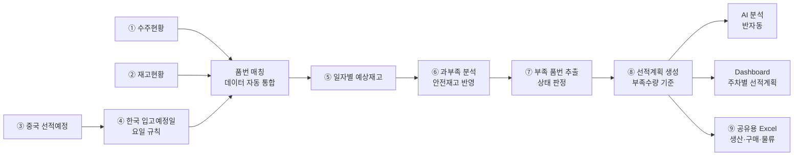

# 생산관리 선적계획 자동화 시스템 — 프로젝트 기획서

| 항목 | 내용 |
|---|---|
| 리포 | data09-18 |
| 제출자 | 안제민 |
| 직무·소속 | 와이어링 하네스 생산관리 / 선적관리 (기획안 「적용업무」 기재). 소속 회사명은 원문 미기재 |
| 과정 | 현장 데이터 디지털화 전문가과정 1차수 |
| 작성일 | 2026-09-28 |
| 문서 상태 | 초안 v0.2 — 수강생 추가 게시물·댓글 반영 |

> v0.2 변경 요약: 수강생이 올린 기획안 docx(「AI 데이터 디지털화를 활용한 생산관리 선적계획 자동화 프로젝트 기획안 — 와이어링 하네스 생산관리」)를 반영했습니다. v0.1에서 (가정)으로 두었던 직무, 보유 데이터 항목, 과부족 공식, 상태 구분, Dashboard 구성을 기획안 원문 기준으로 바꿨습니다. 입고예정일 규칙은 기획안 표(월→수, 화→목, 수→금, 목·금→다음 주 월)와 게시물 원문(월~수 선적 → 2일 후, 목~금 선적 → 다음 월요일)이 같은 내용이라 그대로 둡니다.

---

## 1. 추진 배경과 현안

- 와이어링 하네스 생산관리 업무에서 **수주현황, 재고현황, 중국 선적예정 데이터를 각각의 엑셀 파일로 관리**하고 있습니다(기획안 2장).
- 담당자가 세 자료를 취합해 품번별 과부족을 계산하고, 부족수량에 대한 선적계획을 **수작업으로** 세웁니다. 반복 작업이 많고, 수주·선적 변동이 생기면 신속한 대응이 어렵습니다.
- 중국에서 선적한 물량이 한국에 입고되기까지 요일에 따라 입고일이 달라지므로, 이를 반영한 일자별 재고 예측이 필요합니다.

기획안 4장의 현행 문제는 다음과 같습니다.

| 구분 | 현행 문제 (기획안 원문) |
|---|---|
| 데이터 관리 | 여러 엑셀 파일에 데이터 분산 |
| 데이터 취합 | 담당자가 수작업으로 자료 통합 |
| 과부족 계산 | 수식 및 자료 확인 과정에서 오류 가능 |
| 입고예정 | 중국 선적일을 기준으로 별도 계산 필요 |
| 부족품 확인 | 담당자가 전체 품번을 직접 확인 |
| 선적계획 | 담당자의 경험 및 판단에 의존 |
| 긴급 대응 | 수주 변동 시 즉각적인 재계산 필요 |

## 2. 목표

### 2.1 최종 목표

기획안 16장: 「생산관리 담당자가 데이터를 찾아서 계산하는 업무에서, 데이터가 스스로 분석되어 필요한 선적계획을 제시하는 업무로 전환한다.」

- 수주현황·재고현황·중국 선적예정을 넣으면 **한국 입고예정일을 자동 계산**하고, **일자별 예상재고와 과부족**을 품번별로 보여 주는 시스템
- 부족 품번을 자동으로 뽑아 **부족수량 기준 선적계획**을 만들고, **생산·구매·물류 담당자와 공유**
- 부족·긴급 품목을 AI가 우선순위로 설명하고, **주차별 선적계획 Dashboard**로 한눈에 확인
- 향후 확장(기획안 15장): 선적계획 자동화 → 생산계획 자동화 → 구매발주량 자동 산출 → 수요예측 AI → 통합 생산관리 AI 시스템

### 2.2 1차 개발 목표

제출된 업무 흐름 ①~⑨와 기획안 5장 개선 프로세스(데이터 자동 통합 → 품번 매칭 → 입고일 계산 → 예상재고 계산 → 과부족 분석 → 부족품 자동 추출 → 선적계획 자동 생성 → AI 분석 → Dashboard)를 그대로 따라가는 **브라우저 도구**를 먼저 만듭니다.

- 수주·재고·선적예정 Excel 가져오기(열 매핑)
- 입고예정일 규칙 적용 → 일자별 예상재고 → 과부족(안전재고 반영) → 상태 판정 → 부족 품번 추출
- 부족수량 기준 선적계획 생성
- AI 분석은 반자동(질문문 복사 → AI 답 붙여넣기)
- Dashboard와 공유용 Excel 출력

담당자 자동 알림(메일·메신저)은 2단계에서 다룹니다.

## 3. 보유 데이터

기획안 6장 「데이터 구성」 기준입니다. 실제 파일 샘플은 아직 없어 열 이름·시트 구성은 모릅니다. 그래서 1단계 도구는 **열 매핑 화면**으로 실제 열 이름을 나중에 맞춥니다.

| 데이터 | 주요 항목 (기획안 원문) | 형태 | 규모·주기 | 비고(민감도 등) |
|---|---|---|---|---|
| 수주현황 | 품번, 품명, 고객사, 수주일, 납기일, 수주수량 | Excel (기획안 2장) | 품번 수·갱신 주기 미상 | 고객 주문 정보 — 사내 정보. 고객사명은 외부 AI에 보내지 않는 것을 기본값으로 둡니다 |
| 재고현황 | 품번, 품명, 현재고, 가용재고 | Excel (기획안 2장) | 미상 | 기준 시점 미상. 창고가 여럿인지 미상 |
| 선적예정 | 품번, 품명, 중국 선적예정일, 선적수량, 한국 입고예정일 | Excel (기획안 2장) | 미상 | 한국 입고예정일 열이 이미 있으나 규칙으로 다시 계산합니다(5.1). 둘이 다르면 표시합니다 |
| 안전재고 | 품번별 안전재고 | 원문 공식(8장)에는 있으나 **데이터 구성표에는 없음** | 미상 | 어디서 관리하는지 확인 필요(10장). 1단계는 재고현황의 선택 열 또는 전체 기본값으로 받습니다(가정) |

- 예상재고 계산에는 **현재고**를 씁니다(기획안 8장 공식). 가용재고를 써야 하는지는 10장에서 확인하며, 도구에서 기준 열을 고를 수 있게 둡니다.
- 예상재고에서 수주를 빼는 날짜는 **납기일**로 봅니다(가정 — 10장 확인).

## 4. 해결 방안 개요

| 단계 | 내용 |
|---|---|
| 수집 | 수주현황, 재고현황, 중국 선적예정 (Excel) |
| 정리 | 세 파일을 품번 기준으로 맞추고, 선적예정에 입고예정일 규칙을 적용해 입고 일정으로 변환 |
| 분석 | 기획안 8장 공식 — 예상재고 = 현재고 + 입고예정수량 − 수주수량, 과부족수량 = 예상재고 − 안전재고. 품번별 합계와 일자별 흐름을 함께 계산 |
| AI | 계산은 규칙으로 처리. AI는 부족·긴급 품목의 우선순위 설명(기획안 9장)에 사용 — 1단계는 질문문 복사·답 붙여넣기 방식 |
| 산출물 | 과부족 현황표, 선적계획표, 일자별 예상재고표, 부족 품번 목록, Dashboard, 공유용 Excel |

## 5. 주요 기능

### 5.1 한국 입고예정일 규칙 (제출 원문 그대로)

| 중국 선적 요일 | 한국 입고예정일 | 원문 표현 |
|---|---|---|
| 월 | 선적일 + 2일 (수) | 게시물: 월~수 선적 → 2일 후 입고 / 기획안 7장: 월요일 → 수요일 |
| 화 | 선적일 + 2일 (목) | 게시물: 월~수 선적 → 2일 후 입고 / 기획안 7장: 화요일 → 목요일 |
| 수 | 선적일 + 2일 (금) | 게시물: 월~수 선적 → 2일 후 입고 / 기획안 7장: 수요일 → 금요일 |
| 목 | 다음 월요일 | 게시물: 목~금 선적 → 다음 월요일 입고 / 기획안 7장: 다음 주 월요일 |
| 금 | 다음 월요일 | 게시물: 목~금 선적 → 다음 월요일 입고 / 기획안 7장: 다음 주 월요일 |
| 토·일 | 원문에 규칙 없음 | 1단계는 규칙 없음으로 표시하고 계산에서 뺍니다. 파일에 입고예정일이 적혀 있으면 그 값을 씁니다(10장 확인) |

- 이 규칙대로라면 **화요일에 입고되는 선적은 없습니다.** 선적계획을 거꾸로 세울 때 「화요일 부족분」은 전날(월) 입고, 곧 전주 목·금 선적으로 맞춥니다(10장 확인).
- 규칙은 설정 화면에서 요일별 「선적일 + N일」로 바꿀 수 있게 둡니다. 기본값은 위 표(월·화·수 +2, 목 +4, 금 +3)입니다.
- 공휴일·연휴에 입고일이 걸리면 **휴일 목록을 사용자가 넣었을 때 다음 영업일로 미룹니다**(가정).

### 5.2 과부족·상태 판정 (기획안 8장·10장·11장)

| 항목 | 계산 | 근거 |
|---|---|---|
| 예상재고 | 현재고 + 입고예정수량 − 수주수량 (계획 기간 합계) | 기획안 8장 원문 |
| 과부족수량 | 예상재고 − 안전재고 | 기획안 8장 원문. 양수 = 재고 여유, 0 = 적정, 음수 = 재고 부족 |
| 일자별 예상재고 | 기준일 현재고에서 시작해 날짜마다 입고예정을 더하고 납기일 수주를 뺌 | 게시물 흐름 ⑤ |
| 부족수량 | 일자별 예상재고가 안전재고 아래로 가장 많이 내려간 만큼 (없으면 0) | 게시물 흐름 ⑥⑦. 합계로는 맞아도 입고가 늦어 중간에 비는 경우를 잡기 위함 |

상태 구분은 기획안 11장의 「정상 / 부족 / 주의 / 과잉」과 10장 예시의 「긴급」을 씁니다. 원문에 판정 기준이 없어 다음처럼 정하고, 기준값은 모두 설정에서 바꿀 수 있게 둡니다(가정 — 10장 확인).

| 상태 | 판정 기준 (가정) |
|---|---|
| 긴급 | 과부족수량이 음수이고, 첫 부족일이 기준일로부터 **긴급 기준일수** 이내 |
| 부족 | 과부족수량이 음수 |
| 주의 | 과부족수량은 0 이상이지만, 기간 중 어느 날 일자별 예상재고가 안전재고 아래로 내려감(입고 시점이 늦음) |
| 과잉 | 과부족수량이 수주수량 합계 × **과잉 기준 비율** 이상 |
| 정상 | 위에 해당하지 않음 |

- 긴급 기준일수와 과잉 기준 비율은 원문에 값이 없습니다. 기본값은 도구의 설정 화면에서 정하고, 수강생 확인 후 바꿉니다. 기획안 10장 예시표(A001~A004)가 이 판정으로 같은 결과가 나오는지 시험에 넣습니다.

### 5.3 기능 목록

| 기능 | 설명 | 우선순위 |
|---|---|---|
| 수주·재고·선적예정 Excel 가져오기 | 세 파일(Excel·CSV)을 읽어 3장의 항목으로 변환. 열 이름이 다를 수 있어 **열 매핑 화면** 제공, 매핑 저장 | MVP |
| 품번 매칭 | 세 자료를 품번으로 묶고, 한쪽에만 있는 품번(예: 수주는 있는데 재고현황에 없음)을 따로 표시 | MVP |
| 입고예정일 자동 계산 | 5.1 규칙으로 선적일 → 입고예정일 변환. 규칙·휴일은 설정에서 변경. 파일의 입고예정일과 다르면 표시 | MVP |
| 일자별 예상재고 | 품번별로 기준일 현재고에서 시작해 날짜마다 입고예정을 더하고 수주를 빼서 계산 | MVP |
| 과부족 분석·상태 판정 | 5.2 공식과 상태 구분(정상·부족·주의·과잉·긴급) 적용, 첫 부족일과 부족수량 표시 | MVP |
| 안전재고 기준 | 품번별 안전재고(재고현황 선택 열) 또는 전체 기본값. 기획안 8장 공식에 들어 있어 v0.1의 확장에서 MVP로 올림 | MVP |
| 부족 품번 추출 | 부족·긴급·주의 품번만 모아 첫 부족일·부족수량 순으로 정렬 | MVP |
| 선적계획 생성 | 부족수량을 채우도록 선적일·수량을 5.1 규칙을 거꾸로 적용해 제안. 선적일이 기준일보다 앞서야 하면 「납기 내 입고 불가」로 표시. 사용자가 수량·날짜를 고칠 수 있음 | MVP |
| AI 분석 (반자동) | 부족·긴급 품번의 수치를 담은 질문문을 만들어 복사 → 사내 허용 AI에 붙여 넣기 → 정해진 형식의 답을 붙여 넣으면 품번별 의견으로 정리. 고객사·품명은 기본적으로 빼고 보냄 | MVP |
| Dashboard | 기획안 11장 항목 — 전체 품번 수, 전체 수주수량, 현재고, 입고예정수량, 부족 품번 수, 부족수량, 금주 선적수량, 긴급 선적 품번, 주차별 선적계획, 상태별 색상 구분 | MVP |
| 공유용 Excel 출력 | 과부족 현황표·선적계획표·부족 품번 목록·일자별 예상재고표·입고예정 계산표를 한 파일로 내보내기. 담당자에게 보낼 안내문 초안 복사 | MVP |
| 선적 단위 반영 | 박스·팔레트 등 선적 단위로 올림 | 확장(단위 확인 후) |
| 최근 수주량 변화 반영 | 기획안 9장의 AI 분석 입력 중 「최근 수주량 변화」 — 과거 수주 이력이 있어야 함 | 확장(이력 확보 후) |
| 담당자 자동 공유 | 선적계획이 만들어지면 생산·구매·물류 담당자에게 메일·메신저 발송 | 확장 |
| 계획 대비 실적 | 실제 입고일·수량을 넣어 계획과 비교 | 확장 |
| 생산계획·구매발주량 자동 산출 | 기획안 15장 향후 확장 계획 | 확장 |

## 6. 기대 산출물

기획안 17장 「최종 산출물」과 맞춥니다.

1. **통합 데이터 관리** — 수주현황 + 재고현황 + 선적예정을 품번으로 묶어 보관·내보내기
2. **품번별 과부족 자동 현황표** — 상태(정상·부족·주의·과잉·긴급) 포함
3. **부족수량 기반 자동 선적계획표** — 선적일·수량·입고예정일
4. **부족/긴급 품목 AI 분석 화면** — 1단계는 반자동
5. **주차별 선적계획 Dashboard**
6. **공유용 Excel** — 생산·구매·물류 담당자 배포용
7. **담당자 자동 공유** — 2단계 (확장)

## 7. 기술 구성

| 과정 도구 | 이 프로젝트에서 쓰는 곳 |
|---|---|
| DAY1 암묵지 자산화·전략기획 | 입고예정일 규칙의 예외(휴일·주말 선적), 긴급·과잉 판정 기준, 안전재고 기준, 선적 수량을 정할 때의 판단 기준을 꺼내 적기 |
| DAY2 코랩(Python)·바이브코딩 | 세 파일 정리, 입고예정일 계산, 일자별 예상재고·과부족 계산 로직 시험, 브라우저 도구 제작 — 이 프로젝트의 중심 |
| DAY3 멀티모달 비정형 정보화 | (필요 시) 중국 쪽에서 오는 선적 안내가 PDF·이미지라면 품번·수량·선적일을 표로 뽑기 |
| DAY4 RAG (Dify, NotebookLM) | 이 프로젝트의 핵심은 계산이라 비중이 낮음. 필요 시 물류 규칙·예외 사례 질의 (확장) |
| DAY5 Make 자동화 | 선적계획 파일을 담당자에게 정기 발송, 공유 폴더 갱신 시 재계산 알림 (확장, 보안 허용 시) |
| 생성형 AI | 부족·긴급 품목 우선순위 설명(기획안 9장), 공유 메시지 초안 |

**개발 형태(권장)**

- **설치 없이 브라우저에서 도는 정적 웹 도구**로 만듭니다. Excel을 브라우저 안에서만 읽고 계산하므로 **수주·재고 정보가 외부로 나가지 않습니다.** 모든 계산이 규칙이라 AI 서비스가 없어도 됩니다.
- AI 분석은 도구가 AI에 직접 접속하지 않고, 질문문을 복사해 사내에서 허용된 AI에 붙여 넣는 방식으로 둡니다. 외부 AI 사용 허용 여부는 10장에서 확인합니다.
- 결과는 지금 쓰는 방식과 같게 **Excel로 내보내** 공유합니다. 받는 사람은 새 도구를 몰라도 됩니다.

## 8. 개발 단계

기획안 13장은 8주 8단계(현행 분석 → 데이터 표준화 → 데이터 통합 → 과부족 계산 → 자동 선적계획 → AI 분석 → Dashboard → 테스트)로 적혀 있습니다. 브라우저 도구로는 이 중 계산·화면 부분을 가상의 데이터로 먼저 만들 수 있어, 아래처럼 묶습니다.

### 1단계 — 지금 바로 개발 가능한 부분

제출된 흐름, 입고예정일 규칙, 과부족 공식, 데이터 항목이 구체적이어서 샘플을 받기 전에도 가상의 데이터로 전체를 만들 수 있습니다. 샘플을 받으면 열 매핑만 맞춥니다.

- 수주·재고·선적예정 Excel 가져오기(열 매핑, 매핑 저장), 품번 매칭
- 입고예정일 계산(5.1 규칙, 규칙 변경, 휴일 목록 선택 입력, 파일 값과 비교)
- 품번별 일자별 예상재고 계산
- 과부족 분석(기획안 8장 공식, 안전재고 반영)과 상태 판정(5.2), 부족 품번 추출
- 부족수량 기준 선적계획 생성(입고예정일 규칙 역산, 사용자 수정 가능)
- AI 분석 반자동(질문문 생성·답 붙여넣기)
- Dashboard(기획안 11장 항목, 주차별 선적계획, 상태별 색상)
- 공유용 Excel 출력과 담당자 안내문 초안
- 시험용 가상 데이터에는 월~금 각 요일 선적, 화요일에 처음 부족해지는 품번, 입고가 늦어 부족이 생기는 품번, 기획안 10장 예시(A001~A004)와 같은 수치의 품번을 넣어 계산이 맞는지 확인합니다.

### 2단계

- 실제 샘플로 열 매핑·계산 보정, 휴일·주말 선적 규칙 확정 반영
- 긴급·과잉 판정 기준, 안전재고 관리 위치 확정 반영
- 선적 단위(박스·팔레트) 올림
- 선적계획 담당자 자동 공유(Make)
- 과거 수주 이력으로 최근 수주량 변화를 AI 분석에 추가

### 3단계

- 계획 대비 실적(실제 입고일·수량) 비교와 입고 지연 추적
- 사내 시스템(ERP 등)에서 수주·재고를 직접 받아오는 연동(가정 — 사내 시스템 확인 후)
- 여러 사람이 같은 계획을 보는 공유 저장소
- 생산계획·구매발주량 자동 산출, 수요예측(기획안 15장)

## 9. 기대 효과

기획안 12장의 개선 효과를 따릅니다.

| 항목 | 개선 효과 (기획안 원문) |
|---|---|
| 데이터 취합시간 | 자동화로 단축 |
| 과부족 계산시간 | 자동 계산으로 단축 |
| 선적계획 작성시간 | 자동 생성으로 단축 |
| 엑셀 수작업 | 반복작업 감소 |
| 데이터 오류 | 수작업 입력 및 계산 오류 감소 |
| 긴급 대응 | 부족품 자동 추출로 대응시간 단축 |

- **계산 기준 일관화** — 누가 계산해도 같은 입고예정일 규칙과 같은 판정 기준을 씁니다.
- **공유 누락 감소** — 생산·구매·물류가 같은 선적계획표를 받습니다.

기획안 14장에는 목표 KPI(데이터 취합시간 50% 이상 단축, 과부족 계산 업무 자동화율 90% 이상, 선적계획 작성시간 50% 이상 단축, 부족품번 자동 추출률 100%, 입고예정일 자동 계산률 100%)가 적혀 있습니다. 이는 수강생이 정한 **목표치**이며, 현재 소요시간 측정값은 제출 자료에 없어 이 문서는 개선 수치를 따로 추정하지 않습니다. 목표 달성 여부는 현재 작업 시간을 먼저 재야 판단할 수 있습니다(10장).

## 10. 확인 필요 사항

**샘플 데이터 (필수)**

1. 수주현황·재고현황·중국 선적예정 Excel 샘플 각 1개 — 실제 열 이름, 시트 구성 (항목은 기획안 6장으로 확인됨)
2. 예상재고에서 수주를 빼는 날짜를 **납기일**로 보는 것이 맞는지 (수주일·출하일·생산 투입일이 아닌지)
3. 재고현황의 **현재고와 가용재고** 중 어느 것을 기준으로 계산할지, 재고 기준 시점(매일 아침 기준인지 등), 창고가 여러 곳인지
4. 품번 수와 한 번에 계획하는 기간(몇 주 앞까지 보는지)
5. 선적예정 파일의 「한국 입고예정일」은 누가 어떻게 적는 값인지 — 규칙 계산값과 다를 때 어느 쪽을 믿을지

**입고예정일 규칙**

6. 토·일요일에 선적하는 경우가 있는지, 있다면 입고일은 언제인지
7. 공휴일·연휴(한국·중국 모두)에 입고일이 걸리면 어떻게 하는지
8. 화요일에 입고되는 선적이 없는데, 화요일 부족분은 월요일 입고(전주 목·금 선적)로 맞추는 것이 맞는지

**계산 기준**

9. 안전재고는 어디에서 관리하는지(품번별로 정해져 있는지, 별도 파일인지) — 기획안 8장 공식에는 있으나 6장 데이터 구성에는 없음
10. 「긴급」 판정 기준 — 첫 부족일이 며칠 안이면 긴급인지, 또는 고객·납기 등 다른 기준인지
11. 「주의」와 「과잉」 판정 기준 — 기획안 11장에 상태 이름만 있고 기준값은 없음
12. 수량 단위(EA, 박스, 팔레트)와 선적 최소 단위
13. 이미 확정된 선적예정과 새로 만드는 선적계획을 어떻게 구분해 관리하는지
14. 기획안 10장 예시의 선적일(9/29)을 정할 때 입고일에 여유를 며칠 두는지

**공유·환경·KPI**

15. 생산·구매·물류 담당자에게 지금은 어떤 방식(메일 첨부, 공유 폴더, 메신저)으로 공유하는지, 기존 공유 양식이 있는지
16. 수주·재고 자료를 외부 AI나 클라우드(코랩 포함)에 올려도 되는지, 사내에서 허용된 AI가 있는지
17. KPI 기준선 — 지금 데이터 취합·과부족 계산·선적계획 작성에 걸리는 시간

## 부록. 제출 원문 요약

| 출처 | 파일·게시물 | 내용 |
|---|---|---|
| 패들릿 게시물 1 (2026-09-28T08:27) | 「생산관리 선적계획 자동화 시스템」 — `source/패들릿_제출_원문.md` | 프로젝트 목표(엑셀 수작업 데이터화, 품번별 수주량·재고량·선적예정량 분석으로 부족 예상 품목·선적 필요 수량 자동 산출), 핵심 업무 흐름 ①~⑨(수주현황 입력 → 현재고 반영 → 중국 선적예정 반영 → 한국 입고예정일 계산[월~수 선적 → 2일 후, 목~금 선적 → 다음 월요일] → 일자별 예상재고 → 과부족 분석 → 부족 품번 추출 → 선적계획 생성 → 생산·구매·물류 공유) |
| 패들릿 게시물 1 첨부 추가 (2026-09-28T08:29) | 「AI 데이터 디지털화를 활용한 생산관리 선적계획 자동화 프로젝트 기획안 — 와이어링 하네스 생산관리」 — `source/01_생산관리_선적계획_자동화_기획안.docx` | 17장 구성. 적용업무(와이어링 하네스 생산관리/선적관리), 현행 문제 7가지, 개선 프로세스, 데이터 구성(수주현황·재고현황·선적예정 항목), 입고예정일 요일표, 과부족 공식(예상재고 = 현재고 + 입고예정수량 − 수주수량, 과부족수량 = 예상재고 − 안전재고), AI 선적계획 설명 예시, 자동 선적계획 예시표(A001~A004), Dashboard 구성, 기대효과, 8주 추진 일정, KPI 목표, 향후 확장 계획, 최종 산출물 |

새 댓글은 없습니다. 기획안 docx의 본문과 표는 `source/패들릿_제출_원문.md` 「2026-09-28 추가 게시물·댓글」에 그대로 옮겨 두었습니다.
